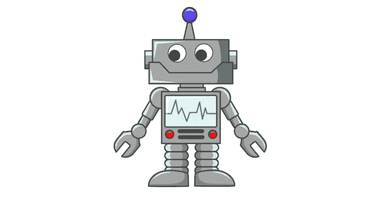

# 害怕 AI…还是不害怕

> 原文：<https://medium.datadriveninvestor.com/fear-of-ai-or-not-9cc3418e7a40?source=collection_archive---------17----------------------->

又是一年，又是一个让我们热切期待深度学习下一次突破的机会。这不完全是新年的材料，但是来自 NYT 的节礼日文章为关于它可能是什么的辩论带来了新的燃料。

AlphaZero 有两点让它非常令人兴奋:

*   它实现了**的通用性**，能够学习不同的游戏，或者至少是游戏的子集——国际象棋、日本象棋和围棋。
*   它展示了**的洞察力**，通过做出我们认为具有更深层意义的动作，类似于游戏中的专家会做的事情。

这两个特征似乎意味着它展示了我们通常对人类的期望。因此，有人认为它*的行为像人类*，而拟人化 AlphaGo 恰恰是这篇文章认为我们不应该做的事情。文章中的论点集中在机器学习的局限性上，提出了通常但有效的论点，即深度学习与人脑的工作方式完全不同。不过，这看起来并不明确。

以散步为例。人类行走，一种非常人性化的活动。鸭子用两条腿走路。当鸭子四处走动时，我们会犹豫不叫它们做什么，走路(好吧，也许摇摇摆摆)。重点是，为什么说**洞察**和**发现象棋**的原理是只有人类才有能力做到的事情。

当然，AlphaZero 不是人类，但是是什么让我们认为只有人脑的方式才是正确的成事方式。毕竟，如果它像鸭子一样走路，像鸭子一样嘎嘎叫，它很可能就是一只鸭子。

如果我们谈论 AlphaZero 时像它是不是人类一样，这应该无关紧要。在未来，机器可能会做更多更高级的认知功能，并且可能做得更好，并且以不同的方式作用于我们的大脑。事实上，它可能有我们没有的认知能力。如果这是一个可能的未来，因为它侵犯了我们一直认为神圣不可侵犯的关于它是什么和感觉是人类的东西，自然会对这种可能性感到焦虑和威胁。这是一种很难摆脱的感觉。这种恐惧源于对人工智能的两种看法:

*   人工智能变得像我们一样，经常伴随着活着、有自由意志和可能有意识的概念。
*   AI 变得比我们更强大。

第一种可能是不合理的恐惧。有人仇外吗？如果人工智能在某种可定义的意义上确实达到了活着的地步，那将类似于遇见外星人，只是我们创造了他们。科技一直是人类的威胁，不管它是否还活着。核武器、软件病毒、千年虫。我们可能有更多的理由担心我们的核计划中的一个缺陷，它会在 3000 年到来时无意中引发一个错误。但同样的，我们有更多的理由担心 AI 是软件，有着软件一直以来固有的缺陷和缺点。

我对一个共存的世界抱有希望。