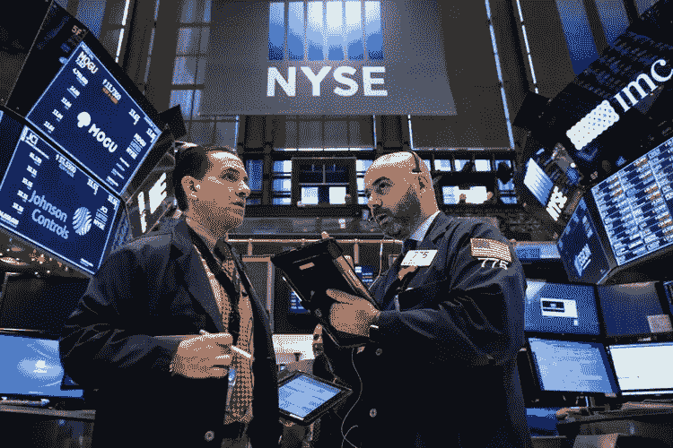

# 对美国经济的担忧和对美联储加息的回应令投资者担忧

> 原文：<https://medium.datadriveninvestor.com/fears-in-the-us-economy-and-response-of-fed-raising-interests-cause-fear-for-investors-8154831452c4?source=collection_archive---------50----------------------->

美联储担心美国经济目前正在放缓，并将继续放缓，因此提高了利率。但即使美联储采用了加息的想法，美国股市暴跌也让许多投资者担心，美联储的反应并不强烈，美联储采取的行动可能与全球经济面临的风险不符。

道琼斯工业平均指数下跌 1.49%，收于 23323.66 点，标准普尔 500 下跌 1.5%，收于 2506.96 点。纳斯达克指数下跌 2.1%，至 6636.83 点。

苹果股价下跌 3.12%，至 160.89 美元，亚马逊股价下跌 3.64%，至 1495.08 美元。网飞股市下跌 1.54%，至 266.77 点。与苹果、亚马逊、脸书和网飞等其他科技公司相比，微软和谷歌的排名略有下降。微软下跌 0.27%，至 103.69 点，谷歌下跌 0.55%，至 1023.01 点。

脸书股价下跌 7.3%，此前有坏消息称，共享用户数据比之前诉讼和审判期间的预期要多。这是继 7 月 26 日下跌 19%之后，脸书今年的第二大跌幅，Facebook 的情况看起来不太好。《纽约时报》发表了一篇报道，称脸书与 Spotify、Bing 和加拿大皇家银行等合作伙伴共享了大量数据。他们能够接触到用户的许多私人信息。由于指控和丑闻已经开始，可以看出，每一个坏消息都导致股价大幅下跌，而且似乎未来还会继续。

**货币**

欧元上涨 0.04%，至 1 欧元兑 1.138 美元

日元持平于 1 美元兑 112.48 日元。

英镑上涨 0.07%，至 1.2619 美元

**商品**

西德克萨斯中质原油下跌 1.5%，至每桶 47.44 美元，抹去了最近 3.4%的反弹。

黄金价格稳定在每盎司 1244.73 美元。