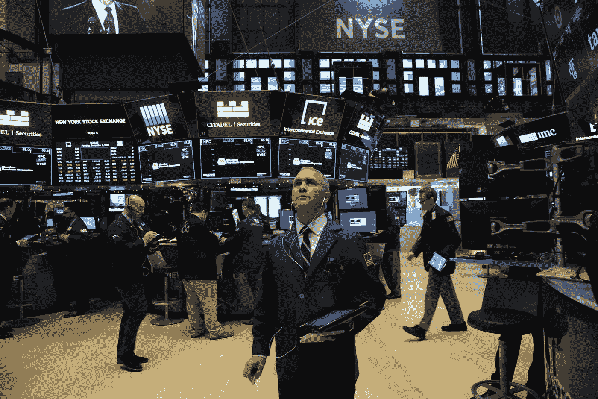

# Fears of Economic Slowdown Rise Plummeting US Stocks

> 原文：<https://medium.datadriveninvestor.com/fears-of-economic-slowdown-rise-plummeting-us-stocks-b501ee802756?source=collection_archive---------22----------------------->

Stocks plummeted abruptly on Tuesday making the largest decline since the October. There are more lingering worries of US Chine trade in Wall Street.

Dow Jones dropped 3.1 percent to close at 25,027.07 reporting its worst day since October 10\. S&P 500 fall 3.2 percent to close at 2,700.06\. The financial sector has the worst performance in the index falling 4.4 percent. Utilities was the only postitive impact in the S&P 500 rising 0.16 percent. Nasdaq Composite dropped 3.8 percent to 7,158.43.

SPDR S&P Bank ETF dropped 5.3 percent. Shares of J.P. Morgan Chase, Citigroup and Bank of America all declined more than 4 percent. Citigroup and Morgan Stanley each reached 52 week lows.

United States and China both agreed over the weekend to cease on the additional tariffs on each other’s goods, and allowing trade talks to continue. The meeting of the two countries made stocks surge on Monday. Even with the intense match over trade between the two countries, Trump administration slapping a heavy $250 billion worth tariffs on Chinese imports, and Chinese Presidents Xi Jinping’s government has imposed $110 billion of tariffs on US goods.

Trump sends a series of tweets saying that the deal will be done if it is possible but also says, “But if not possible remember … I am a Tariff man.”

## Currencies

Euro fall 0.09 percent to $1.133 per euro

Japanese yen rose 0.17 percent to 112.96 yen per dollar

Great Britain Pound fell 0.09 percent to $1.27 per pound