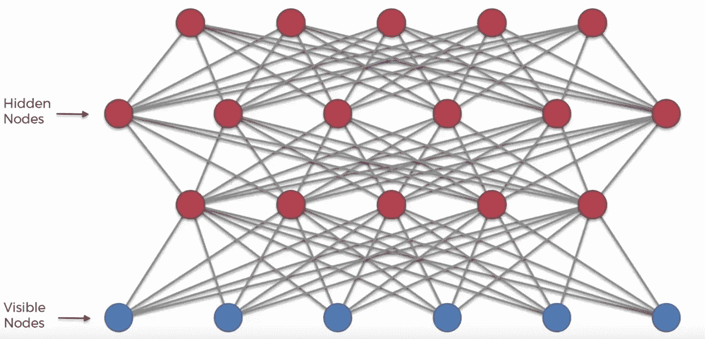

# 使用深度信念网络的特征检测(DBN)

> 原文：<https://medium.datadriveninvestor.com/feature-detection-using-deep-belief-networks-dbn-df730d9894ae?source=collection_archive---------0----------------------->

# 介绍

深度信念网络可以被视为一堆 RBM，其中一个 RBM 的隐藏层是它“上面”的可见层。2006 年，多伦多大学的杰弗里·辛顿首次提出了深度信念网。就网络结构而言，DBN 等同于 MLP。但是说到训练，他们就完全不同了。事实上，训练方法的差异是 dbn 能够超越浅层对手的关键因素。

你可以在我之前的帖子[这里](https://medium.com/datadriveninvestor/an-intuitive-introduction-of-restricted-boltzmann-machine-rbm-14f4382a0dbb)和它的应用[这里](https://medium.com/datadriveninvestor/dimensionality-reduction-and-feature-extraction-with-rbm-f499965979e9)和[这里](https://medium.com/datadriveninvestor/recommender-systems-using-rbm-79d65fcadf8f)中读到 RBM。

 [## 用 7 个步骤解释深度学习——数据驱动投资者

### 在深度学习的帮助下，自动驾驶汽车、Alexa、医学成像-小工具正在我们周围变得超级智能…

www.datadriveninvestor.com](https://www.datadriveninvestor.com/2019/01/23/deep-learning-explained-in-7-steps/) 

# 深度信念网络的细节

像 RBMs 一样，DBNs 可以学习输入的底层结构，并从概率上重建它。换句话说，像 RBM 这样的 dbn 是生成模型。dbn 中的层仅在层之间有连接，而在同一层内的单元之间没有连接。

DBN 的训练如下

*   在 DBN，一次训练一层。第一个 RBM 被训练以尽可能准确地重建其输入。
*   第一个 RBM 的隐藏层被视为第二个的可见层，并且使用第一个 RBM 的输出来训练第二个 RBM。
*   这个过程一直持续到训练完 DBN 的所有层。除了 DBN 的第一个图层和最后一个图层，DBN 中的每个图层都是 RBM 的隐藏图层和可见图层。

关于 DBN 的一个重要注意事项是，每个 RBM 层学习整个输入。在其他类型的模型中，如卷积网络，早期层检测简单的模式，后期层重组它们。就像在面部识别的例子中，早期的层将检测图像中的边缘，随后的层将使用这些结果来形成面部特征。另一方面，随着模型的缓慢改进，DBN 通过连续微调整个输入进行全局工作。

DBN 是一种表示层次，像所有神经网络一样，是一种表示学习形式。请注意，DBN 不使用任何标签。相反，DBN 一次一层地学习输入数据的底层结构。

标注可用于通过监督学习微调 DBN 的最后几个图层，但只能在初始的非监督学习完成后进行。例如，如果我们希望 DBN 成为一个分类器，我们将首先执行无监督学习(这个过程被称为*预训练*)，然后使用标签来微调 DBN(这个过程被称为*微调*)。

为此，您需要一个非常小的标记样本集，以便将特征和模式与名称相关联。权重和偏差被轻微地改变，导致网络对模式的感知的微小变化，并且通常总的准确度有微小的增加。幸运的是，相对于原始数据集，标记数据集可能很小，这在实际应用中非常有用。

本帖附送的 jupyter 笔记本可以在[这里](https://github.com/nitwmanish/Feature-Detection-Using-Deep-Belief-Networks)和[这里](https://github.com/nitwmanish/Emotion-Detection-Using-Deep-Belief-Networks)找到。

# 结论

RBM 可以提取特征和重构输入，但是 RBM 不能捕获复杂数据(如图像、声音和文本)中的结构，而 dbn 可以。dbn 已经被用于识别和群集图像、视频捕获、声音和文本。

***我希望这篇文章能帮助你很好地理解*深度信念网络 *(* DBN *)以及如何将其用作*特征提取系统。**