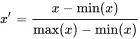
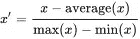

# 特征缩放:为什么，什么，哪里，如何？

> 原文：<https://medium.datadriveninvestor.com/feature-scaling-why-what-where-how-683f61812f4c?source=collection_archive---------0----------------------->

**为什么要缩放特性**

大多数情况下，数据中的不同特征可能具有不同的量值。例如，在杂货店购物数据集的情况下，我们通常以克或磅为单位观察产品的重量，这将是一个较大的数字，而产品的价格可能是美元，这将是一个较小的数字。许多机器学习算法在其计算中使用数据点之间的欧几里德距离。具有两个具有不同数值范围的特征将让具有更大范围的特征支配算法。

**什么是特征缩放**

特征缩放是预处理技术，其中我们改变数字特征的范围。在数字特征上可以做三件事:

*   改比例

重缩放是指在向量上加上或减去一个常数，然后将向量乘以或除以一个常数(*f*(*x*)=*ax*+*b*)。例如，改变单位，如摄氏温度到华氏温度。

*   正常化

归一化意味着将特征除以向量的范数。我们基本上希望向量的欧氏距离为 1。

可以进行两种标准化。

1.  最小-最大标准化:

我们将值的范围调整为[-1，1]或[0，1]。公式是

2.均值归一化:

我们不使用最小值进行调整，而是使用特征的平均值。

*   标准化

标准化意味着使向量的平均值为 0，标准差为 1。通常这是通过减去平均值并除以标准偏差来完成的。标准化值也称为 Z 分数

**在哪里进行特征缩放**

有一系列算法是比例不变的，如基于树的算法，其中不需要缩放，因为它们不是基于距离的模型。

诸如线性判别分析(LDA)、朴素贝叶斯等一些家族算法基于特征的范围对特征进行加权，因此缩放不会影响这些算法。

缩放还有助于其他算法，如主成分分析(PCA)、k-最近邻(Knn)、线性/逻辑回归(正则化时)，缩放有助于我们避免偏向高幅度特征。甚至神经网络也受益于特征缩放。

但是一般来说，特征是被缩放的，因为它有助于在梯度下降算法中更快地收敛。如下图所示

**如何实现:**sci kit-learn 预处理模块拥有优秀的 api 和关于特性缩放的文档[这里](http://scikit-learn.org/stable/modules/preprocessing.html#standardization-or-mean-removal-and-variance-scaling)。