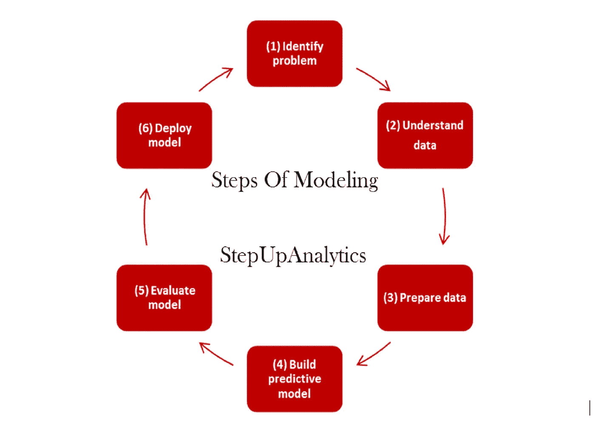
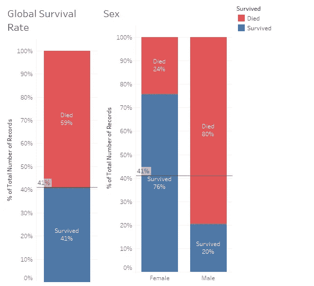
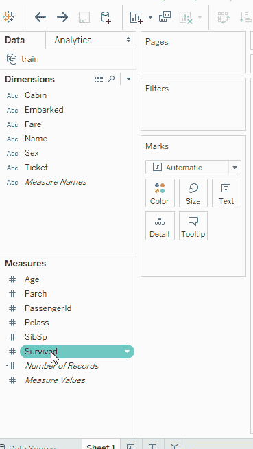
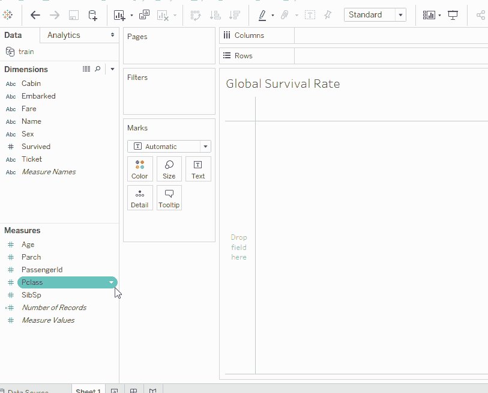
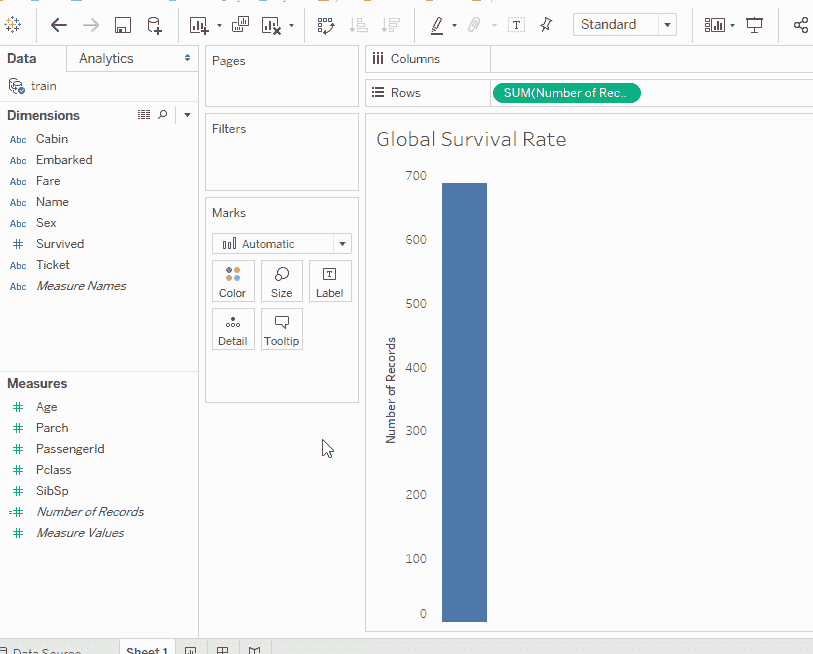
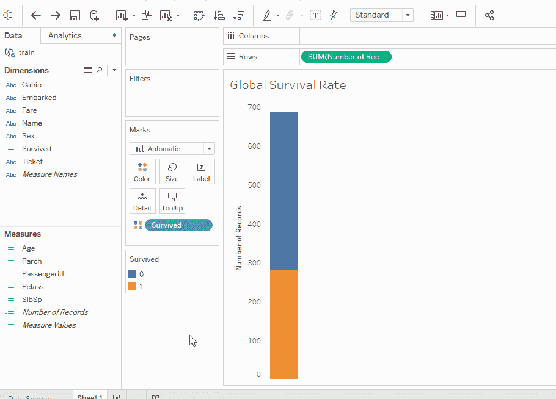
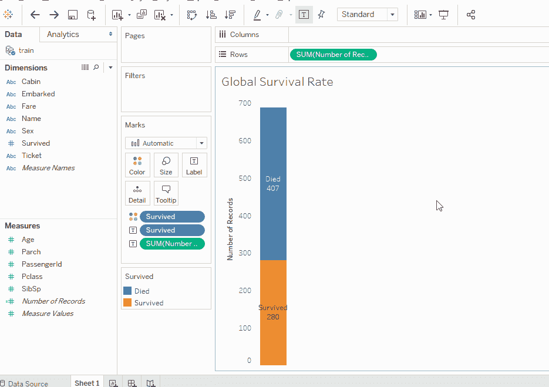
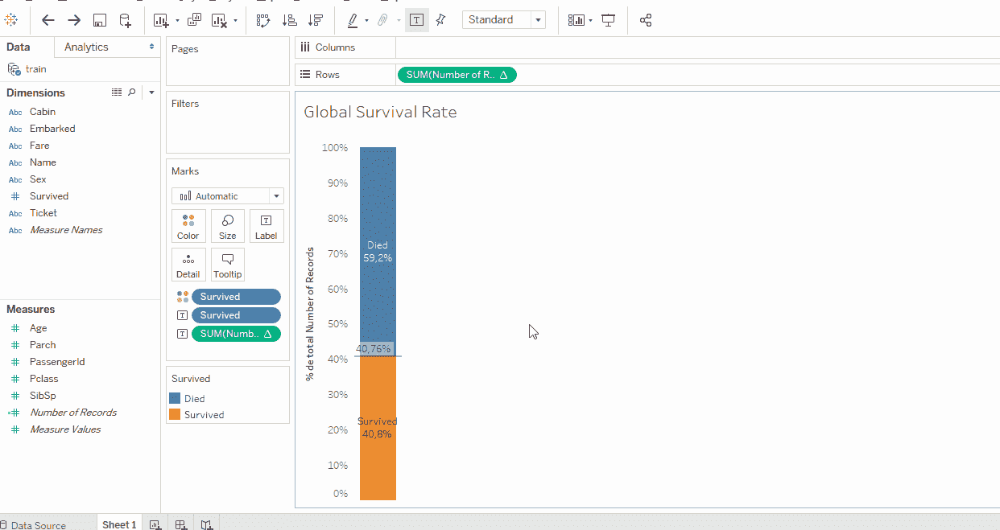
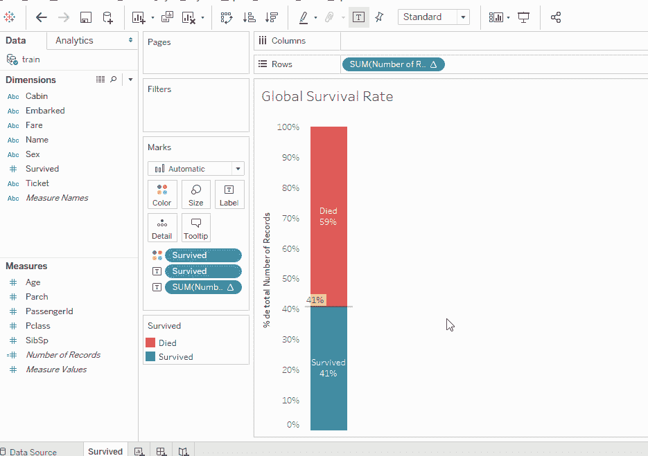
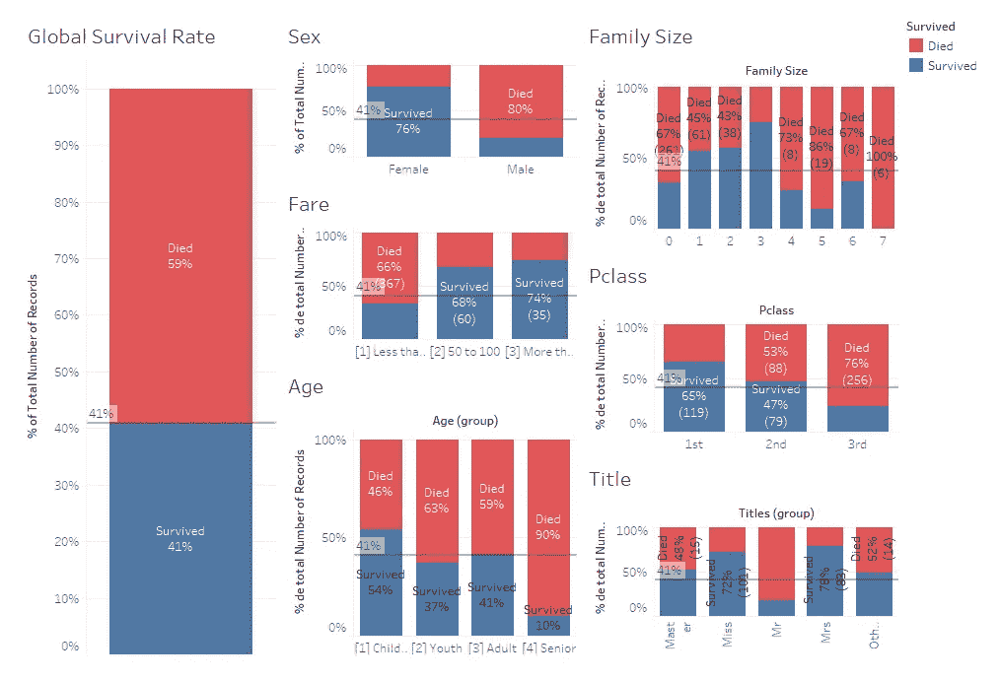

# 功能选择:使用 Tableau 进行 A/B 测试

> 原文：<https://medium.datadriveninvestor.com/feature-selection-a-b-test-with-tableau-462cb8d949e0?source=collection_archive---------0----------------------->

Source: [https://www.datasciencecentral.com/profiles/blogs/steps-of-modelling](https://www.datasciencecentral.com/profiles/blogs/steps-of-modelling)

在数据科学项目中，在分析数据或创建概括数据的模型之前准备数据是很重要的，事实上，这是项目中需要更多时间的阶段(通常在 60%到 80%之间)。[1].

当目标是建立一个具有高预测精度的稳健模型时，选择重要变量非常重要。当训练数据集具有最重要的变量时，模型对它们进行的泛化将具有最高的质量。

同时，训练数据集的特征越不重要，引入模型的噪声就越多，从而降低了模型的最终性能(在计算中，这种现象被称为“垃圾输入，垃圾输出”法则)。

那么，如何区分数据集变量呢？有不同的特征选择技术，它们的使用取决于项目范围和负责的数据科学家的专业知识。

在这篇文章中，我们使用可视化工具 [Tableau](https://www.tableau.com/) 和关于泰坦尼克号的流行的[数据集，应用一种 A/B 测试，选择对存活率有更大影响的水手的特征。](https://www.kaggle.com/c/titanic)

## A/B 测试特征选择背后的思想

我将解释的方法的主要思想是比较数据集变量与全局存活率(预测中的目标变量)的影响。

Globar Survival Rate vs Sex

因此，举例来说，我们看到参考线是 41%的机会在事故中幸存。属性“性别”增加了有利于女士的参考线，这是一个很有意义的事实，因为这类事故的协议是“妇女和儿童优先”。从测试中，我们发现，仅从性别来看，女性比男性的生存几率要高 25%。

因此,“性别”属性是建模过程中的一个重要变量，应该予以考虑。变量的选择对数据集中包含的其余要素执行相同的分析。如果一个特征显示出可以增加或减少 41%参考线的模式，那么所述特征在统计上是显著的。

科学文献表明，如果观察到仅通过改变特征，最终目标值是不同的，则特征与目标是相关的。[2].

## 构建全球存活率条形图

一旦数据集加载到 Tableau 中，变量“Survived”将由于其数值而位于 measures 部分，我们必须将它拖到 dimensions 部分，以便它可以被解释为分类变量。

**Step 1:** ‘Survived’ must be a dimension.

然后我们创建一个条形图，显示船上的水手总数。为此，我们将计算字段“记录数”拖到其中一个轴上:列将生成一个水平图，而行将生成一个垂直图。

**Step 2:** Drop ‘Number of Records’ to an axis.

图表的基础已经准备好了，下一步就是添加“幸存”。为此，我们将变量转换为颜色标记，这就是为什么将“幸存”解释为一个维度很重要，因为这样 Tableau 将为“幸存”中出现的每个类别添加一个默认颜色(0 或 1)。

**Step 3:** Drop ‘Survived’ to the color mark.

差不多完成了，剩下要做的就是格式化图表和轴上的文本。首先对于文本，我们将更改“幸存”类别中的别名，考虑到值 0 意味着水手死亡，值 1 意味着水手幸存。

将“记录数”添加到文本标记将包括酒吧每个部分的水手人数，而添加“幸存”将包括每个部分的别名值。

**Step 4:** Edit alias and add texts to the bar.

最后，让我们创建参考线，因为有必要将轴更改为记录总数的百分比。

**Step 5:** Scale axis to percent of total and add reference line.

全球生存条形图差不多完成了，所以我们最后编辑了颜色和百分比刻度，没有小数。

**Step 6:** Change colors and format values.

## 评估功能

现在参考线已经准备好了，要确定该变量是否具有统计显著性，只需将相对轴上的比较变量与“记录数”相加即可。

Creating ‘Sex’ comparison bar chart.

使用第一部分中为变量“性别”解释的相同选择标准，选择最重要的特征来训练预测模型。

Features selected by A/B test.

> **注**:“家庭规模”是从“SibSp”和“Parch”的总和中创建的变量。特征工程、评级模型设计、性能测试的全过程都可以在这个[笔记本](https://www.kaggle.com/danielmartinezb/titanic-prediction-using-ensemble-learning/notebook)中找到。

## 参考

[1]K .叶列缅科，《自信的数据技能》，可兰经页有限公司，2018 年。
[2]A. Blum 和 P. Langley，“机器学习中相关特征和例子的选择”，《人工智能》，第 97 卷，第 1–2 期，第 245–271 页，1997 年。