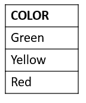
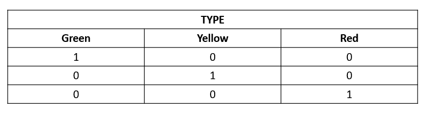
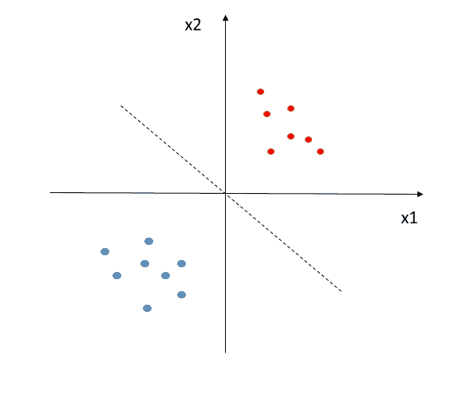
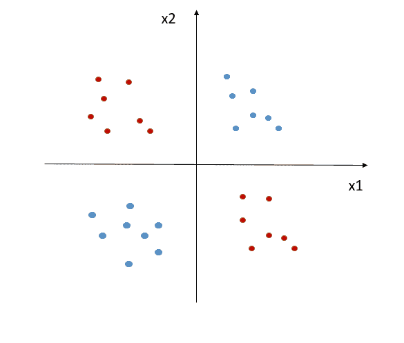
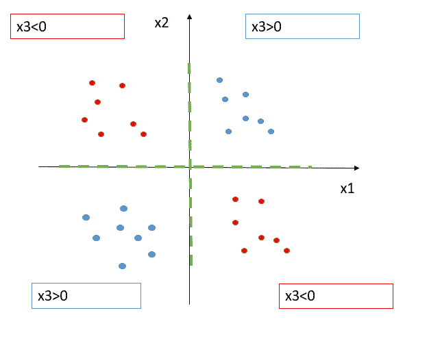
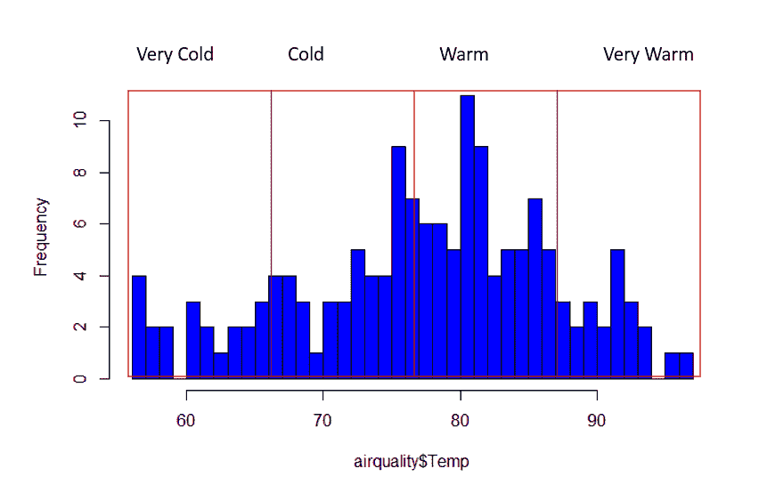
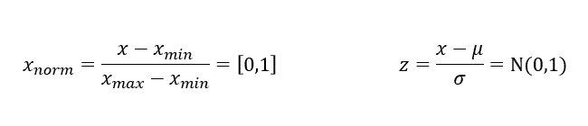

# 特征工程:ML 算法的幕后

> 原文：<https://medium.datadriveninvestor.com/features-engineering-behind-the-scenes-of-ml-algorithms-e356e38073d?source=collection_archive---------3----------------------->

大多数人(包括我)倾向于认为，构建机器学习算法的核心活动无疑是构建算法本身。具体地说，这意味着处理实际数据，推断它们的结构并做出预测。几年前的一项调查显示，数据科学家通常花 80%的时间检查、清理和组织他们的数据，只花剩下的 20%来构建实际的算法。这种情况被称为 80/20 规则，今天旨在打破这种情况以提高效率，但数据准备仍然占工作的一半以上。

准备数据以使算法发挥最佳性能的科学称为特征工程。事实上，它不仅包括对现有功能的一些调整，还包括创建可能包含新的相关信息的新功能。

在整篇文章中，我将研究一些可能帮助您选择最有意义的特性的实践。此外，我将详述一些技术，以使您选择的特性更好地执行您的算法。

所以让我们从一些策略开始:

*   **特征必须与目标**相关。总结相关信息的艺术在数据科学中也有重要作用。在我们的模型中保留多余的或者无意义的特征会适得其反:它们会使模型变得过于复杂和沉重而难以训练。当然，使特性相关的是它的相对目标。也就是说，假设我们想要建立一个模型来预测患特定疾病的概率。我们有成千上万的病人病历，但是我们需要所有的病历吗？如果我们对肺部疾病感兴趣，我们不会看膝盖的 RMI 扫描……但如果我们在寻找一些肥胖的指标，它可能会变得相关。
*   **在预测时间**必须知道特征。这听起来可能是显而易见的，但经常发生的是，在收集数据时，我们忘记了预测将在第二个时刻进行，因此我们必须确保我们收集的数据在那个时候也是可用的。让我们考虑这个例子:你想建立一个模型，预测你的公司将要支付给股东的股息。您将使用雇员数量、工作时间和上一张资产负债表的利润作为特征。如果预测时间是在年底，你是幸运的，因为你公司的利润将与资产负债表一起公布。然而，如果你想在 6 个月之后重复你的分析，你将只有 3 个特征中的 2 个，因为利润，在那个时候，将不可用。
*   **特征应该是有意义的数值**。如果我们想到任何算法，很明显它们是数学模型，因此，它们由一系列数学运算组成。因此，他们不能训练非数字的特征。这并不意味着分类特征不能在训练中使用:简单地说，它们需要通过一个称为一键编码的过程进行转换，我将在稍后解释这一点。此外，它们应该有一个相关的量级:这意味着，如果一个观察值为 1，另一个值为 2，后者的重要性(或重要性)是前者的两倍。如果我们想到一些变量，如订单 ID，我们知道它们是数字，但没有有意义的大小(如果订单 ID 为 120，并不意味着它的重要性是 ID 等于 60 的订单的两倍)。
*   **功能要有足够的例子**。这个想法是，如果特征倾向于很差的组合并且是不平衡的，那么我们的算法将是有偏见的。假设我们想从一张图片中预测我们正在看哪种水果:在我们的特征中，我们选择了“颜色”,但结果是这个特征只展示了“绿色”值。一旦应用于新数据，该模型将无法概括其预测，因此，我们宁愿从我们的分析中排除这一特征。

所有这些方法都涉及预处理阶段:在这一步中，您几乎不接触您的数据，您只是基于一些标准来决定选择哪些特征。

现在让我们来看看你的一些功能的修改。

*   **输入值**。收集数据时，可能会出现某些值缺失的情况。在这种情况下，您可以删除显示一个或多个 NA 值的所有条目，或者输入一些新的相关值。第一种方法可能是用特征的平均值或中值来代替它们。请注意，有时可能会出现一种微不足道的情况:如果您面对一个具有 0–1 二进制值的要素，那么如果这些值不可用，它们可能会用 0 来表示。风险是将其视为实际值，而不是缺失值。因此，在这种情况下，一个好的方法是创建一个新列(还是 0–1 列)，其中 1 表示前一列的值可用，而 0 表示不可用。
*   **处理分类值**。正如预期的那样，我们不能给我们的算法输入任何数值。然而，如果它们没有一个有意义的数量级，把它们归入数字类也可能是无用的。

我们有一个名为“颜色”的功能，它展示了三个条目:绿色、黄色和红色。这些值是分类的，我们可能决定将它们编码为 1、2 和 3。然而，这是没有意义的，因为黄色(等于 2)是绿色(等于 1)的两倍是不对的。或者，我们可以采用我上面提到的一键编码:

通过这样做，我们创建了三个新列，现在每个值都由一个向量表示，其中数字 1 的位置表示值的种类。[1 0 0]和[0 1 0]之间没有层次关系。

*   **处理异常值**。离群值是远离平均值的值。它们可以是单变量(当一个观察值仅代表一个特征的异常值时)或多变量(当该观察值的多个特征远离平均值时)。识别异常值的第一步是可视化数据:箱线图、散点图和直方图都是有用的工具。更复杂的可能是询问异常值的原因，因为如果您必须决定是保留还是丢弃异常值，这是您需要的信息。事实上，异常可能是由收集数据时的错误引起的。也就是说，如果你收集了在 X 公司工作的男性的一些身体特征，你观察到你的“身高”特征的值是 7 米…那么，你可以假设这是一个错误。另一方面，如果您的观察表现出真正的异常，您可能会对保留这些信息感兴趣，以便模型可以合并这些信息并检测未来的异常。您可以使用的一些技术是对数变换(这样您可以减少方差并且不会破坏您的模型)，或者更复杂的是，您可以提取所有的异常值并在它们的基础上构建一个特定的模型。
*   **特征交叉**。这种技术与前面的技术相比不太直观，但是它在收集和总结相关信息方面非常强大。特征交叉的想法是，从现有的变量中，我们可以创建新的特征(作为现有特征的转换)，它包含更多的信息，特别是与任务更相关的信息。让我们用一个例子来形象化它:

在这种情况下，我们可以很容易地线性分离我们的两个集群(注意:当我说线性可分离时，我的意思是它存在我的两个特征的线性组合，这很好地分离了我的类)。现在考虑以下情况:

这里，不可能找到 x1 和 x2 的线性组合，使得蓝点和红点被分离。但是如果引入一个新的特征 x3，由 x1 和 x2 的乘积定义，会发生什么呢？好了，我们现在可以定义一个规则来区分我们的类了。怎么会？看看这个:

我们可以得出结论，如果 x3 的符号是正的(因此 x1 和 x2 具有相同的符号),则类是蓝色的，而如果 x3 的符号是负的(因此 x1 和 x2 具有不同的符号),则类是红色的。

正如你所看到的，我们通过引入一个新的特征，将一个非线性任务转化为线性任务，我们提出了一个非常简单的决策规则。

我们可能会认为温度的微小变化不会对我们的标签产生太大影响，因此将这些数据分为四类不会影响模型的信息损失，但处理温度特征会容易得多。

这并不是您可以进行的所有功能操作的详尽列表。在检查您的数据时，您将意识到这个理想列表可能是无限的，因为您可以极具创造力并根据您的任务调整您的功能。重要的是要记住，通过简单快速的改变，你可以令人难以置信地改进你的模型，最重要的是，使你的任务更容易处理。

*原载于 2019 年 8 月 1 日*[*【http://datasciencechalktalk.com】*](https://datasciencechalktalk.com/2019/08/01/features-engineering-behind-the-scenes-of-ml-algorithms/)*。*