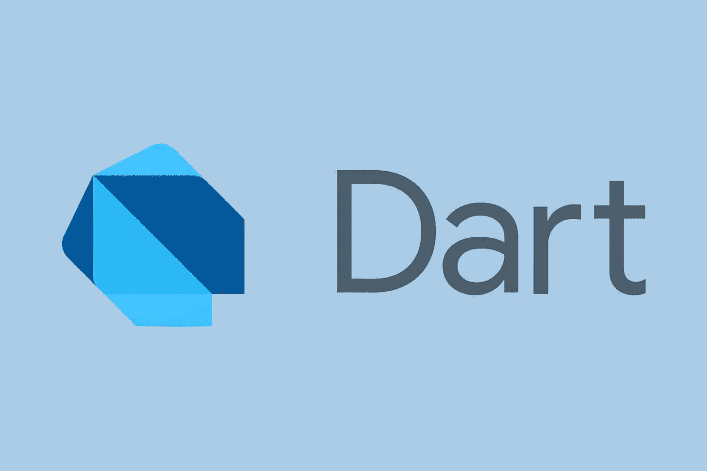

# Google Dart 2.5 SDK 的特性:机器学习完成& Dart:FFI

> 原文：<https://medium.datadriveninvestor.com/features-of-the-google-dart-2-5-sdk-machine-learning-complete-dart-ffi-4de7ce6d842a?source=collection_archive---------1----------------------->

全世界的开发人员都在热议新的 Google Dart SDK 的发布。这个新版本的重要之处在于，它让我们得以一窥 ML Complete，这是 Google 实现 ML 驱动的自动代码完成的方法。虽然这是新 Dart 2.5 SDK 版本中最突出的功能之一，但不是唯一的。让我们仔细看看机器学习完成和在最新版本中发现的其他一些东西。

# ML 完成:深入

我们提到 ML Complete 会自己完成代码的编写。但它的创建是为了解决这样一种情况，即可能性列表不断增长，因为要探索的 API 的数量也在增长。它是用 TensorFlow Lite 构建的，实际上内置在 Dart 分析器中。开发人员可以在所有支持 Dart 的编辑器中使用它的新版本。这对[定制软件编程](https://skywell.software/)来说是一个巨大的推动，因为开发者现在可以避免犯错误，并且可以更快地查看 API，因为他们所要做的只是编写一些需要的符号，系统会处理其余的。

 [## 创建折衷书架的程序员指南|数据驱动的投资者

### 每个开发者都应该有一个书架。他的内阁中可能的文本集合是无数的，但不是每一个集合…

www.datadriveninvestor.com](https://www.datadriveninvestor.com/2019/03/25/a-programmers-guide-to-creating-an-eclectic-bookshelf/) 

# Dart FFI

这里的一大新功能开发是，这一新的 FFI(外来函数接口)允许调用基于 C 的 API 系统或也是用 C 创建的系统库。这是开发人员社区一直在寻求的东西，Google 已经决定倾听，因为调用 C 代码进入 Dart 变得非常有问题。虽然 Google 在一定程度上解决了这种情况，但 Dart 外部函数接口仍然局限于通过本机扩展深度集成到 Dart VM 中。但这还是聊胜于无。

# 颤振的新版本

我们提到了最大的新闻是 ML Complete 和 FFI，但还有一些额外的公告没有吸引太多的注意力，这就是新的和改进的 Flutter 1.9 的发布。您可能会发现以下特性:

*   iOS 的各种新支持。这包括预计推出的 macOS Catalina 以及 iOS 13。开发人员将在 Dart 版本中找到新的工具、特性和材料部件。
*   支持新的 Xcode 构建系统。这使得新的 64 位支持系统可用于工具链的所有部分，并减少了平台依赖性。
*   对于喜欢 Flutter 应用的 iPhone 用户来说，这是个好消息。由于 iOS 13 中新的可拖动滚动条，新的改进使这些应用程序看起来更好。它可以通过按住滚动条本身或从右侧拖动滚动条来激活。
*   也支持 iOS 黑暗模式，但这是相当有限的。预计在以后的版本中这将是一个更大的问题。
*   如果你有苹果手表或苹果电视，对你来说也有一些好消息。新版本中包含了对位代码的实验性支持，在技术上可以用来支持 watchOS 和 tvOS 之类的东西。事情是，平台提到需要支持位代码才能从应用商店发出请求。

# 为什么这个新版本很重要？

Dart 编程语言的最新版本对开发人员和最终用户都非常有用。就开发人员而言，机器学习元素的引入使生活变得容易得多，因为代码可以自动完成，错误更少。这也影响了最终用户，因为这意味着当你下载并开始使用应用程序时会有更少的错误。此外，如果你喜欢拥有一部 iPhone，但喜欢由谷歌创建的应用程序，更准确地说是用 Flutter 创建的应用程序，它们在你的手机上看起来会好得多。通常，人们并不关心应用程序是在哪个平台上创建的，他们只是希望它能正常工作。这个新版本解决了在 iOS 设备上运行的 Google apps 的一些性能问题。

此外，我们确实在这个新版本中看到了一些进步。虽然它们不是巨大的突破，但它确实包括了我们以前没有看到的东西，例如代码创建过程中的机器学习。此外，Google 正在倾听开发社区的需求，让他们的工作变得更加容易。这在 ML Complete 和新的 Dart: FFI 外来函数接口中都很明显。因此，这个版本有适合每个人的东西，我们都可以期待更好的用户体验。

# Dart 确实取得了很大的进步

很多人不知道这一点，但是 Google 最初设想 Dart 可以取代 JavaScript。当这一切没有发生时，Dart 面临着不确定的未来，濒临灭绝。然后，它被重新设计和定位为一种更适合客户端的语言，用于在任何平台上创建闪电般快速的应用程序。开发人员可以使用 Dart 创建移动、web 和服务器端应用程序和命令行脚本。所有这些功能和最新发展刺激了 Dart 的发展。因此，期待 Dart 的新版本构建今天发布的更多开发，并且在未来几年将会有更酷和令人兴奋的特性。

*最初发表于*[*sky well . software*](https://skywell.software/blog/features-of-the-google-dart-2-5-sdk/)*。*