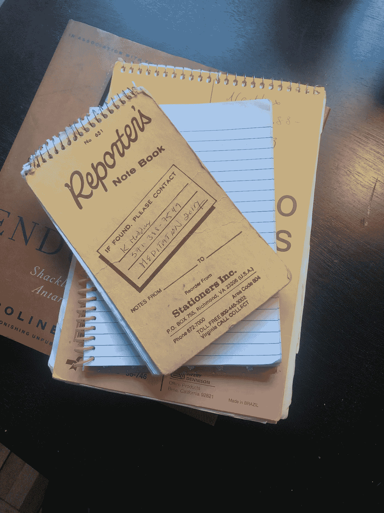

# 感觉被大科技困住了？我的十大过滤泡沫终结者

> 原文：<https://medium.datadriveninvestor.com/feeling-trapped-by-big-tech-my-top-10-filter-bubble-busters-c4f88a82f74b?source=collection_archive---------19----------------------->

***定义我们当前时刻的词语***

它们无处不在，被过度使用。

虽然我真的喜欢文字，但我讨厌听到它们。

尽管我花了几个月的时间编写一个单词或短语，有时是在给自己的短信和电子邮件中；其他时候，为一些我还没想过要写的博客文章落笔(我必须承认，在我的垃圾抽屉里翻找一支没干的笔，掸掉我过去几十个记者记事本中的一个，写下我的条目，这感觉真好)。

直到我真正坐下来写这个清单，我才意识到是什么在驱使我。

我相信这些词将成为历史上这一特定时刻不可分割的标志，我们选择和/或创造这些词是为了理解特朗普主义的两颗自杀式炸弹和数字时代的所谓“意外后果”。

## “一切都会过去的”

啊，熟悉且经常被引用的格言。

但是在这个奇怪的漩涡中几年了，我不确定。更重要的是，我发现自己越来越确定我们不会毫发无伤地度过这一时刻。

所以在那一刻到来之前，我列出了以下清单:

# *放大

# *武器化

# *可选性

# *络合剂

# *一个世界

# *施为的

# *巨魔工厂

# *异端

# *交叉性

# *当然，还有“过滤气泡”

你自己有吗？想加入我的名单吗？请做！