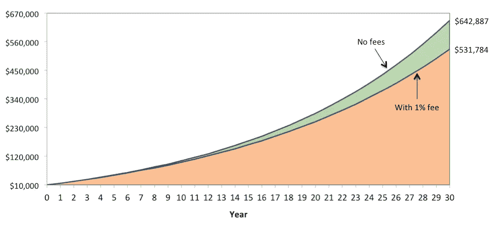
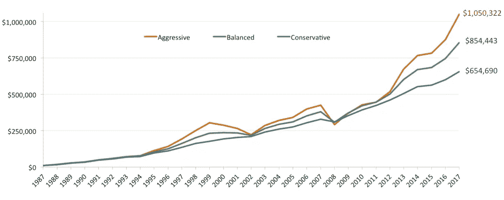
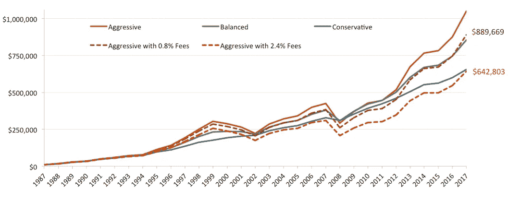

# 费用很重要

> 原文：<https://medium.datadriveninvestor.com/fees-matter-a9b19811055b?source=collection_archive---------25----------------------->

我们很多人经常想知道我们的投资组合表现如何，以及我们对股票的敞口是太多还是太少。尤其是当股市成为头条新闻的时候，这通常发生在事情变得不稳定的时候。然而现实是，费用在投资组合中所占的比重比大多数人意识到的要大(正如最近 twitter 上一篇精彩的帖子所指出的)。

考虑一个简单的例子，你初始投资 10，000 美元，它以平均每年 6%的速度增长。你每年年底还要加 6000 美元。

下图显示了在没有任何费用的情况下，相对于每年 1%的费用，这笔投资会如何增长。在这两种情况下，30 年后你都会有很大的改变(说明了长期复利的力量)。与此同时，费用会占你久而久之回报的更大一部分。

15 年后，这两条线之间的差额略低于 15，000 美元——这看起来不多，但仍高于初始投资额。然而，到第 30 年，这一差距攀升至 11 万美元以上。

在这两种情况下，你看到的都是一条漂亮的向上的斜线。现实生活中显然不会发生这种事。但愿如此！所以让我们考虑一个稍微现实一点的场景。我们将用实际的股票和债券来做这件事。当股票波动时，债券通常会波动，从而分散投资组合，让你的投资更平稳(理论上)。

假设你在 1987 年底用 1 万美元开始投资。你还在每年年底在账户上增加了 6000 美元。以下是你可以选择的三种假设投资:

1.  激进的投资组合:90%的股票和 10%的债券
2.  平衡的投资组合:60%股票，40%债券
3.  保守的投资组合:30%的股票和 70%的债券

以下是这三个假设的投资组合在未来 30 年内的表现，直到 2017 年底*。请注意，随着时间的推移，您将总共投入 184，000 美元。

*Past performance is not an indicator of future returns. Potential for profit is accompanied by possibility of loss. Diversification does not guarantee returns and does not eliminate risk of loss.*

尽管股市在 2000 年(科技股泡沫破裂时)和 2008 年(金融危机时)经历了两次大幅下跌，但激进的投资组合仍然脱颖而出。

然而平衡和保守也不算太寒酸。如果你有激进的投资组合，你就不必眼睁睁地看着 2008 年 1 月到 2009 年 2 月间 425，000 美元跌到 240，000 美元。如果你再看一下图表，你会发现在 2008 年底，激进投资的价值实际上比另外两个投资少了*。只是在过去的九年里，它才处于领先地位。*

让我们做一个小实验，允许你做一次欺骗:你可以回到 1987 年，选择一个在接下来的 30 年里表现最好的投资组合，也就是进取型投资组合。然而，你必须使用共同基金来实现这个投资组合。假设每年的共同基金费用为 1.4%，这接近平均水平(你很幸运投资了没有手续费和其他销售费用的基金)。

此外，鉴于激进投资的大起大落，并假设你不是斯波克先生的瓦肯亲戚，你认为你需要一位顾问来防止你在困难时期(如 2002 年和 2008 年)情绪失控。所以你雇了一个顾问，每年收取 1%的费用，这是典型的平均值，来帮助你保持正轨。

换句话说，你可以以每年总计 2.4%的费用实施激进投资组合。下面我还展示了一个案例，其中投资组合可以实现三分之一，0.8%。虚线显示了包含费用的投资组合是如何增长的。

*Past performance is not an indicator of future returns. Potential for profit is accompanied by possibility of loss. Diversification does not guarantee returns and does not eliminate risk of loss.*

通过以平均的共同基金和顾问费实施激进的投资组合，你最终的结果甚至比保守的选择还要糟糕。哦，你仍然不得不忍受 2008 年那段残酷的时期。

在 2008 年，只支付三分之一的典型费用并不能拯救你，但在 30 年后，你确实多支付了近 25.5 万美元。

费用很重要。

在很长一段时间内复利可以导致显著的增长，因此熟悉的建议是尽早开始。然而，另一方面，费用也是复合的，高费用会从你的投资中拿走很大一部分。

这个练习的重点不是说你应该因为费用而完全回避投资。从现在到比如说 1988 年，优势在于有这么多低成本的选择。

我也不是说你不应该聘请顾问。一个好的顾问首先应该能够根据你的目标(多个目标)、风险承受能力(不仅仅是一个关于你是否愿意冒险的敷衍问题)和风险承受能力(你实际上可以承受多大的风险)，判断出什么是适合你的正确资产配置。同样重要的是，他们应该能够帮助你保持正轨，尤其是在困难时期。如果你一开始就有正确的投资组合，这显然要容易得多。

*脚注:*

**股票:S &普 500。债券:彭博/巴克莱美国综合债券指数。投资组合每年重新平衡。*