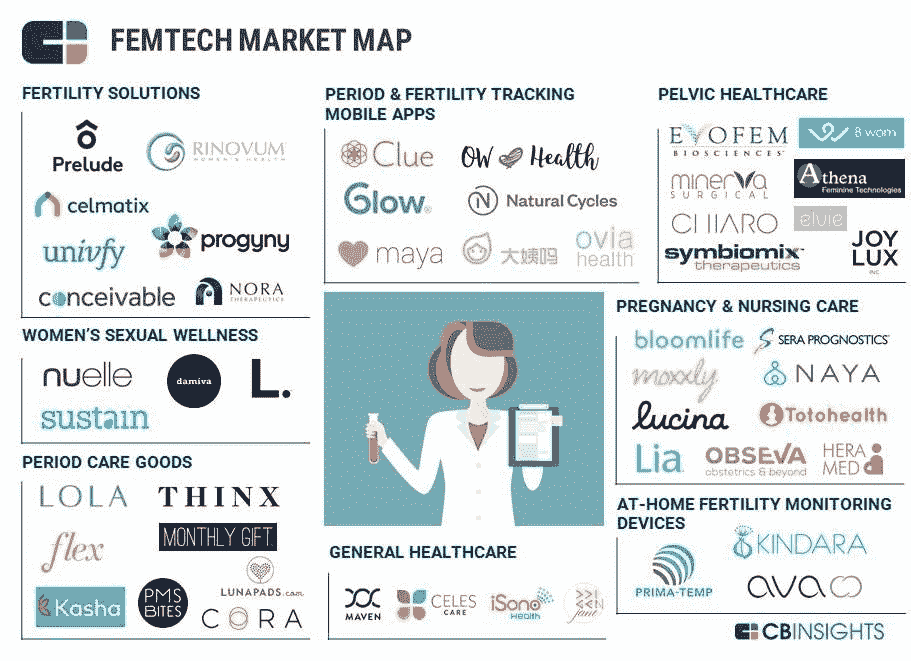

# 需要发生什么？

> 原文：<https://medium.datadriveninvestor.com/femtech-what-needs-to-happen-6dd0a2ac3aa?source=collection_archive---------1----------------------->

Femtech 是任何旨在改善妇女生活、解决妇女特有问题的技术，其中妇女是主要用户。Femtech 汇集了推动数字健康的趋势(个人跟踪、可穿戴设备、临床应用等。)来解决妇女特有的健康问题。这一领域涌现了大量公司，尤其是在过去 5 年里，以下是一个例子:

然而，这一领域的创业努力和资金仍存在明显差距，根据诺拉·马斯特森教授的说法，2017 年只有 1.4%的医疗保健投资分配给了女性健康和福祉方面的创新。要改变这种情况需要什么？这篇文章将关注四个需要进一步发展的具体杠杆:

**1)法规** —美国食品和药物管理局过去一直处理硬件(制药和医疗设备)，现在对软件(数字健康)越来越开放。[预认证项目](https://www.fda.gov/medicaldevices/digitalhealth/digitalhealthprecertprogram/default.htm)专注于加快审批，尤其是应用程序的审批。对于数字医疗整体而言，特别是 femtech，要继续取得成功，更有效的监管框架是必不可少的。

**2)销售周期** —向供应商和付款人销售时，医疗保健因[长销售周期](https://www.linkedin.com/pulse/death-pilot-dealing-long-sales-cycles-your-startup-amit-garg/)而臭名昭著。尽管 Femtech 公司不成比例地直接面向消费者，这在营销和品牌方面有其自身的挑战，但这确实意味着这些公司可以更快地进入市场并扩大规模。现在，femtech 初创公司需要真正增加收入，以打破人们对 femtech 支付意愿的误解。

退出 **3)退出**——FEM tech 的退出还很少——NV vision(波士顿科学公司 2.75 亿美元)和 couns yl(Myriad Genetics 公司 3.75 亿美元)是明显的例外——这应该也确实让这个领域的更多风险投资暂停。长期以来，投资 femtech 是福音传道者，更多的影响力投资只有在有更强有力的证据证明财务优势时才会真正改变。

文化 —房间里的大象是女性科技与社会和政治有着内在的联系。更多的女性风投和企业家是答案的一部分，这肯定是一项正在进行的工作。科技领袖和科技公司的承诺也有所帮助，但行动肯定会胜于雄辩。缩小性别差距需要两性都做出承诺。当我们不再把女性健康作为一个“不舒服的话题”时，这个领域将会出现各个层面的真正创新。

*这篇文章是与* [*达薇亚·拉格哈万*](https://www.linkedin.com/in/divyara/) *合作完成的，灵感来自她的作品。这些都是专注于实践见解的有目的的短文(我称之为 GL；dr —良好的长度；确实读过)。如果它们能让人们对某个话题产生足够的兴趣，从而进行更深入的探索，我会感到非常兴奋。我在三星的创新部门工作，该部门名为*[*NEXT*](http://samsungnext.com/)*，专注于 deep tech 中软件和服务的早期风险投资，这里表达的所有观点都是我自己的。*