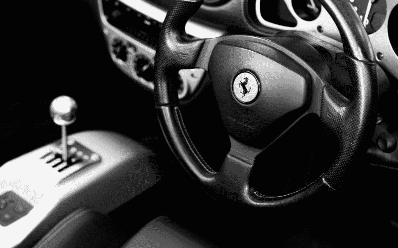
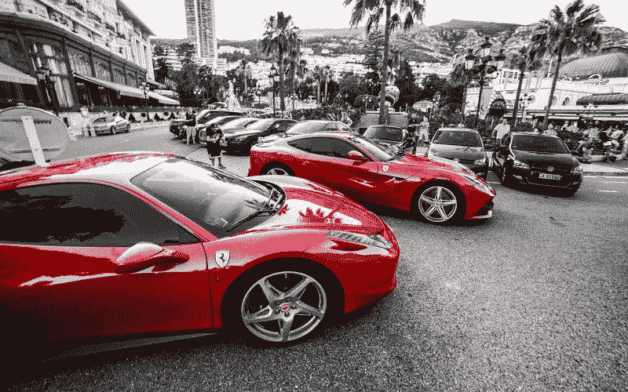
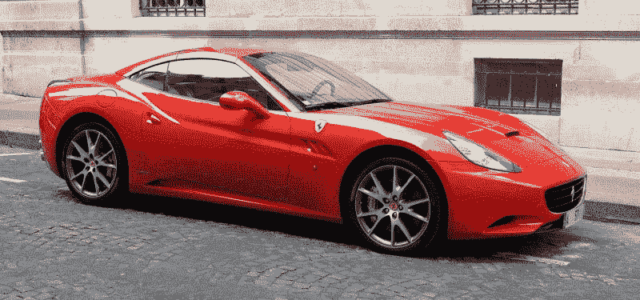
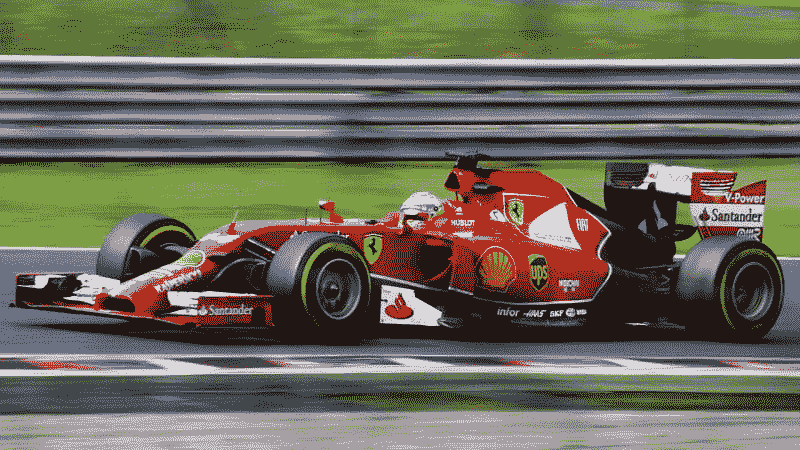
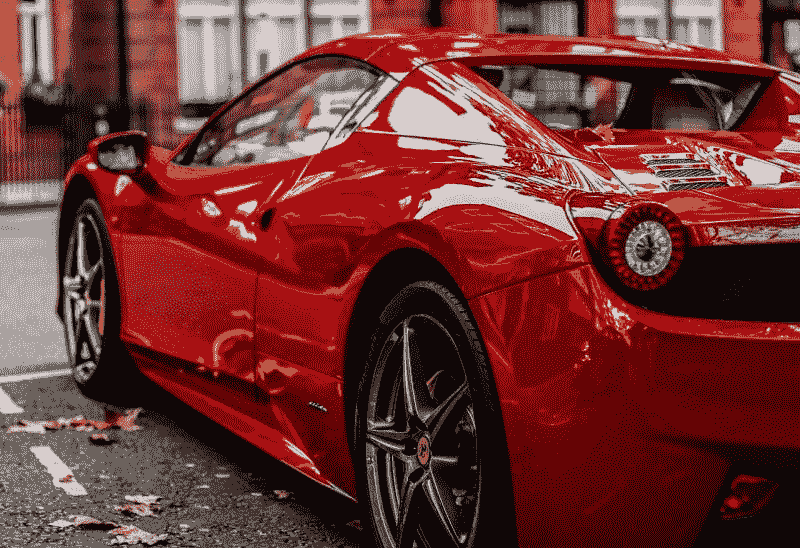

# 法拉利收入下降——市场疯人院

> 原文：<https://medium.datadriveninvestor.com/ferraris-revenues-are-declining-market-mad-house-5bcbe69aa78c?source=collection_archive---------7----------------------->

迎合富人并不总是一个好的商业计划，因为法拉利的收入正在下降。

事实上，Stockrow 估计， **Ferrari N.V .(纽约证券交易所代码:RACE)** 的收入从 2017 年的 41.02 亿美元降至 2018 年的 39.31 亿美元。而且法拉利的收入增速从 2017 年的 25.5%下滑至 2018 年的-4.16%。因此，我计算出 2018 年法拉利的收入增长率下降了 29.66%。

 [## 算法交易的机器学习-数据驱动的投资者

### 当你的一个朋友在脸书上传你的新海滩照，平台建议给你的脸加上标签，这是…

www.datadriveninvestor.com](https://www.datadriveninvestor.com/2019/01/30/machine-learning-for-stock-market-investing/) 

然而，法拉利赚的钱更多。2018 年，这位汽车传奇的净收入从 6.4273 亿美元增长到 9.0193 亿美元。与此同时，法拉利的营业收入从 9.3619 亿美元增长到 9.5062 亿美元。但 2018 年毛利从 21.2 亿美元下滑至 20.66 亿美元。

# 法拉利赚了更多的钱

有趣的是，法拉利拥有更多的现金。事实上，法拉利的现金和等价物从 2017 年的 7.7756 亿美元增长到 2018 年 12 月的 9.1226 亿美元。

此外，法拉利的短期投资从 2017 年的 1883 万美元降至 2018 年的 1169 万美元。因此，法拉利在 2017 年有 7.9639 亿美元的现金和短期投资，2018 年有 9.2395 亿美元。

此外，随着收入下降，法拉利的现金流也在增长。例如，法拉利报告 2017 年自由现金流为 5.733 亿美元，2018 年自由现金流为 7.2937 亿美元。此外，法拉利的运营现金流在 2017 年至 2018 年间从 7.9568 亿美元增长至 10.74 亿美元。

因此，向富人出售商品在一个非常重要的方面获得了回报。富人更有可能用现金支付，即使销售额下降，也会产生更多的现金流。因此，意大利人对奢侈品的传统强调将会得到回报。

# 法拉利的客户群在增长吗？

幸运的是，百万富翁的数量；和法拉利的潜在客户群正在增长。事实上，美国百万富翁的数量接近瑞典的人口。

为了澄清，Spectrem Group 估计，2018 年超过 1020 万美国家庭的收入在 100 万美元至 500 万美元之间，彭博[指出](https://www.bloomberg.com/news/articles/2019-03-13/the-u-s-now-has-more-millionaires-than-sweden-has-people)。相比之下，Worldometers 估计，2018 年瑞典人口为 1051 万。

彭博报告称，更重要的是，2018 年，价值 100 万至 500 万美元的美国人数量增长了 2.5%。此外，2018 年，收入在 500 万美元至 2500 万美元之间的美国家庭数量增长了 0.6%，即 173，000 户。

具体来说，2018 年 12 月有 140 万个美国家庭的价值在 500 万美元至 2500 万美元之间。因此，法拉利在美国的潜在客户群在 2018 年增长了 173，000 人。

此外，富人比以往任何时候都更有钱。 *Vox Recode* [估计](https://www.vox.com/recode/2019/5/9/18537122/billionaire-study-wealthx-san-francisco)2019 年美国亿万富翁的平均财富为 60 亿美元。因此，富人有更多的钱来购买这些法拉利。

# 法拉利的客户群还能增长到什么程度？

不仅仅是美国，法拉利的市场也在增长。石英 [估计](https://qz.com/india/1316124/india-will-have-nearly-a-million-millionaires-by-2027/)到 2027 年，印度可能会有 95 万名百万富翁。

令人难以置信的是，Quartz 预测印度百万富翁的数量将在不到十年的时间里增长 190%。澄清一下， *Quartz* 估计 2017 年印度有 33 万名百万富翁，但到 2027 年这一数字将增长至 95 万。

因此，法拉利很快就会有更多的印度客户。值得注意的是，如果愿意，印度人已经有足够的钱花在法拉利经销商身上。据 *Quartz* 计算，2017 年，高净值个人持有印度 48%的财富或 39 亿美元。

因此，随着收入不平等的加剧，富人越来越富。然而，在增加法拉利销量的道路上会有很多障碍。

# 民粹主义对法拉利是威胁吗？

推动法拉利销量的收入不平等，也加剧了对富人和民粹主义的不满。例如，488 Spider 是持枪的富人憎恨者和脾气暴躁的交通警察的绝佳目标。

此外，一些国家出现了反富人骚乱。最近，黄色背心恐吓了巴黎；和其他法国城市，连续 30 个周末，路透社报道。黄背心的“抗议”包括砸商店橱窗和破坏行为。

显然，那些砸碎商店橱窗的人不会认为拿把大锤砸向 812 超高速公路有什么了不起。工人阶级警察也不是；或者保安，可能冒着生命危险保护一个亿万富翁的加州。

在这种情况下，法拉利可能会成为那些买得起的人的负担。我认为，即使是最富有的亿万富翁也不会喜欢在日常出行中不得不雇佣一排雇佣兵保护自己。

# 法拉利是价值投资吗？

我认为市场先生高估了法拉利在 2019 年 6 月 22 日的交易价格 162.21 美元。简而言之，法拉利没有赚到足够的钱来证明其股价。

此外，它的 51.25₵年度股息很低。事实上，法拉利在 2019 年 6 月 22 日向投资者提供了 88₵的年化支付，股息率为 0.54%，支付率为 24%。

另一方面，我认为法拉利可以以更低的价格买到。也许是 54.04 美元，所以我建议等到法拉利跌破 60 美元再考虑购买。

*原载于 2019 年 6 月 22 日*[*【https://marketmadhouse.com】*](https://marketmadhouse.com/ferraris-revenues-are-declining/)*。*

*免责声明:文章所表达的观点和看法仅属于作者，不一定反映 DDI 的立场。这篇文章无意成为投资建议。*