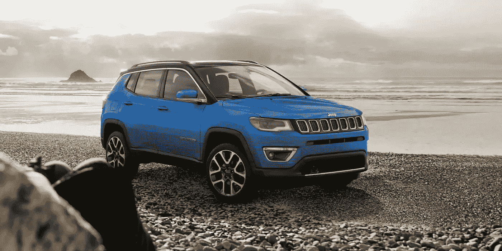
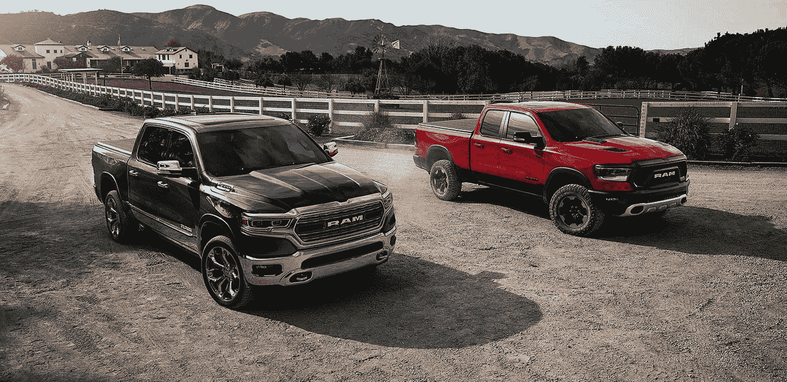
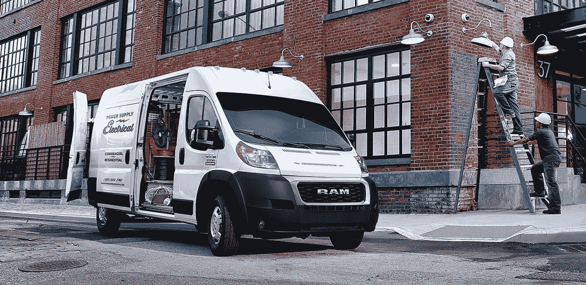
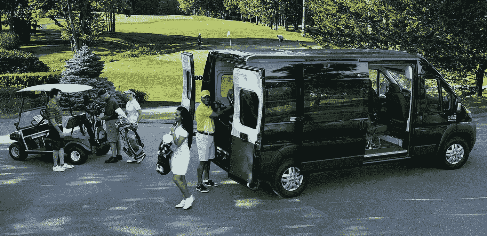
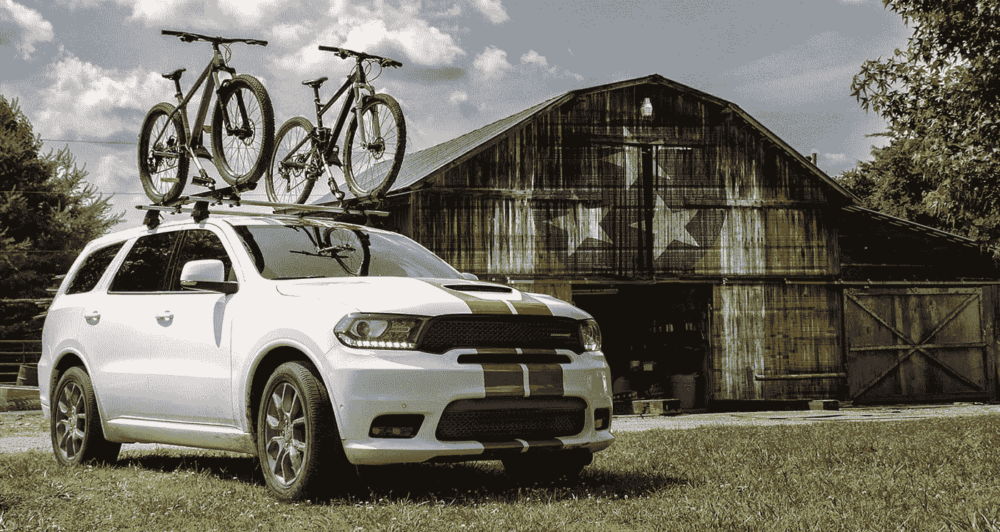
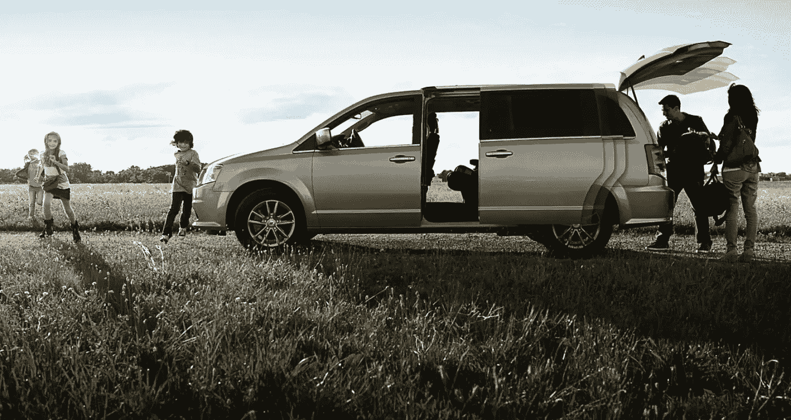

# 菲亚特-克莱斯勒比你想象的更有价值

> 原文：<https://medium.datadriveninvestor.com/fiat-chrysler-has-more-value-than-you-think-8bc3e005eb8?source=collection_archive---------5----------------------->

菲亚特-克莱斯勒比大多数投资者意识到的更有价值，因为日产和雷诺公司想要收购它。事实上，**日产汽车公司(OTCMKTS: NSANY)** 和雷诺正在考虑恶意收购**菲亚特-克莱斯勒汽车公司(NYSE: FCAU)** 。

彭博[声称](https://www.bloomberg.com/news/articles/2019-03-27/renault-seeking-nissan-merger-to-make-fiat-chrysler-bid-ft-says)为了解释雷诺管理层提议与日产合并以获得菲亚特克莱斯勒或 FCA 的资源。新闻文章委婉地称该提议为“合并”，但看起来像是接管。

雷诺想要菲亚特-克莱斯勒，因为这家法国公司是主要的汽车制造商之一，在北美没有重要的业务。菲亚特-克莱斯勒在北美拥有广受欢迎的道奇、Ram 和 Jeep 品牌。此外，在菲亚特-克莱斯勒的帮助下，日产可以提高其北美销量。

目前，雷诺拥有日产 43%的股份，日产拥有 15%的股份。这两家公司想要与**大众(VOW。德)**和**丰田(NYSE: TM)** 。此外，雷诺的大部分业务都依赖于不稳定的欧洲汽车市场。

# 为什么雷诺和日产想要菲亚特克莱斯勒

很容易理解为什么雷诺和日产想要菲亚特-克莱斯勒。它的一些品牌在北美很畅销。

例如，Jeep 2018 年在美国销售了 973，227 辆汽车，高于 2017 年的 828，522 辆， *FCAUAuthority* [估计](http://fcauthority.com/fiat-chrysler-automobiles/fiat-chrysler-automobiles-sales-numbers/jeep-sales-numbers/)。与此同时，克莱斯勒 2018 年在美国销售了 536，980 辆 Ram 皮卡，2017 年在美国销售了 500，723 辆皮卡， *Caresalesbase* [估计](http://carsalesbase.com/us-car-sales-data/ram/ram-pickup/)。

相比之下，日产集团 2018 年在美国销售了 148，720 辆汽车，2017 年销售了 121，847 辆汽车，一份新闻稿[透露](https://nissannews.com/en-US/nissan/usa/releases/nissan-group-reports-december-2018-and-2018-calendar-year-u-s-sales)。因此，日产并不是美国汽车行业的主要参与者。

事实上，仅菲亚特克莱斯勒(Fiat Chrysler)旗下品牌吉普(Jeep)在美国的销量就比日产集团(Nissan Group)高出近 10 倍。显然，日产和雷诺希望在美国皮卡和运动型多功能车(SUV)市场上占据更大份额。此外，获得这一份额的最简单方法是收购菲亚特-克莱斯勒。

毫不奇怪，菲亚特-克莱斯勒正在扩大吉普、公羊和道奇的生产。《财富》[报道](#2b03f79153c9)特别指出，FCA 将花费 45 亿美元升级底特律地区的六家工厂。明智的是，FCA 正在重组这些工厂，以生产 Jeep Wagoneer 和 Dodge Durango SUV。此外，Jeep 计划推出一款新的更大的 SUV，座位更多。

# 菲亚特-克莱斯勒正在与 Waymo 合作开发无人驾驶汽车

除了 Jeep 和 Ram 的受欢迎程度，菲亚特-克莱斯勒还与 Waymo 建立了合作伙伴关系。澄清一下，Waymo 是自动驾驶汽车初创公司 **Alphabet(纳斯达克股票代码:GOOG)** 拥有的。

 [## 在自动驾驶汽车发生事故的情况下，谁应该承担法律责任？-数据驱动型投资者

### 我仍然认为自动驾驶汽车是一种奢侈品，而不是必需品…

www.datadriveninvestor.com](https://www.datadriveninvestor.com/2018/11/02/who-is-legally-accountable-in-the-case-of-an-autonomous-vehicle-accident/) 

值得注意的是，据《财富》报道，Waymo 正在为其自动驾驶车队购买 62，000 辆克莱斯勒 Pacifica 小型货车。 [Waymo](https://marketmadhouse.com/will-waymo-boost-fiat-chrysler-automobiles-fcau/) 正在使用这些车辆用于 [Waymo One](https://medium.com/waymo/waymo-one-the-next-step-on-our-self-driving-journey-6d0c075b0e9b) ，这是一项在凤凰城地区测试的叫车服务。

因此，日产和雷诺可以与 Waymo 合作，并与菲亚特-克莱斯勒一起在自动驾驶汽车领域占据更强的地位。特别是，新的更大的吉普车有更多的座位，听起来非常适合自动乘车。

# 菲亚特克莱斯勒非常适合拼车

最后，菲亚特-克莱斯勒有能力通过道奇 Grand Caravan、克莱斯勒 Pacifica、Grand Wagoner 和道奇 Durango 等车型开发日益增长的乘车市场。澄清一下，那些较大的车辆包含大量的乘客和行李空间，这正是优步和 Lyft 司机想要的。

拼车市场很大，例如，美国有超过 75 万名优步司机，App s [估计](http://www.businessofapps.com/data/uber-statistics/)的*业务。此外，分析师对优步 2018 年的估值为 720 亿美元。*

此外，优步的美国竞争对手 Lyft 声称在美国和其他地方拥有超过 150 万名司机*，扩展漫谈* [报道](https://expandedramblings.com/index.php/lyft-statistics/)。此外，刚刚[举行](https://www.washingtonpost.com/business/2019/04/01/lyft-plunges-below-ipo-price-sending-cautionary-message-other-unicorns/?utm_term=.80137c2f1348)首次公开募股(IPO)的 Lyft 声称在 2018 年第四季度提供了 1.784 亿次乘车。

因此，日产和雷诺可以通过收购菲亚特-克莱斯勒来扩大在拼车领域的业务。此外，自动驾驶汽车可能会扩大菲亚特克莱斯勒在拼车领域的影响力。我认为，尤其是 Waymo One，如果其自动驾驶汽车技术可行，它可能会成为拼车领域的主要参与者。

# 菲亚特克莱斯勒赚钱了吗？

因此，菲亚特克莱斯勒汽车公司(Fiat Chrysler)处于有利地位，可以通过拼车和自动驾驶汽车在未来的交通运输中获利，但它现在赚钱了吗？

答案是肯定的，因为 FCA 报告称，2018 年第四季度的毛利为 177.02 亿美元，收入为 1263.18 亿美元。此外，菲亚特克莱斯勒报告 2018 年第四季度营业收入为 56.6 亿美元，净收入为 41.47 亿美元。

此外，菲亚特-克莱斯勒报告 2018 年第四季度自由现金流为 52.37 亿美元，运营现金流为 114.34 亿美元。最后，菲亚特克莱斯勒在 2018 年 12 月 31 日有 150.17 亿美元的现金和短期投资。

# 菲亚特克莱斯勒是一项价值投资

因此，FCA 有大量现金投资于扩张和新车型。重要的是，菲亚特-克莱斯勒把钱花在了能获得最大回报的地方；在北美卡车、SUV 和货车市场。

小型货车、SUV 和皮卡车没有跑车性感，但它们是美国人和加拿大人最喜欢的交通工具。事实上，大多数美国人；加拿大人的车道上停着一辆 SUV、一辆货车或一辆皮卡。因此，菲亚特-克莱斯勒正在制造北美人想要的汽车，并在汽车业务可能增长的领域进行投资。

因此，我认为**菲亚特克莱斯勒(纽约证券交易所代码:FCAU)** 在 2019 年 3 月 28 日交易的每股 15.43 美元是一项价值投资。此外，菲亚特-克莱斯勒计划于 2019 年 5 月 2 日支付 74₵特别股息，*《底特律自由报》* [报道](https://www.freep.com/story/money/cars/chrysler/2019/02/21/fca-stock-dividend/2941326002/)。

因此，日产和雷诺考虑收购菲亚特克莱斯勒是明智的。寻找廉价成长股和股息股的普通投资者最好调查一下菲亚特克莱斯勒汽车公司。

# **菲亚特-克莱斯勒比你想象的更有价值**

菲亚特-克莱斯勒的价值比大多数投资者意识到的要高，因为日产和雷诺想要收购它。事实上，**日产汽车公司(OTCMKTS: NSANY)** 和雷诺正在考虑恶意收购**菲亚特-克莱斯勒汽车公司(NYSE: FCAU)** 。

彭博[声称](https://www.bloomberg.com/news/articles/2019-03-27/renault-seeking-nissan-merger-to-make-fiat-chrysler-bid-ft-says)为了解释雷诺管理层提议与日产合并以获得菲亚特克莱斯勒或 FCA 的资源。新闻文章委婉地称该提议为“合并”，但看起来像是接管。

雷诺想要菲亚特-克莱斯勒，因为这家法国公司是主要的汽车制造商之一，在北美没有重要的业务。菲亚特-克莱斯勒在北美拥有广受欢迎的道奇、Ram 和 Jeep 品牌。此外，在菲亚特-克莱斯勒的帮助下，日产可以提高其北美销量。

目前，雷诺拥有日产 43%的股份，日产拥有 15%的股份。这两家公司想与像**大众这样的汽车巨头竞争。德)**和**丰田**。此外，雷诺的大部分业务都依赖于不稳定的欧洲汽车市场。

# **为什么雷诺和日产想要菲亚特克莱斯勒**

很容易理解为什么雷诺和日产想要菲亚特-克莱斯勒。它的一些品牌在北美很畅销。

例如，Jeep 2018 年在美国销售了 973，227 辆汽车，高于 2017 年的 828，522 辆， *FCAUAuthority* [估计](http://fcauthority.com/fiat-chrysler-automobiles/fiat-chrysler-automobiles-sales-numbers/jeep-sales-numbers/)。同时，克莱斯勒 2018 年在美国销售了 536，980 辆 Ram 皮卡，2017 年在美国销售了 500，723 辆皮卡， *Caresalesbase* [估计](http://carsalesbase.com/us-car-sales-data/ram/ram-pickup/)。

相比之下，日产集团 2018 年在美国销售了 148，720 辆汽车，2017 年销售了 121，847 辆汽车，一份新闻稿[透露](https://nissannews.com/en-US/nissan/usa/releases/nissan-group-reports-december-2018-and-2018-calendar-year-u-s-sales)。因此，日产并不是美国汽车行业的主要参与者。

事实上，仅菲亚特克莱斯勒(Fiat Chrysler)旗下品牌吉普(Jeep)在美国的销量就比日产集团(Nissan Group)高出近 10 倍。显然，日产和雷诺希望在美国皮卡和运动型多功能车(SUV)市场上占据更大份额。此外，获得这一份额的最简单方法是收购菲亚特-克莱斯勒。

毫不奇怪，菲亚特-克莱斯勒正在扩大吉普、公羊和道奇的生产。《财富》杂志[报道](#2b03f79153c9)特别指出，FCA 将花费 45 亿美元升级六家底特律地区的工厂。明智的是，FCA 正在重组这些工厂，以生产 Jeep Wagoneer 和 Dodge Durango SUV。此外，Jeep 计划推出一款新的更大的 SUV，座位更多。

# **菲亚特-克莱斯勒正与 Waymo 合作研发无人驾驶汽车**

除了 Jeep 和 Ram 的受欢迎程度，菲亚特-克莱斯勒还与 Waymo 建立了合作伙伴关系。澄清一下，Waymo 是自动驾驶汽车初创公司 **Alphabet(纳斯达克股票代码:GOOG)** 拥有的。

值得注意的是，据《财富》报道，Waymo 正在为其自动驾驶车队购买 62，000 辆克莱斯勒 Pacifica 小型货车。 [Waymo](https://marketmadhouse.com/will-waymo-boost-fiat-chrysler-automobiles-fcau/) 正在使用 [Waymo One](https://medium.com/waymo/waymo-one-the-next-step-on-our-self-driving-journey-6d0c075b0e9b) 的车辆，这是一项在凤凰城地区测试的叫车服务。

因此，日产和雷诺可以与 Waymo 合作，并与菲亚特-克莱斯勒一起在自动驾驶汽车领域占据更强的地位。特别是，新的更大的吉普车有更多的座位，听起来非常适合自动乘车。

# **菲亚特克莱斯勒非常适合拼车**

最后，菲亚特-克莱斯勒有能力通过道奇 Grand Caravan、克莱斯勒 Pacifica、Grand Wagoner 和道奇 Durango 等车型开发日益增长的乘车市场。澄清一下，那些较大的车辆包含大量的乘客和行李空间，这正是优步和 Lyft 司机想要的。

拼车市场很大，例如，美国有超过 75 万名优步司机，App s [估计](http://www.businessofapps.com/data/uber-statistics/)的*业务。此外，分析师对优步 2018 年的估值为 720 亿美元。*

此外，优步的美国竞争对手 Lyft 声称在美国和其他地方拥有超过 150 万名司机*，扩展漫谈* [报道](https://expandedramblings.com/index.php/lyft-statistics/)。此外，刚刚[举行](https://www.washingtonpost.com/business/2019/04/01/lyft-plunges-below-ipo-price-sending-cautionary-message-other-unicorns/?utm_term=.80137c2f1348)首次公开募股(IPO)的 Lyft 声称在 2018 年第四季度提供了 1.784 亿次乘车。

因此，日产和雷诺可以通过收购菲亚特-克莱斯勒来扩大在拼车领域的业务。此外，自动驾驶汽车可能会扩大菲亚特克莱斯勒在拼车领域的影响力。我认为，尤其是 Waymo One，如果其自动驾驶汽车技术可行，它可能会成为拼车领域的主要参与者。

# **菲亚特克莱斯勒赚钱了吗？**

因此，菲亚特克莱斯勒汽车公司(Fiat Chrysler)处于有利地位，可以通过拼车和自动驾驶汽车在未来的交通运输中获利，但它现在赚钱了吗？

答案是肯定的，因为 FCA 报告称，2018 年第四季度的毛利为 177.02 亿美元，收入为 1263.18 亿美元。此外，菲亚特克莱斯勒报告 2018 年第四季度营业收入为 56.6 亿美元，净收入为 41.47 亿美元。

此外，菲亚特-克莱斯勒报告 2018 年第四季度自由现金流为 52.37 亿美元，运营现金流为 114.34 亿美元。最后，菲亚特克莱斯勒在 2018 年 12 月 31 日有 150.17 亿美元的现金和短期投资。

# **菲亚特克莱斯勒是一项价值投资**

因此，FCA 有大量现金投资于扩张和新车型。重要的是，菲亚特-克莱斯勒把钱花在了能获得最大回报的地方；在北美卡车、SUV 和货车市场。

小型货车、SUV 和皮卡车没有跑车性感，但它们是美国人和加拿大人最喜欢的交通工具。事实上，大多数美国人；加拿大人的车道上停着一辆 SUV、一辆货车或一辆皮卡。因此，菲亚特-克莱斯勒正在制造北美人想要的汽车，并在汽车业务可能增长的领域进行投资。

因此，我认为**菲亚特克莱斯勒(纽约证券交易所代码:FCAU)** 在 2019 年 3 月 28 日交易的每股 15.43 美元是一项价值投资。此外，菲亚特-克莱斯勒计划于 2019 年 5 月 2 日支付 74₵特别股息，*《底特律自由报* [报道](https://www.freep.com/story/money/cars/chrysler/2019/02/21/fca-stock-dividend/2941326002/)。

因此，日产和雷诺考虑收购菲亚特克莱斯勒是明智的。寻找廉价成长股和股息股的普通投资者最好调查一下菲亚特克莱斯勒汽车公司。