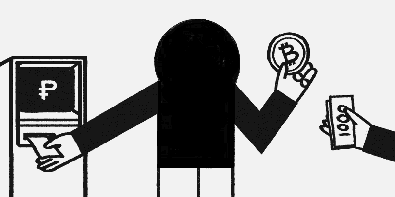
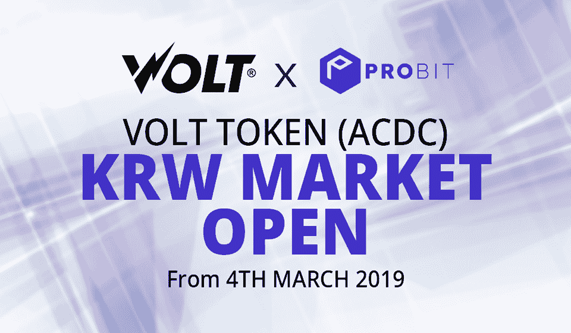

# FIAT RACE:为什么加密交易所需要“传统货币”？

> 原文：<https://medium.datadriveninvestor.com/fiat-race-why-do-crypto-exchanges-needs-traditional-currencies-f5eacaed0b92?source=collection_archive---------21----------------------->

如果不能换成法币，加密货币会如此流行吗？

也许每个投资加密货币的投资者都设定了一个目标，那就是赚真金白银。很少有人会仅仅为了支持创业公司(还记得 coin grow 的炒作)，超级新的想法而投资，因为安全或者这是日常生活中使用加密货币的一种简单方式。

去年 2018 年，所有人都感受到了加密货币与法定货币(即真实货币)之间的联系，比特币的下跌，失败的 ICO，中国拒绝接受加密货币以及“泡沫”的破裂放松了许多商业项目。

如何保存已经开始的项目，并恢复加密交换？

**菲亚特赛车**

今天，看到 Huobi Global、币安、Probit、EXMO 和其他大型加密交易所宣布进入加密菲亚特市场就不足为奇了。今天，世界各地的用户都可以交易菲亚特，并轻松地与银行进行交易。

> [DDI 编辑推荐—认证加密货币交易商](http://go.datadriveninvestor.com/cryptotrader/matf)

所有这些变化都是由于密码交易所之间的竞争而发生的，为了交易所的利益在寻找一个点——<contact with="" fiat="" money="">。2018 年的交易平台开始推出与传统货币的交易对，还扩大了现金存取款机的服务。</contact>

这项服务成为交易平台的又一安全保障。由于汇率不稳定，客户不确定他们是否能够盈利，扩大交易所的过程变得更加复杂。但是，随着对客户的创新，它已经成为一个眼睛痛的景象。现在，你可以从银行卡中直接向交易所发送法定货币。同意，总比找第三方，私下交流的形式，收费高。

**全球密码交易所**

许多加密交易所在新加坡、美国和马耳他设立了办事处，这使得通过与银行合作直接进行菲亚特交易成为可能。

比如火币开通了与美元配对的比特币、以太坊、Stablecoin 系绳等交易。最低订单金额设定为 100 美元。世界各地的客户都可以利用这一新选项。用户需要通过 KYC 和反洗钱检查才能继续交易。2018 年，币安开始与英镑和欧元配对交易比特币和以太坊。

韩国也是一个拥有大量加密查询的发达国家。有 10 多家加密交易所提供韩元交易。现在最流行的是 UPbit、ProBit、Bithumb、Coinone、Korbit、Gopax 等。用户有机会用韩元进行交易，还需要注意的是，交易所在美国、新加坡、香港等国家设有办事处，为全球提供服务。

日元是世界上第一种用于交易加密货币的货币。根据 Coinhills 的研究，自去年年底以来，日元是继美元之后比特币(BTC)最畅销的法定货币。日元(JPY)排名第一，以极小的差距领先于美元(分别为 48.34%和 43.77%)。韩元以 6%位居第三。日本的加密交易所也提供交易日元的机会，如 Bitfinex、Bitflyer、Coincheck 和 Zaif。

[https://prostocoin.com/blog/fiat](https://prostocoin.com/blog/fiat)

美国、新加坡、白俄罗斯、马耳他、韩国和日本等国家长期以来一直受益于加密货币。在欧洲，各国已经改变了对加密货币、区块链技术的看法，并正在引入国家层面使用的法律法规。也许很快我们就能看到更多的国家货币将在世界市场上交易，因为技术是发展的引擎。

**回到未来**

我认为在不久的将来，将不再需要中间人<exchangers>的服务，因为加密交易所增加了服务并降低了直接与银行交易的费用。更不用说他们的不安全感，当业主们带着客户的钱消失了。这种工具一直存在，并将继续存在，而这就是当局让其公民的生活更加安全的意愿。</exchangers>

正如我们所看到的，加密货币的销售和购买并没有减少，有更多的人对投资加密货币感兴趣，比特币和其他硬币的增长速度只是证明了这一点。

通常，西方国家使用某项特定技术的过程会增加发展中国家加速使用它们的速度，因此我们正在等待更多国家开始规范加密货币的概念，以及更先进的法律来引入新技术。以及更高级别的密码交换。