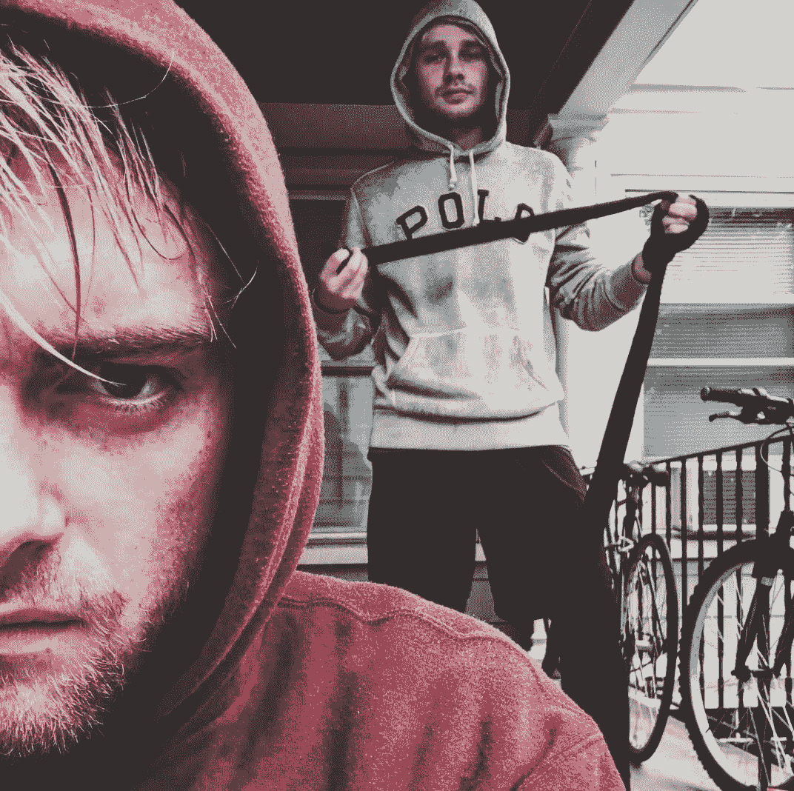
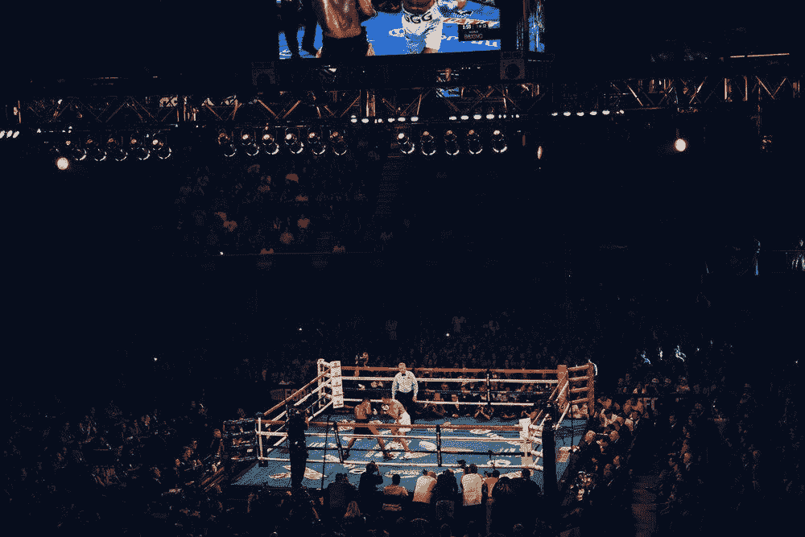
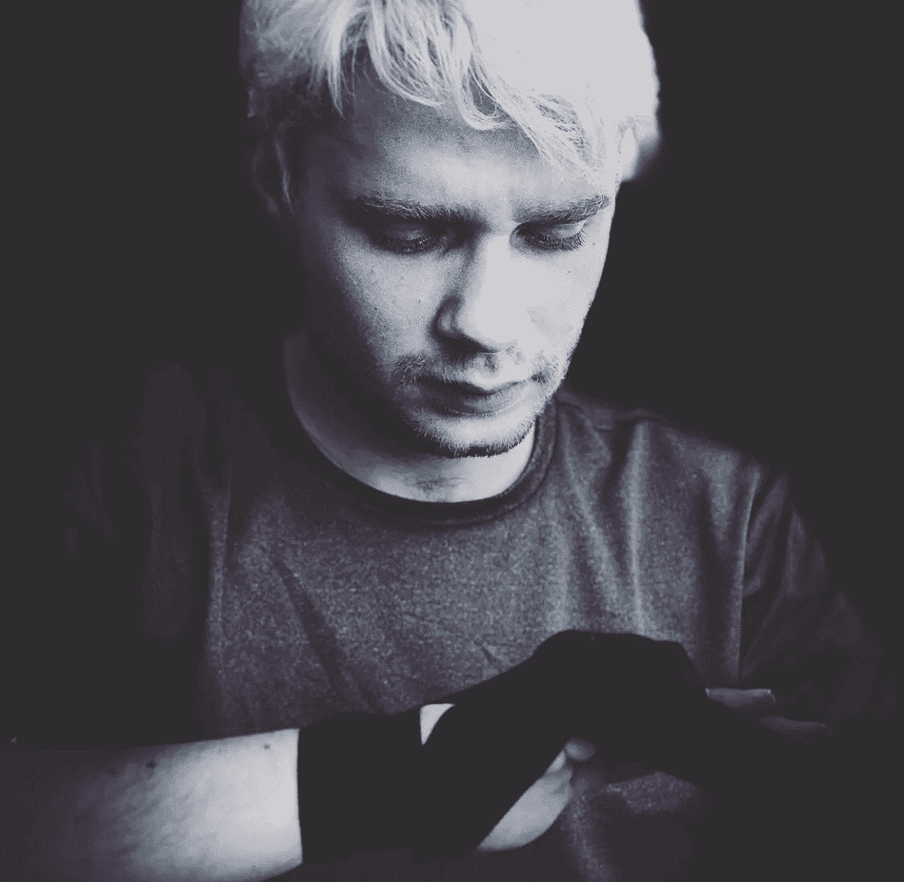
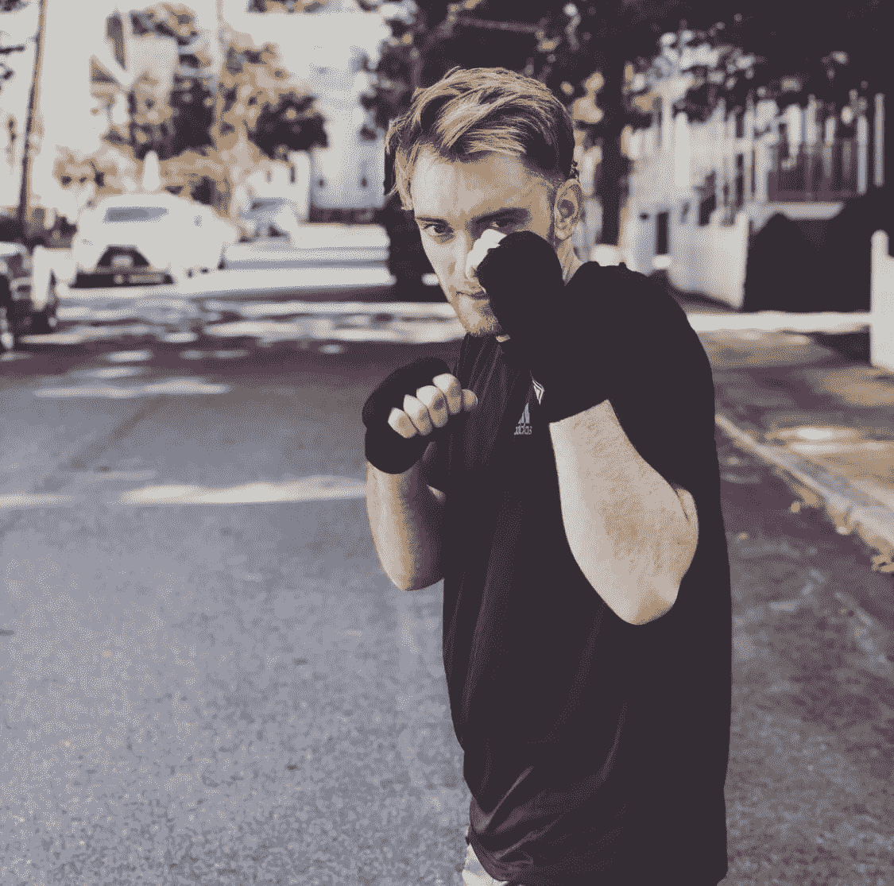

# 战斗的朋友:拳击和货币化

> 原文：<https://medium.datadriveninvestor.com/fighting-friends-boxing-monetization-27d5f0a09b90?source=collection_archive---------8----------------------->

[James Clarke- Instagram](https://www.instagram.com/jamesclarke93/)

说到创新的想法，你有没有想过将你和你的朋友想出来的活动货币化？我不确定这是否完全是真的，但可以肯定的是，你有过这样的对话，你可能太陶醉了，以至于无法用你独特的稀释视角去思考赚钱的方法。你和一个朋友在酒吧，你想出一个手工酿造，将取代足球尾门百威啤酒，对不对？此时，你可以想象一下《老友记》第集，剧组在他们的公寓里设立了一个酒吧。好主意！好吧，我可能是酒吧里那个当时想写文章的朋友，但炒作可能是真的。你能在公共场合痛打对方并获得金钱奖励吗？

情况可能就是这样；让我们仔细看看。

**对运动的热爱。**尽管这个想法看起来很疯狂，但有组织的战斗可能已经从勇敢的参赛者那里产生了收入，这些参赛者在人类记忆所及的时间里，在挑战身体极限的比赛中进行肉搏战。更详细地说，你肯定看过拉塞尔·克罗在《T4:角斗士》中的打斗。这部电影讲述了一系列公共事件，无疑是罗马时代的娱乐选择。在更现代的环境中，我们可能会在一场广为宣传的拳击比赛或其他有组织的体育赛事中为我们这个时代的伟大斗士喝彩。

相比之下，赤裸裸的街头斗殴不会吸引足够的注意力来利用观众参与和花钱的意愿。然而，它确实吸引了人们的注意力。这种类型的事件激发了人类天生的好奇心，引起了人们的兴趣。这可能是为什么康纳·麦格雷戈和弗洛伊德·梅威瑟在公众面前展示他们的跨组织活动，我们注意到了。这场特殊的比赛可能不会有数百万美元，但通过合法化的方式利用对这项运动的热爱仍然是可以把握的。

**准备。朋友们在酒吧谈论一起组织一场拳击比赛似乎并不完全有效，除非你看一看与努力相关的准备工作。当你开始谈论饮食制度和日常锻炼时，你可能会开始注意到所付出的努力。这时，你可能会想，怎么会有人把糖的摄入量限制在每天只吃一粒葡萄干。你甚至可能会惊讶于你的朋友没有喝酒，并早早离开去准备第二天的例行公事。**

人们总是喜欢看拳手们为了娱乐而相互争斗。此外，有一些有效的准备进入战斗，但一个问题仍然存在。

> 这场拳击赛怎么才能货币化？

**升职。当战斗发生时，人们需要知道这件事。这是现代通过社会媒体活动进行营销的地方。让我们不要忘记脸书和来自广泛国际和不同背景的各种朋友的力量。据 business 的[希金斯称，仅在脸书，每个用户的平均好友数量就在 338 左右。](https://www.bustle.com/articles/158302-the-ideal-number-of-best-friends-is-lower-than-you-think-but-dont-start-dropping-people)然而，在朋友之间分享事件并要求他们随后分享该事件之前，需要有一个事件来分享。借助脸书平台和其他知名平台(如 Eventbrite ),举办活动从未如此简单。他们选择了 Eventbrite 平台作为首选。这是他们的[事件](https://www.eventbrite.co.uk/e/jc-vs-tr-amateur-boxing-fight-tickets-50751352662)！**

如果项目真正取得成果，货币化方面处于决策的最前沿，我的同事们必须专注于他们自己的个人品牌和推广。作为这样做的一种手段，他们已经开始拍摄和创建一个故事线，为他们作为崭露头角的职业拳击手的旅程做准备。他们也没有忘记世界上任何一个拳击组织的拳手们都梦寐以求的金腰带。这种材料的延续和潜在的聚合将是至关重要的，以创造这种永无止境的吹嘘权利的虚构斗争所需的关注。人们需要与战士们建立联系，把他们视为表演者，参与他们的战斗。在穆罕默德·阿里像蝴蝶一样飘，像蜜蜂一样蛰之前，他在旁观者眼中是谁？不仅需要大肆宣传，而且这种宣传对任何潜在的参与者来说都必须是切实可见的。

**场地。如果你曾经参加过职业体育赛事，比如去看芬威公园的波士顿红袜队比赛，你可能会同意，一半的乐趣是在一个除了赛事本身还有更多体验的地方。第一次在不太知名的对手之间进行拳击比赛，场地肯定会成为吸引观众的一个因素。由于争斗可能会在相当短的时间内戛然而止，一个建议可能是把一系列的争斗串在一起，我的同事可以把它们作为头条新闻。另一个建议是选择一个有其他吸引人的地方，如特许经营或现场音乐，以鼓励活动中更多的人流量。此外，困难的部分将是在融资和工作人员的活动，以便拳击可以开始。**

[Joel Muniz -Unsplash](https://unsplash.com/photos/lUK16p_JtCM)

**职业拳击作为指导。众所周知，如今的拳击比赛有可能赚大钱。金钱奖励方面的成功秘诀与这项运动的组织和管理有很大关系。在早期，拳击行业的先驱们，比如由美国传统的[Joseph D ' o ' Brian](https://bizfluent.com/how-5006693-start-boxing-promotion-business.html)精心制作的 Tex Rickard，向他们的拳手们保证奖金，以确保他们能从血腥的相互殴打中获得经济利益。在这个项目的初期，可能值得考虑从招生中建立一个资金池来将他们的努力货币化。由于我的同事也将专注于比赛的准备工作，因此让第三方赞助商为他们组织比赛可能对他们最有利。**

如果没有第三方参与，那就有很多需要仔细计算和组织的事情。根据 bizfluent 、的 [DeBenedetti 的说法，也有不同的法律规定，发起人必须获得各自州的许可才能在那里经营。此外，推广者也是将拳手匹配到合适对手并获得合适场地的绝佳联系人。他们肯定会遇到的许多管理和监管难题都可以解决，这样他们就可以专注于他们的身体和健康目标和能力。](https://bizfluent.com/how-5006693-start-boxing-promotion-business.html)

**前路漫漫。毫无疑问，这是一项有趣且令人兴奋的努力，我的同事们不仅有健身的潜力，还有赚钱的潜力。仔细的准备和计划将会使这个项目圆满结束。如果他们不选择使用推广者，他们将需要在监督关键决策和平衡活动规划准备的许多旋转盘子时保持真正的企业家精神。**

如果你想继续关注他们在通往荣耀之路上的故事，请关注更新和新的发展。Instagram feeds 的链接见下文。

最诚挚的问候，

[李理查森](https://medium.com/@lee.richard)

*请随时关注更多类似主题的作品-名称链接到媒体上的个人资料。*

[**维克托·罗根**](https://www.instagram.com/victor_rogen/)

> “有时候，只需要一个想法就可以开始一件伟大的事情。无论从运动的角度还是职业的角度来看，获得新的技能对我来说都是一次奇妙的经历。我可以推荐大家去追求自己的想法，忘掉那些怀疑你的人。”

[**詹姆士·克拉克**](https://www.instagram.com/jamesclarke93/)

> “我想说，到目前为止，我在拳击中学到的最多的是，这不仅仅是挥拳；擂台内外的训练是建立你的心理游戏的关键，你的训练也是如此。当你真正训练并理解运动员在为这项运动做出如此大的牺牲时必须做出的难以置信的承诺时，你就会学会更加尊重这项运动。”