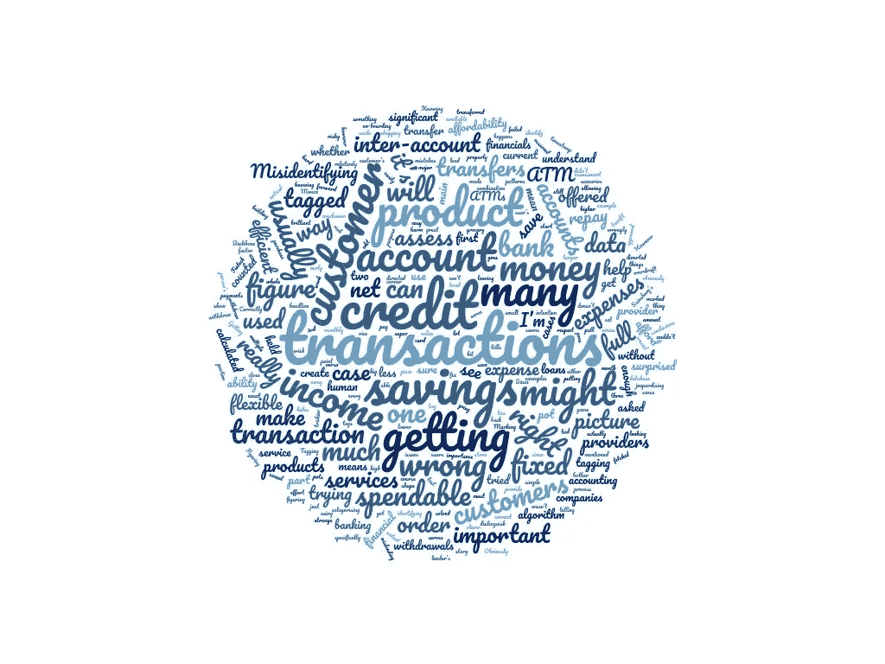

# 计算交易数据

> 原文：<https://medium.datadriveninvestor.com/figuring-out-transaction-data-f0bab90c9b94?source=collection_archive---------12----------------------->

在建立 Backbone 的过程中，我测试了许多金融科技产品，以了解他们的数据如何用于信用风险评估。

看到这些公司中有多少努力理解用户的银行交易，我并不感到惊讶。然而，令我惊讶的是，他们中有多少人在很大程度上犯了错误。

## 为什么做对很重要？

我注意到使用银行交易数据的两个主要用例，它们是帮助客户创建储蓄罐和评估客户是否能负担得起信贷产品。

为了帮助顾客建立一个储蓄罐，重要的是要了解顾客的净可消费收入是多少，以及其中有多少可以存入储蓄罐。
就信贷产品而言，了解他们有多少可用收入可以用来偿还贷款是很重要的。

在这两种情况下，获得净可支出收入是服务高效且适合客户的关键因素。当计算出的净可支出收入低于实际收入时，客户要么不会尽可能多地储蓄，要么在信贷产品的情况下，不会被批准使用信贷产品。
当计算出的净可消费收入高于实际收入时，客户可能会透支，因为太多的钱被挪用于储蓄，如果是信用贷款，他们可能无法偿还贷款。

因此，为了拥有一款高效的产品，既能服务于客户，又不会危及他们的财务状况，同时还能让他们最大限度地受益于该产品，企业必须做好这一点。

## **他们错在哪里？**

我见过的三大错误是:

1.不了解全部情况

2.不考虑账户间转账

3.错误识别交易

**不了解全貌**

在使用我尝试过的服务时，我通常会被问及我希望他们连接到哪个银行账户。这个过程通常假设我只使用一个。

一旦获取了我的交易，服务就不会费心去弄清楚它们正在获取的交易是否讲述了整个金融故事。显然，当试图评估一个人的储蓄能力或信用承受能力时，只获得其财务状况的一部分会非常误导人。

问题是，任何人看到交易都会马上发现有什么不对劲，那么为什么算法不能发现呢？

当试图评估信贷产品的可负担性时，这尤其具有风险，因为这可能很容易被用来利用贷方的算法来显示高的可消费收入，而客户的其他账户情况不佳。

**账户间转账不入账**

我肯定不是只有我一个人在同一家银行有储蓄账户和活期账户。当一个人有这些账户时，可能会有一些从活期账户到储蓄账户的转账，反之亦然。我尝试的一些服务足够聪明，可以从我的主要银行提供商持有的所有账户中提取交易。然而，他们都无法识别账户间转账。
这意味着我转入储蓄账户的钱被计为费用，而我从储蓄账户取出的钱被计为收入。这显然是计算这些交易的错误方法，可能会导致服务提供商得出错误的结论。

奇怪的是，这部分真的很容易搞清楚。这些转账通常标有非常接近的时间戳，金额完全相同。搞清楚它们互相抵消有多难？

当试图评估客户存钱或购买信贷产品的能力时，知道客户有一个储蓄账户并知道账户间转账的模式是一项重要的数据，但似乎没有正确使用。

**误识别交易**

这是这些提供商在对交易进行分类时犯的许多小错误的标题。

正确识别事务及其目的非常重要。重要性在于大多数信贷和储蓄提供者区分固定月支出和灵活支出的意图。
将太多的交易标记为固定费用可能意味着向客户提供的储蓄将少于他们能够储蓄的，或者向客户提供的信贷将少于他们实际能够提供的。另一方面，将太多的交易标记为灵活可能意味着太多的钱将被用于储蓄，没有足够的钱来支付账单等，或者在信贷的情况下，客户可能会获得他们无法偿还的信贷产品。

几个交易出错的例子:

将信用卡付款标记为一笔大额购买——这意味着该交易将被标记为固定支出，因为它每个月都会发生，但它实际上隐藏了多个固定和灵活支出的更大画面。这又回到了掌握全局的第一点。

误识别自动柜员机提款——由于许多自动柜员机提款不是在银行自动柜员机上进行，而是在其他自动柜员机上进行，因此在许多情况下它们被错误地标记。例如，如果你在 Sainsbury's 的自动取款机上取钱，这些交易通常被标记为杂货店购物，通常被标记为固定费用，尽管它并不一定是固定费用。

## **总之**

开放式银行为金融科技公司提供了大量数据，他们可以利用这些数据来让自己的产品变得更好。获得正确的银行交易应该是任何金融服务提供商的基石，以便制造一种高效的产品，为他们的客户提供巨大的价值，而不会使他们受到伤害。

我提到的前两个问题相对容易解决。第三个问题有点棘手，但通过人类和人工智能的结合，这个问题可以解决。在这方面，Monzo 早期所做的工作，当他们要求用户标记或编辑交易标记时，是一种创建交易标记数据库的出色方式，我相信这将对他们的未来有很大帮助。