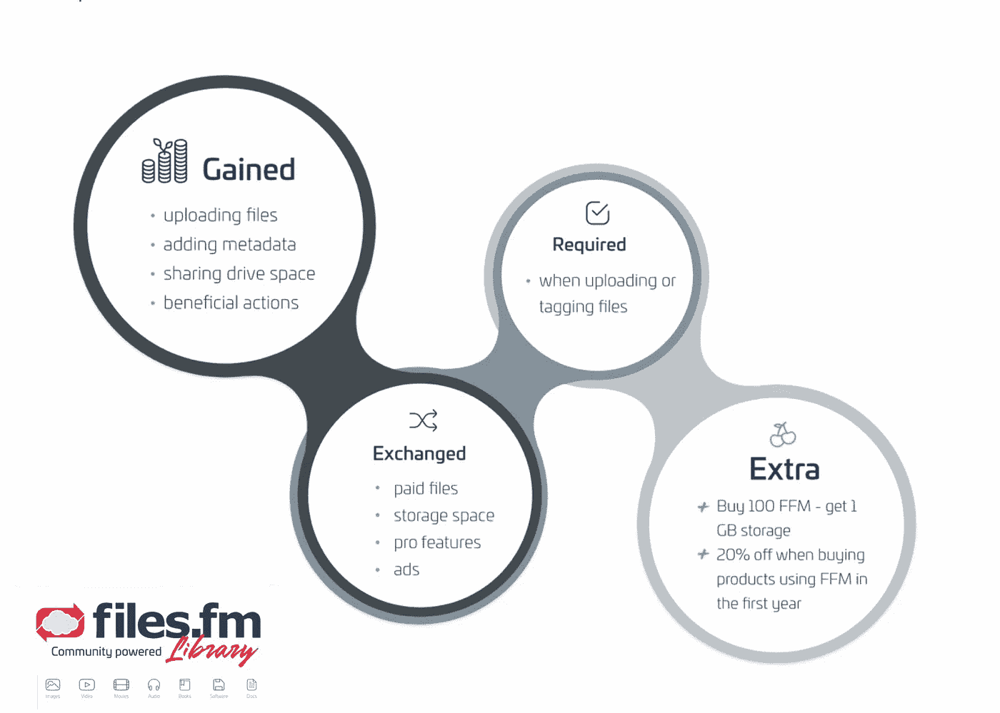
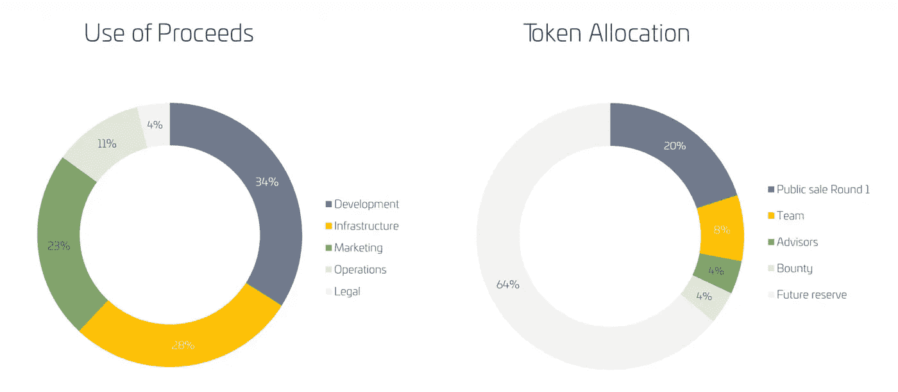
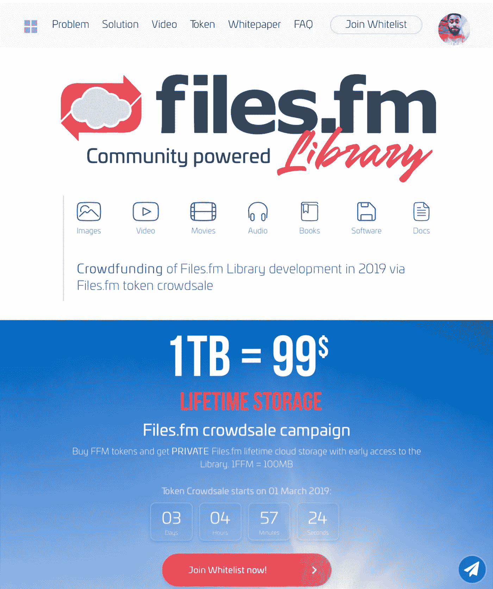
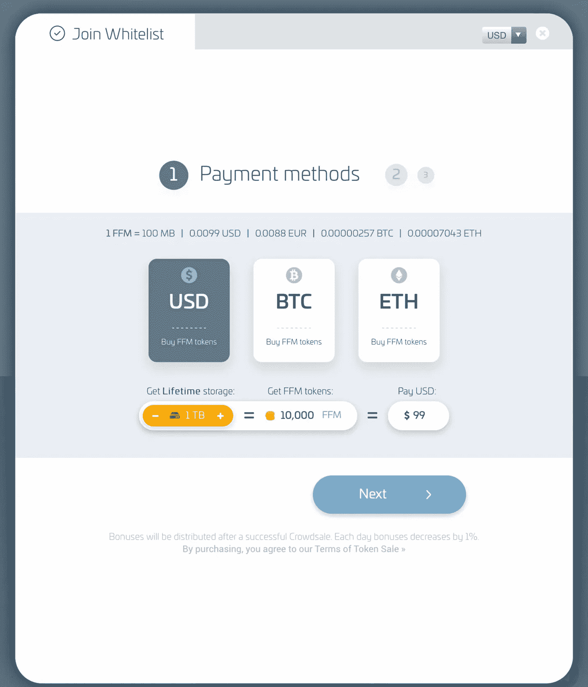
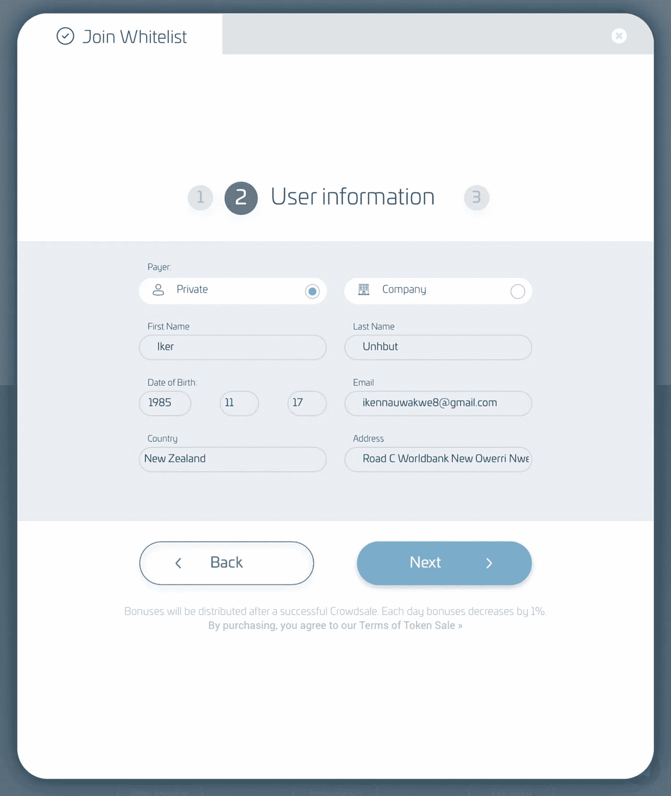
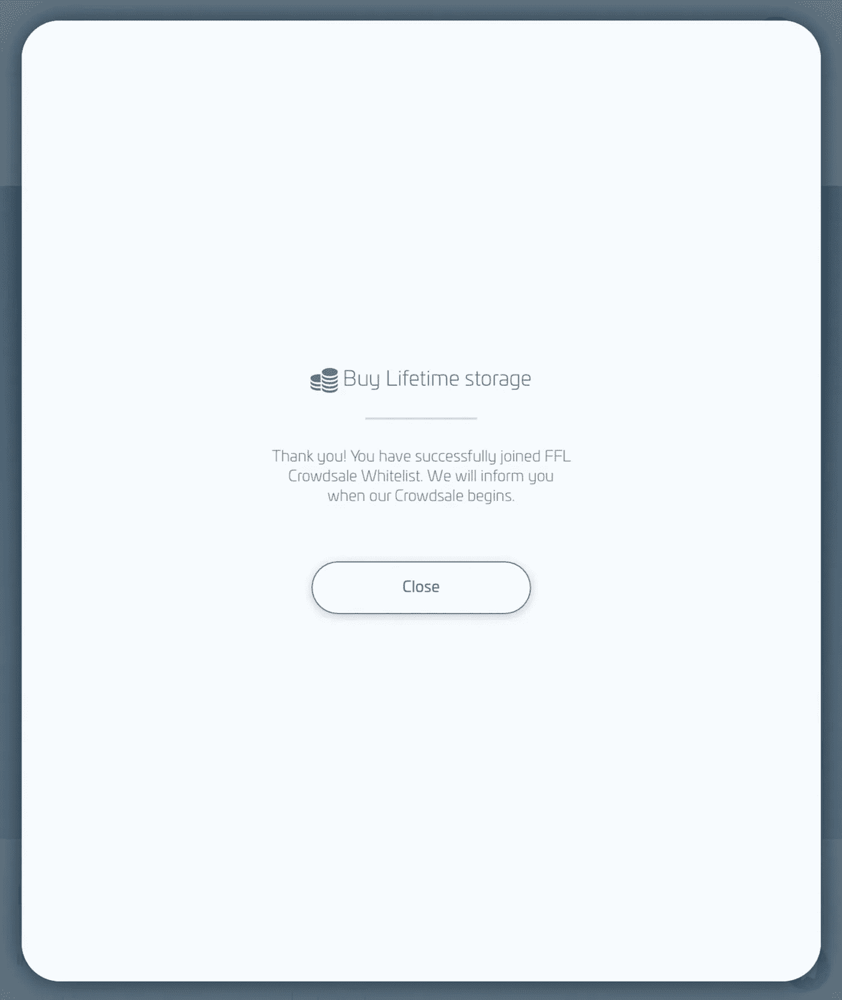

# 文件。详细的代币经济

> 原文：<https://medium.datadriveninvestor.com/files-fm-the-detailed-token-economy-984e807e1f66?source=collection_archive---------17----------------------->

文件。Fm 是一家在英国和拉脱维亚注册的内容交付公司，成立于 2007 年。拥有来自全球超过 750，000 名注册用户的客户群，每月至少有超过 170 万的在线流量。与众多建立在多年交付和信任基础上的合作伙伴一起，推出了世界上第一个半分散式 P2P 内容交付库。有了一个已经运行的平台，文件。Fm Iibrary 是由一个经验丰富的团队设计的，该团队在 IT 和区块链技术方面拥有经过测试和信任的知识库超过十年。该团队在管理大型数据流和服务器负载方面拥有丰富的经验，例如点对点视频流、大规模文件存储和共享、torrent 半分散支持、web torrents 和文件商店。

# 为什么使用区块链和代币？

区块链开启了一系列机会，如令牌化系统，以取代传统的信用和礼品卡佣金。FFM 是文件的代号。Fm 库本机令牌。这些 FFM 令牌是 ERC-20 兼容的，因此基于以太坊区块链，因为它们是区块链技术的基础。实施私有侧链，以提高平台在大规模区块链上的速度，并降低交易成本。

# FFM 公用令牌有什么作用？

拥有令牌将允许您访问特殊功能，如按消费付费存储模式。FFM 代币将允许用户、实干家、顾客和创造者成为平台经济和价值的一部分。

# 令牌分发

这家跨国金融科技公司推出了众筹销售，预计至少有 200 万美元的软资本，以启动该项目。通过这个众筹计划，它现在的目标是促进市场增长，减少营销和运营预算等预算。虽然一个高调的混合平台充满了集中和分散的文件共享和内容交付系统的功能，但总的硬性上限只有 1000 万美元。这些资金将用于营销活动、分类法律法案、未来平台项目以及维护和扩展文件。调频地平线深入到无限的网络空间。

FFM 代币的总供应量固定在 100 亿 FFM，其中 20 亿将分配给代币生成活动，计划于 2019 年 3 月 1 日启动。内部 FFM 代币的初始销售价格以 1 FFM 兑 0.01 美元的汇率标示(也相当于欧元、BTC 和瑞士法郎)。FFM 代币的交易也可以用法定货币(欧元和美元)、加密货币(BTC 和瑞士法郎)以及电汇(如果需要的话)进行。价值 0.01 美元的单个令牌也相当于文件上 10 兆字节(10 MB)的存储空间。调频数据库。未来计划向系统添加更多令牌以及更多存储 Pb，以便在用户需要与文件交互时为他们提供类似 flash 的上传和下载体验。Fm 协议无论内容大小都以闪电般的速度在飞。

由于对能够或不能参与的国家数量没有限制，这个特性本身就美化了文件。口味独特的咸味 Fm 众筹。只要你有一个有效的用户账户& ID，只需注册 https://files.fm/library/,，几乎任何人都可以参与众筹活动。允许购买的最低金额为价值 100 美元的 FFM 币，根据汇率最高可达 10000 FFMs。向购买者暴露了文件上 100 GB 存储空间的终身风险。Fm 私有云。

加入这些文件。Fm crowdsale 简单易用，只需遵循几个步骤；

# 步骤:

1.  访问 https://files.fm/library/，并注册平台

2.点击加入白名单

3.选择您的付款方式

4.填写用户特定的信息

网站:https://library.files.fm/?utm _ source =赏金

白皮书:https://fv1-1.failiem.lv/down.php?I = 952 tqfun & download _ checksum = 3d BF 560 c 557 a68b 964d 99 CFBB 768d 89 ea 405 e2ea & download _ timestamp = 1550763125

中等:https://medium.com/@files.fm

电报:https://t.me/filesfm

安·斯莱德:https://bitcointalk.org/index.php?topic=4949343.0

作者的 Bitcointalk:[https://bitcointalk.org/index.php?action=profile;u=2187995](https://bitcointalk.org/index.php?action=profile;u=2187995)