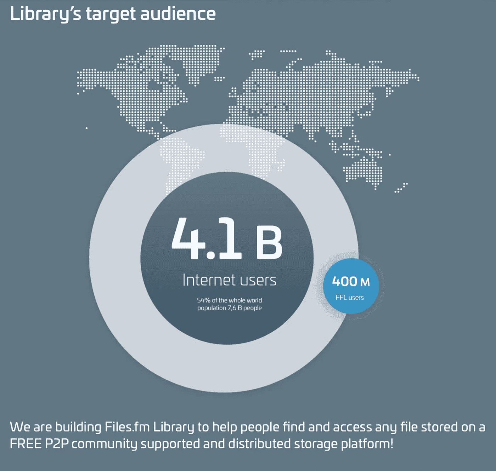
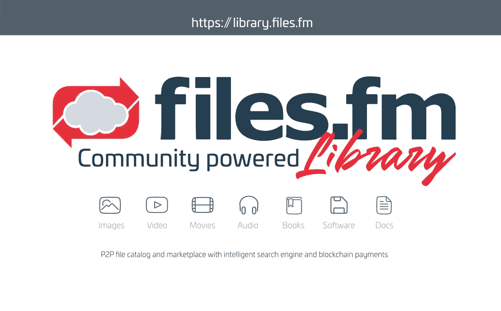
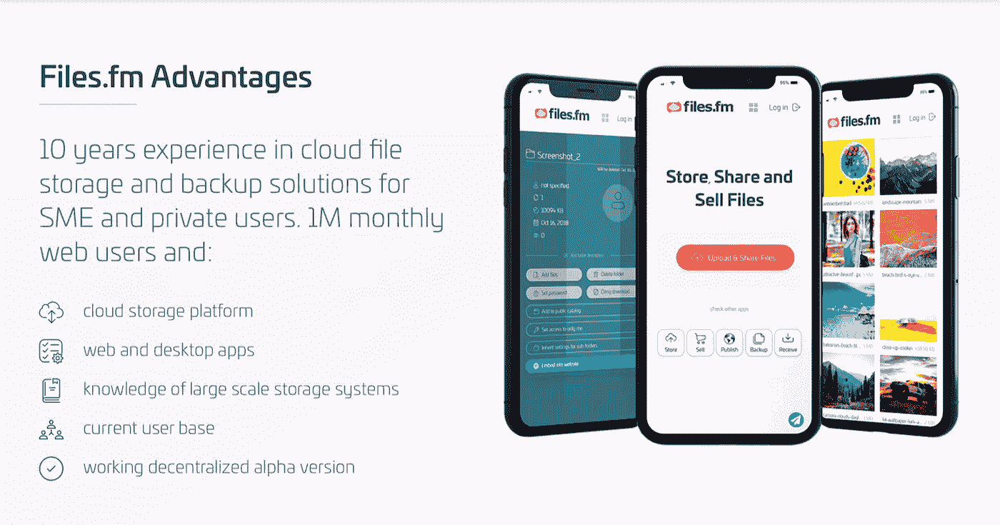
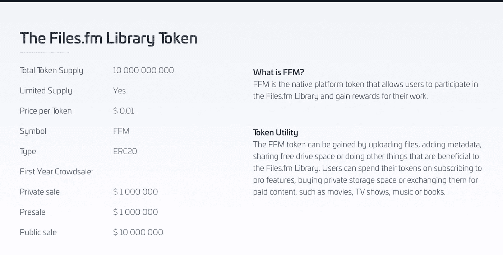
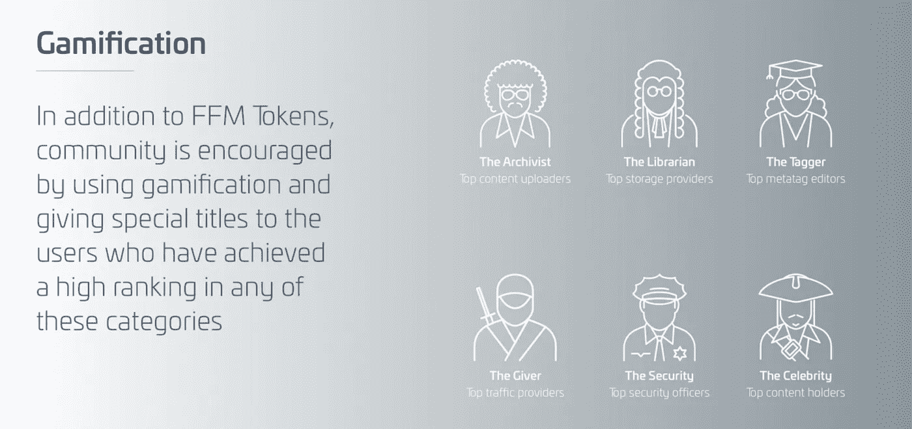

# 文件。Fm:面向所有人的半分散式云共享库。

> 原文：<https://medium.datadriveninvestor.com/files-fm-the-semi-decentralized-cloud-sharing-library-for-all-a288a1ab2f27?source=collection_archive---------9----------------------->

# 文件。调频平台功能

据信，引入用户友好且非盗版的对等技术将有助于减少现代内容传送系统中的盗版。自从在线流内容传送系统网飞建立以来，BitTorrent 用户数量的减少就证明了这一点。

文件。Fm Library (FFL)被设计为一个具有半分散架构的生态系统，因为它将现有的数字内容生成和存储原则与更近的分散技术融合在一起。作为面向社区的文件共享协议。Fm Library 将包含一个文件搜索引擎和目录系统，确保该系统与任何浏览器兼容。它保留了浏览器互联网络作为更广泛文件上的节点的特权。以克服诸如成本和局限性等缺点。在这个平台上，用户不仅可以雇佣作者和内容创作者，还可以为某些任务赚取佣金。

# 团队和顾问

点对点(P2P)网络已经获得主流采用，因为它被收集起来，2017 年超过 1%的全球互联网用户每天至少与一个 P2P 文件共享网络进行交互。从传统 P2P 协议中借用了一些功能，如可靠的系统增长、令人难以置信的速度和成本效益，所有这些都归功于社区的支持。考虑到以下目标，FFL 将为潜在的大量客户实施文件共享功能:

*   **下载速度快**
*   **无限流量**
*   **支持成千上万的同步用户和流量峰值**
*   **降低服务维护费用**
*   **独立文件交换**

# 平台用例

随着互联网用户的数量每天呈指数级增长，存在着大量的数据，这些有用的数据并不容易被大众所挖掘。目前，全球估计有超过 41 亿的互联网用户(其中 1%是 FFL 的目标受众)正在被记录和归档。Fm 希望利用这个庞大的未开发信息数据库，因为某个地方的某个人非常需要这些数据。在文件里。Fm 生态系统人们可以在他们的计算机上存储这些稀有的数据，这些数据原本是无法访问的，并且可能永远不会被更广泛的网络看到或使用。

我们将这些视为内容的一般主要使用案例

*   **休闲**
*   **业务**
*   **教育**
*   **孩子**
*   **爱好**

由于未来的需要，下面列出的内容将被创建、处理、分析并提取到一个半分散的数据库中，该数据库允许访问和重新使用数据，例如:

General Content Types: Photos | Video | Audio | Docs | Books. | Apps

**图片文件:**这包括股票图片、图标、地图、信息图、免费股票照片和付费股票照片。

**视频文件:**包括股票视频、电影、虚拟博客、纪录片、知识共享、创作者视频频道、免费/付费股票视频

**音频文件:**涉及所有音乐内容，包括歌曲、歌词、乐器、dj 套装、样本、有声读物、播客和乐谱。

**文档文件:**各种文档，包括 Word 文档、pdf、模板、数据集、学习笔记、演示文稿。

**书籍文件:**所有格式的书籍；畅销书、经典著作、教育资料、自行出版的文章和出版物、儿童书籍、期刊、地图。

**软件&应用:**所有免费和开源软件，游戏，字体，桌面&移动应用，

在专业搜索引擎和编目系统的帮助下，用户将能够搜索、流式传输和下载公共内容，如库存照片或视频、书籍、教育和学术材料，并在使用时获取付费内容。

# 优势文件。信息技术利益相关者的 Fm 生态系统

文件。Fm 理想主义不仅仅是基于创建一个内容交付 P2P 协议，而是参与一个社区来收集和上传内容，以及整理和安排不同类型的内容供下载。作为一个由社会驱动的平台，它寻找积极的消费者，这些消费者将参与上传、标记和管理有用的文件，并以 FFM 本地令牌作为报酬。作为网络上的一个潜在属性，每个人都可以为这个媒体文件共享平台的发展做出贡献，并停止以今天的云托管发电站为特征的垄断行为。

正如已经提到的，FFM 代币将根据用户对生态系统贡献的质量进行奖励。区块链是这项创新发明成功背后的基础技术，因此允许加密技术为令牌化铺平道路，因此诞生了 FFM 令牌。去中心化和智能合同技术等其他功能充满了区块链列车。交易变得透明、自由和可信，因为它利用了集中和分散存储原则。集中式系统与传统的文件共享和内容交付网络(如 Google、Microsoft、Amazon 和 Apple)具有相同的功能。去中心化的概念基于理想主义，即找到一种最佳方式，将每笔交易的记录注册到区块链上一个不可变但可访问的超级账本上，以便安全保存和提供证据。

# 游戏化

这是一种激励机制，专门用来鼓励积极的参与者和用户。调频图书馆。利用人类对竞争、社交、成就、地位、自尊、利他主义、封闭性的自然渴望，或者利用他们将每种情况都想象成一场游戏或玩耍的图形气质。用作用户之间互动的途径，也用于参与某些管理职责。

在文件上。Fm Library，游戏化是作为一个排名系统引入的，该排名系统涉及根据以下六个类别向平台上的活跃参与者授予专门的化身:

*   **顶级内容上传者—档案管理员**
*   **顶级 metatag 编辑——标记者**
*   **顶级安全官员——保安**
*   **顶级存储提供商—图书管理员**
*   **顶级流量提供商——给予者**
*   **顶级内容持有者—名人**

> “在 2013 年接受调查的福布斯全球 2000 强公司中，超过 70%的公司表示，他们计划将游戏化用于营销和留住客户。”

**—维基百科**

通过使用等级特定的头像，社区可以建立一个阶层系统，这将使那些贡献最大的人受益，只要他们与生态系统进行交互，如评论和投票，就会在他们的用户名旁边显示用户的特殊头衔。在每个类别中，用户将能够明确地查看他们在地区和全球的排名。拥有最高地区分数的高级用户还将获得额外的 FFM 代币，作为他们额外工作和努力的回报，他们可能会选择交换更多的存储空间、付费文件或独家访问该平台的 premium pro 版本。

此外，用户将能够投票支持有用和可靠的内容，并报告不适当的文件。随后将最受欢迎的(全球和特定地区)、被投票和引用的文件放在每个文件类别的搜索目录的最顶端。

> “了解数据的生命周期以及如何将数据用于未来目的非常重要。关于数据生命周期的一个最著名的理论使用这四个简单的步骤来描述它:创建、处理、分析、保存、访问和重用数据。FFL 需要用户上传他们创建的数据，但我们的平台志愿者会做剩下的步骤。我们的主要任务是为后代保存数字创建的文件。FFL 的目标用户是研究人员、区块链技术爱好者、图书管理员、博客作者、拥有大量数据文件的网站，以及关心保护我们数字遗产的人。”
> 
> **-文件。Fm 团队**

**下面是这些文件的社交链接。调频图书馆。**

【https://library.files.fm/?utm_source=bounty】网址:

***白皮书:**[*https://fv1-1.failiem.lv/down.php?i=952tqfun&download _ checksum = 3d BF 560 c 557 a 68 b 964d 99 CFBB 768d 89 ea 405 e2ea&download _ timestamp = 1550763125*](https://fv1-1.failiem.lv/down.php?i=952tqfun&download_checksum=3dbf560c557a68b964d99cfbb768d89ea405e2ea&download_timestamp=1550763125)*

***中等:**[*https://medium.com/@files.fm*](https://medium.com/@files.fm)*

***电报:**[*https://t.me/filesfm*](https://t.me/filesfm)*

***安线程:**[*https://bitcointalk.org/index.php?topic=4949343.0*](https://bitcointalk.org/index.php?topic=4949343.0)*

***作者的 Bitcointalk:**[*https://bitcointalk.org/index.php?action=profile;u=2187995*](https://bitcointalk.org/index.php?action=profile;u=2187995)*