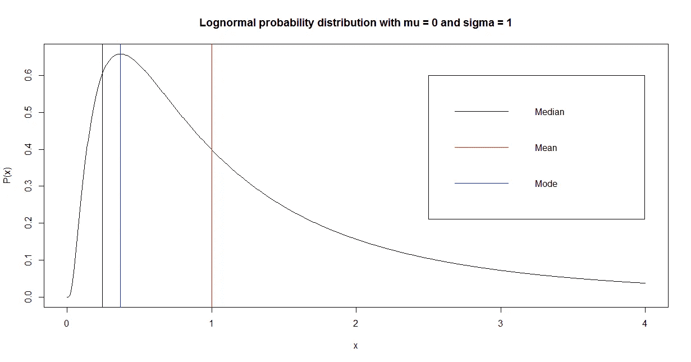

# 用 R 填充数据集中的空白

> 原文：<https://medium.datadriveninvestor.com/filling-blanks-in-a-dataset-with-r-90ece2329b2c?source=collection_archive---------3----------------------->

Photo by [Mika Baumeister](https://unsplash.com/@mbaumi?utm_source=medium&utm_medium=referral) on [Unsplash](https://unsplash.com?utm_source=medium&utm_medium=referral)

我学习物理学到的第一件事是，当你必须以任何方式分析数据时，你必须用你的眼睛看一看你的数据集**。信息就是一切，它**隐藏在**数据里面。**

但是我们经常不得不面对数据的**缺失**问题。这个问题有很多原因。数据可能被破坏，或者收集数据的系统无法正常工作，或者简单地说，对于某种现象，数据**根本不存在**。

虽然缺少数据看起来是个大问题，但这并不意味着我们不能从数据集中提取信息。

在本文中，我将向您展示如何使用 r 来修复数据集中出现的空白。

# 为什么空白是一个问题

在**机器学习**中，如果一些预测值缺失，许多监督模型无法做出预测。例如，线性或逻辑回归**、随机森林、简单神经网络等等都会发生这种情况。当存在空白时，数据集的**整个记录**在训练和预测阶段都被丢弃。这可能是一个问题，因为它**减少了训练数据集的大小**(减少了我们可以用来训练模型的信息量)并使预测**变得不可能**。**

解决这个问题的方法是**用其他重要数据填充缺少的数据**，这些数据保持原始非空白记录的统计属性。

如果我们的数据集是非规格化的表，填充过程**必须对每一列重复**。在本文的下一部分，我将向您展示一些实值变量和分类变量的技巧。

# 填充实值变量

## 单一、可自由支配的价值

填充实值变量中空白的最简单的方法是用一个固定的、**预定义的**值替换它们。这种选择的原因取决于我们正在研究的变量的商业性质。例如，如果我们在包含客户通过信用卡进行的**交易**的数量的列中有空白，可能该信息不存在于交易系统中，因为客户**从未进行过**任何交易。在这种情况下，**合理的**替换值选择可能是 **0** ，因为它很好地代表了商业现象**而没有修改**数据内部的信息。

按照数据科学的惯例，**商业生理学**必须是我们决策的**主要驱动力**。

在其他情况下，我见过用于机器学习的商业产品使用与数据集典型值**相差很远**的值，例如-9999。我个人**不鼓励**这种填充空白的方式，因为它可能会在我们数据的概率分布中引入**人为偏差**，并且它不是基于任何类型的商业假设(这相当糟糕)。

## 计算值

另一种选择是从非空白值开始计算一个值，并用它来替换空白。常见的选择有:

*   平均
*   中位数
*   方式

从统计学上来说，我更喜欢**均值**有很多原因；这是期望值(我对随机变量的期望值)的最佳估计，计算简单，即使在小的有限样本中，计算也不会有太大的偏差(例如，与方差相反)。

另一方面，如果值的概率分布过于不对称，使用**中值**可能会有用，以避免尾部(即最不可能的值)。

如果分布**非常尖锐**，使用**模式**可能会有用，这是最可能的值。

让我们看一个对数正态分布的例子。

如您所见，平均值甚至考虑了最不可能的值，而中值和众数聚焦在峰值周围**(即最可能值附近)。**

下面是生成此图表的 R 代码:

所以，没有一个唯一的答案适用于所有问题。每个问题都有自己的特点，是数据科学家的经验而不是数学造成了差异。

# 填充分类变量

对于分类值，我们无法计算数值，因此我们有两种选择:

*   从可用类别中选择一个类别
*   为空白处创建“不适用”类别

“不适用”类别很容易实现。实际上，它根本不需要实现。它只是一个桶，我们把所有的空白放在里面。

虽然这可能是一个不错的解决方案，但在我看来，一个合理的选择是选择最常用的值。它不像连续情况下的“平均”值，但它是在我们的数据集中出现的概率最大的值。它考虑了数据的统计结构，实现起来并不困难。

另一方面，我们可以根据我们问题的业务需求选择**另一个类别**。

# 培训、验证和测试样本

填充过程必须在机器学习的三个规范样本中执行，但是实值变量的计算值和分类变量的填充符必须仅来自训练集。事实上，使用来自验证集和测试集的数据会引入偏差。

请记住，我们真正了解的唯一样本是训练集。**验证**和**测试**集合模拟数据我们不知道，所以**我们不能把它们**用于这样的目的。

# 填充值的部署

当我们部署机器学习模型时(例如，通过 REST API 或 R 或 Python 中的批处理预测)，填充值**必须与模型本身一起部署**。它们是预测前数据预处理的一部分，实际上也是我们可交付成果的一部分。因此，我们的软件必须根据我们在训练前执行的数据发现中确定的值来实现空白填充。

# R 代码中的一个例子

让我们在现实生活中使用所有这些概念。在机器学习中，特别是在有监督的模型中，我们经常不得不处理数百个变量(我参与的上一个项目有一个由 1245 个不同列组成的数据集)，因此空白填充过程可能会非常繁琐。在下一段中，我将向您展示一个简单的 R 代码，它在一个循环中执行大型数据集的空白填充。

让我们假设我们的数据集由数字和分类变量组成，并且我们已经选择用平均值**替换实变量中的空白，用最常见的类别**替换分类变量中的空白。

假设我们已经引入了机器学习的 3 个规范集，并创建了 3 个不同的不相交数据框架:

*   训练集:*训练*数据帧
*   验证集:*有效的*数据帧
*   测试集:*测试*数据帧

下面是一个简单的 R 代码，**循环遍历列**并根据这些标准执行空白填充。为了节省内存，不会复制数据集。

# 结论

填补空白是数据科学过程中非常重要的一部分，如果执行不当，实际上可以**改变**机器学习的结果。

只要我们有一些空白(即少于 10–20%的数据集行)，这些技术可以很好地使用。如果空白数字太高，我们就没有足够的信息来填充它们，所以**丢弃**该列而不是推断数据可能是有用的。