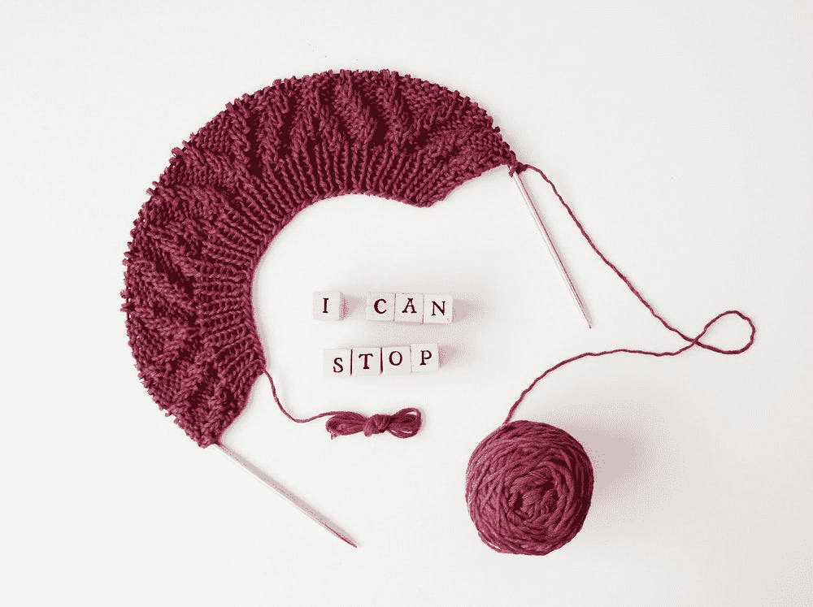

# 充实每一个小时:作为自由职业者的压力

> 原文：<https://medium.datadriveninvestor.com/filling-every-hour-dealing-with-the-pressure-to-be-productive-as-a-freelancer-59846e4d7fee?source=collection_archive---------3----------------------->

我的 Medium 主页上的每第二篇文章都在激励我变得更有效率。

生产力是显著的，我稍后会说明我的意思，但对于自由职业者来说，这是一个复杂的概念。

The 10am/noon/2:45pm/3pm/3:15pm/3:30pm/4pm slump when working from home, less the artistic twigs.

当我第一次投身到自主创业的海洋中时，我决定每天都要在某种程度上平衡工作和生活。

对我来说，为自己工作最难的部分就是带着罪恶感生活。没有做足够的工作，没有给每个客户 100，000%的提交。

不是一个真正的自由职业者的罪恶感，有人最终会指出来，所以我最好在我稍微领先的时候辞职。当我开始工作的时候，我为发给客户的每一张发票道歉。

我的成年生活不够悲惨，所以我应该找一份真正的工作。

最重要的是，强调尽最大能力工作，最大限度地利用一天中的每一个小时。用各种仪式、锻炼、柠檬茶和三个小时的冥想来充实早晨。晚上有任务和杂务要在第二天完成。

没有屏幕时间，不要和别人有眼神接触。他们会用一些安迪在他的告别工作派对上醉酒的滑稽动作来分散你的注意力，你的职业生涯就永远结束了。

# 这是我想要的吗？

当然，有一个成功的职业生涯是令人惊讶的，尤其是因为写作对我来说如此重要，就像对大多数自由职业者一样。但是，我愿意放弃和男朋友一起在厨房做饭吗？

或者熬夜完成一个截止日期，第二天早上 5 点起床去健身房锻炼，因为这应该可以提高认知功能，这样更好吗？成功人士都是这样的。

拥有美好的一天意味着什么的织锦已经被压缩成实现一系列相似的目标。不管它们在你的生活中是否真正重要。

生产率也是扁平化和线性的。而且感觉不太对。意识到这一点，我的脊梁骨在蠕动。

所以，我要再次提高生产率。这个扁平的词需要被构造。

我正在撕开影响者和营销人员塞进生产力的沉闷纸箱，让它摆脱他们的期望。

在其赤裸裸的荣耀，我附上一个更真实的感情这个词:

生产力是有价值地花费的时间。

Sure I can! Just two more rows… and maybe another two after that.

我一天的生产力是在晚上做一些编织。这让我感觉很好，是我冥想的一种形式。我敦促你在完成你的单人任务后，找到能帮助你放松下来的方法。如何在这场游戏中长期保持理智。

当我的大脑无法继续前进时，它也会休息一下。我知道我的极限。万事通在一篇文章中批评我没有无情地突破每一个精神障碍，这一点我从未遇到过。滚开。

我一直努力逃避朝九晚五，这需要很大的勇气。现在我在这里，我不会让其他作家让我感觉不好，这样他们就可以通过掠夺我的恐惧来赚钱，这些恐惧是他们首先植入的！

我知道什么时候我在以积极的方式伸展自己，什么时候我把自己打破到了暴躁和疲惫的地步。

我已经平静了一点。让我们回到正题。

生产力就是每周至少休息一整天，如果不是两天的话。这很难实现。从认知上来说，我知道这对我的产出有好处，并让我更加享受(这也是我的一个主要优先事项)我的工作。然而，总是有那种偷偷摸摸的诱惑去“提前完成一周”。到目前为止我还没成功过。所以我尽全力把它剪下来。

生产力就是我带着我的狗去散步或者在房子里追着它跑。他让我发笑，这是非常有价值的产出。事实上，我计划在下一季度大幅增加我的笑声产量。

Here’s Pa himself in all his scruffy resplendency.

如果你从每天花 10 个小时写文章中获得快感，那你就更有力量了。但是也许可以考虑一下为什么鞭打你的大脑会给你一种满足感。为了你自己，你要确保这是源于你想过的生活，而不是源于你希望别人如何看待你的生活。

> 我艰难地认识到，努力给别人留下深刻印象可以让你感到被重视，但这还不到重视自己的十分之一。

生产力不是寻求一种无法获得的充满无尽愉悦幸福的生活。让自己从那种压力中解脱出来。如果语言不流畅，不要责备自己。

当我因为我的单子越来越少而需要寻找新客户而感到压力时，我真的很有压力。

以至于我抓起电话，让一个爱人重复一遍“没必要担心找不到新客户。一切都会解决的。”

是的，这听起来很疯狂。但是，你应该看到这个咒语给我的生活带来的不同。没有它，我紧张得甚至无法开始工作。当我知道自己如坐针毡时，我对搜索的抗拒比试图移动我的腿还要糟糕。

正如一些人会雄辩地说的那样，斗争是真实的。

通常，我们很难对自己表现出同情。这就是为什么我发现让关心我的人重申我需要牢记的信念是如此有效。

你只需要一个善良的人对你表示同情，这样你就可以反过来对自己表示同情。这打破了阻力和焦虑。这有助于我们工作时不用担心被拒绝。

当你在截止日期前忙得不可开交时，这一切都归结于这个问题，你刚刚收到一封客户的电子邮件，说你上次提交的文章中有不少语法错误。当一切都指向你是一个失败者时，你应该问自己:

> 被自己接纳了怎么还会害怕被拒绝？

感觉还好。你不需要感觉很棒，甚至很棒，但是如果你的生产力因为害怕被拒绝而出现泡沫和爆发，那么你只会把你的自我价值建立在你的最后一篇文章、邮件活动或章节上。

当这个信仰体系是我的首选时，停机时间就是一场噩梦。我的日子是恐慌打字的不稳定周期。我离不开我的笔记本电脑，内心充满了愧疚。我写的大部分都是垃圾。

然而，我认为恐惧是一种商品。

恐惧促使我采取行动。如果不被滥用，[恐惧呼吁](https://www.psychologytoday.com/intl/blog/emotional-nourishment/201809/fear-appeals)是一种健康和正常的心理方法。太多的恐惧让我们的[海马](https://www.smithsonianmag.com/science-nature/what-happens-brain-feel-fear-180966992/)失常，我们除了因恐惧而抽搐之外什么也做不了。我们中有四分之一的人在生活中经历过某种形式的焦虑症，这显然不是前进的方向。

在我不算太严重的工作崩溃后，我不得不慢慢地自学作为一名自由职业者，如何平衡工作和生活。

对我来说，结构和无益的、令人窒息的压力之间只有一线之隔。安排好我的工作周对创造一种工作节奏很有帮助，这种工作节奏满足了我写作的需要，让我有饭吃，但最重要的是给我生活中让我开心的其他部分留下了充足的时间。无论是关系、精神、健康、爱好、欢笑，它们都值得享受。

我现在要原谅自己打开 Spotify，播放 80 年代的民谣。对我的邻居来说，这绝对不是一次有趣的经历，但在追求生产力的过程中，你不可能让每个人都满意…