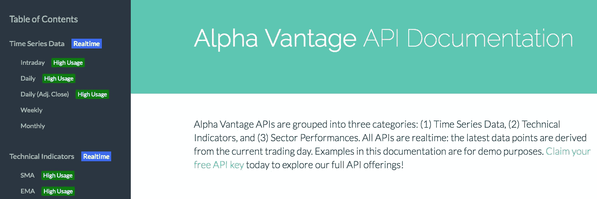
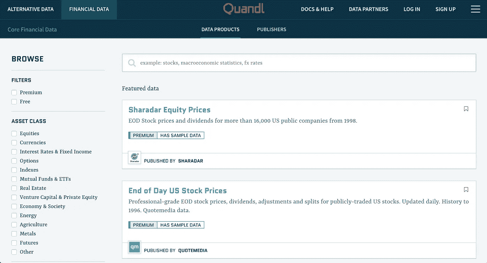

# 财务数据 API

> 原文：<https://medium.datadriveninvestor.com/finacial-data-apis-897a94a812d0?source=collection_archive---------2----------------------->

2017 年雅虎股票 API 的关闭是交易和金融开发者社区的重大损失。雅虎的 API 已经成为个人和企业级用户使用的股票数据 API 的黄金标准。然而，随着雅虎 API 的关闭，许多替代品出现了，包括一些现在被认为比旧的雅虎股票 API 更全面的 API。在这篇文章中，我将讨论 Yahoo API 的三个最流行的替代品，讨论免费使用和基于付费订阅的服务。

 [## 雅虎财经 API |数据驱动投资者的 6 种替代方案

### 长期以来，雅虎金融 API 一直是许多数据驱动型投资者的可靠工具。许多人依赖于他们的…

www.datadriveninvestor.com](https://www.datadriveninvestor.com/2019/02/25/6-alternatives-to-the-yahoo-finance-api/) 

# 什么是金融数据 API？

金融数据 API 提供了当前在市场上交易的金融资产的实时数据。这些 API 通常被格式化成 RESTful JSON 端点，并允许用户向服务器发出 GET 请求，以便将数据实现到应用程序中。最常用的指标是公共股票的价格，尽管本文中讨论的更高级的 API 都提供各种资产的报价，包括外汇、加密货币以及各种技术指标，这些指标是交易员和投资者用来监控市场的资产的数学计算。

## 1.阿尔法优势

AlphaVantage documentation page

AlphaVantage 可能是当今最受欢迎的 Yahoo API 替代品，它是一个免费使用的 JSON API，由开发人员创建并为他们量身定制。AlphaVantage 提供四个领域的 API:股票、外汇、加密货币和技术指标。所有类别都提供每日、每周和每月数据，股票和外汇 API 也提供每五分钟更新一次的盘中报价。

因为这项服务是免费的，AlphaVantage 将请求限制为每分钟 5 个，每天 500 个。有一个高级 API 密钥允许呼叫量超过此限制。鉴于 AlphaVantage 主要是作为一个免费使用的 API 建立的，溢价限制和价格并不是一成不变的，必须由每个用户提出要求。

## 2.多边形. io

Polygon.io landing page

Polygon 提供股票、外汇和加密货币的数据。这是一项基于订阅的服务，为新用户提供 7 天免费试用。在 7 天的试用后，用户将获得三个订阅级别，价格最低的一个仅提供对 currencies/crypto 数据的访问，价格较高的一个提供对所有 API 的完全访问，价格根据请求量和技术支持而定。

正如基于订阅的服务所预期的那样，Polygon 提供的服务比 AlphaVantage 更全面。最值得注意的是，Polygon 提供实时数据更新，而 AlphaVantage 的日内更新是每 5 分钟接收一次。Polygon 通过使用 WebSockets 来广播它们的实时数据。除了实时数据之外，Polygon 还提供更高级的数据，如市场上某项资产的最后交易指标，以及其他有用的信息，如公司摘要、首席执行官姓名等。凭借如此丰富的功能和数据点，Polygon 已经成为股票、外汇和加密货币数据的首选 API。

## 3.Quandl

A searchpage for Quandl APIs

Quandl 是一个金融、经济和其他相关 API 的聚合市场。因此，Quandl 不是创建他们自己的专有 API，而是聚合由第三方开发者创建的 API，并作为用户购买他们可能需要的任何 API 的市场。通过这样做，Quandl 成功创建了最大、最全面的金融和经济 API 来源，API 范围从简单的股票报价一直到在北美销售的三星电视数量。

Quandl 上托管的每个 API 都有自己的定价系统，有些 API 是免费使用的，有些是基于订阅或一次性购买的。除了 API，Quandl 还提供了用 R、Python 和 Excel 分析数据的服务。