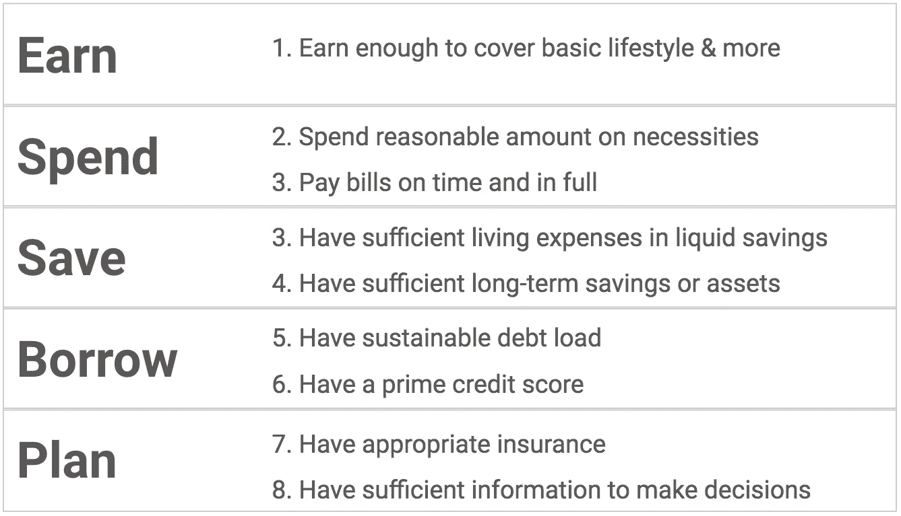
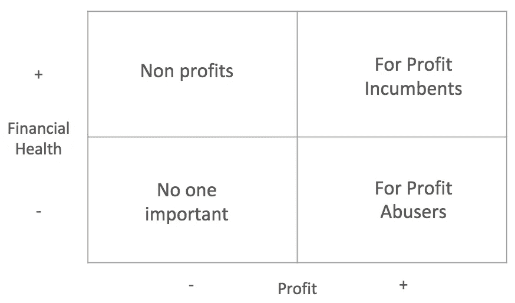
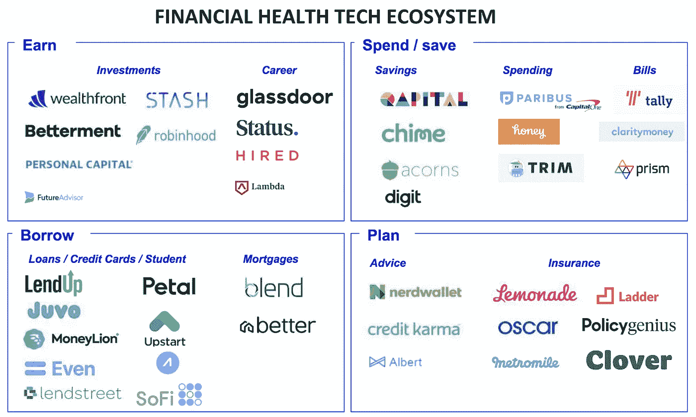
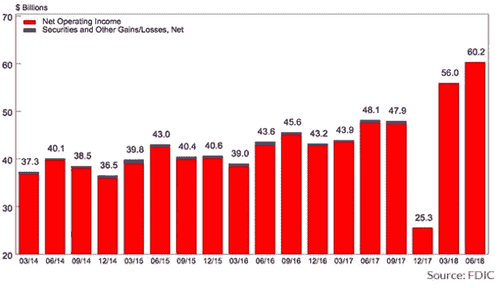
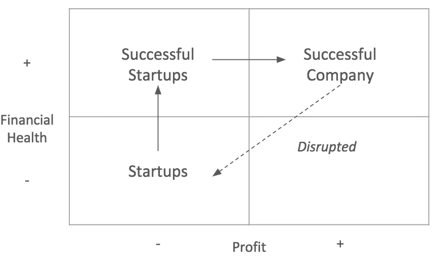

# 财务健康——有这样一个应用程序

> 原文：<https://medium.datadriveninvestor.com/financial-health-theres-an-app-for-that-9b62343a9057?source=collection_archive---------4----------------------->

关于财务健康，金融科技公司需要了解什么。

> “我们是一家金融健康公司”——每一家金融科技初创公司都是如此

似乎今天每个消费金融公司都是一个“财务健康”公司——专注于帮助用户增加他们的财务健康。原则上这很好，但很少有公司真正做到这一点。

让我们来谈谈什么是真正意义上的财务健康的营利性公司。

## 财务健康到底意味着什么？

CFPB 将财务健康(或“财务健康”)定义为一种*“一个人能够完全履行当前和持续的财务义务，能够对自己的财务未来感到安全，并能够做出让自己享受生活的选择的状态”。*

换句话说——身体健康意味着你不会受到身体或精神的束缚而无法享受生活，而财务健康意味着你不会受到钱包的束缚。

更具体地说，如果你:

Factors of Financial Health

简单吧？

缺乏财务健康并不一定是贫穷的。当然，贫穷意味着缺乏财务健康——美国的贫困率为 12%,在发达国家中排名第二。但即使财务健康与收入相关，同一收入区间的财务健康差异也很大，这表明还有其他重要因素在起作用。

在这个时代，由于学生债务、低利率、低工资和低水平的住房拥有率(查看这篇[帖子](https://link.medium.com/jJPs9n0rNR))，保持财务健康是很难的。总体而言，大约三分之一的美国成年人的财务健康得分在 50 分或以下，表明他们缺乏财务健康(2)。

有人可能会说，金融健康是一个宏观经济问题——贫困应该在政策层面用最低工资、就业、医疗保险、普遍基本收入等工具来解决。虽然这可能是真的，但金融科技领域并没有屏住呼吸——一系列声称专注于财务健康的盈利性企业已经出现。

# **成为“财务健康”的公司意味着什么？**

从某种意义上说，每个金融公司都提供了某种程度的财务健康——对消费者来说意味着财务价值。否则，这种播放器将没有任何用户，并将不复存在。以我们非常讨厌的大银行为例:当然，它们在费用和利息上赚了一大笔，但它们仍能让消费者购买房屋，将钱存放在安全的地方，并为退休做打算。他们收费的主要原因是因为消费者仍然从服务中获得价值。只要消费者价值高到足以维持增长，在位者自然会希望利润最大化。

这就是初创公司的用武之地——这些公司试图打破财务健康的现状，以一种对消费者更有价值的方式重建财务健康。他们关注“营利性虐待者”和“营利性在职者”，并试图以增加影响的方式进行重建。

Types of financial health companies

问题是你是否是一家财务健康的公司，而是财务健康是你目标的一部分。评估这一点的一个公式是计算影响 x 可持续性 x 规模，其中:

*   影响=与行业平均水平相比，为消费者提供的财务健康价值
*   可持续性=公司是否(或能够)通过这种策略盈利
*   规模=获得价值的活跃用户数量

因此，如果你是一家初创公司，因为你筹集了 A 轮融资并拥有大量现金，所以向 100 万人提供 10%的存款利率，你的影响和规模可能很高，但从长远来看，你的业务可能是不可持续的，因为你会耗尽资金。同样，如果你是一家赚钱的大银行，但你的存款利率仅略高于竞争对手，那么即使规模和可持续性很高，你的影响力实际上也很低。

你需要这三者来证明你是一家财务健康公司。你需要证明你已经改变了一个财务健康指标。你需要能够说，如果消费者有完美的[信息](https://s3.amazonaws.com/qed-uploads/The+Copernican+Revolution+in+Banking+-+Publication+Version.pdf)，他们仍然会使用我的产品，我可以提供这种产品足够的利润来维持增长。

# **谁在“金融健康”领域？**

金融科技领域充满了这样的初创公司，因为在今天的金融科技生态系统中，建立一个消费金融应用程序很容易。尽管大多数金融科技公司都渴望成为所有金融健康的唯一提供者，但现实是，在一个领域做得好已经足够具有挑战性了。下面是一些*玩家存在的地方:*

当然，还有许多其他金融科技公司。这些只是证明它们具有影响力、规模和可持续性的几个例子。以下是每个领域和机会的一些趋势:

*   赚**:公司大多专注于投资民主化(免费、自动化、建议)。其他值得注意的趋势包括面向高薪行业的在线工作培训的激增以及零工经济的兴起。虽然工资和职业的透明度有所提高，但仍然缺乏能够带来更高薪酬的可扩展职业指导解决方案。消费者仍然不得不谈判工资或者把他们的职业生涯掌握在自己手中。**
*   **消费/储蓄**:各种金融应用正试图通过智能评估你的现金流来实现储蓄自动化。一些创业公司专注于从订阅和购买中获得回报。这一领域的机会包括以自动化的方式将消费者转向更好的金融产品，以帮助他们省钱。
*   **借款:**自 LendingClub 以来，在线贷款公司激增，专注于扰乱发薪日业务和利用替代数据。各家公司在价格(通过 LendUp 等替代数据实现更好的承保)和易用性(通过 Tally 等自动化)上展开竞争。然而，这些产品在过去 50 天里基本没有变化。真正的机会是建立全新的产品，打破储蓄和收入之间的人为界限，实现权衡自动化，对抗收入波动。
*   **计划:**透明度、信息和工具都非常充足。保险创业公司的崛起才刚刚开始。像 Credit Karma 这样的产品推荐公司在预测你的行为和获得批准的机会方面变得越来越老练。机会在于让这些行动对特定的客户群有意义:通过正确的渠道在正确的时间传递正确的信息。

# 创业公司在这个领域有哪些制胜策略？

虽然开发一个产品很容易，但是找到正确的问题并创造一个能以正确的方式解决问题的产品却要困难得多。更重要的是，打造一个比竞争对手好得多的产品，以克服金融产品的高转换成本。最后，你要用一个可持续的商业模式来完成所有这些。如果这很容易，金融科技将会很快蚕食银行利润(事实并非如此，相反，见下图)。

Bank profits are surging (Quarterly Net Operating Income of the 5,500 FDIC insured banks)

回到财务健康的公式上来——**初创公司应该关注影响力，担心可持续性，当被锁定时，扩大规模**。

为了最大化您对消费者财务健康的影响:

1.  打造比竞争对手**好 10 倍****的产品，这样你就可以克服转换成本**
2.  **赚足够的钱来支持你的抱负，这样你就不会破产**
3.  **拥有**护栏**以避免为了利益而牺牲冲击力，这样你就不会成为你想要摧毁的玩家**

## **提升 10 倍**

**简而言之，如果你的产品不是竞争对手的 10 倍，你就没有机会。**

**这意味着你的产品对他们的财务健康产生了 10 倍以上的影响。让我们面对现实吧——你没有现有公司拥有的品牌、规模经济、分销或资本。此外，金融产品具有粘性，这就是为什么大通银行不得不给你 500 美元，甚至考虑转换银行账户。不幸的是，作为一家初创企业，你无法支付收购费用。你需要在原始价值上竞争。你是怎么做到的？**

1.  ****专注** —确保你专注于特定的客户群，这样你就不会建立一个一刀切的解决方案。专注于一个片段开始。听这段。每天和他们聊天。关注他们的问题，而不是你的解决方案。一旦你理解了他们的问题，找到 30 个喜欢你的解决方案的用户。**
2.  ****下大注**——大玩家下大注风险太大，但你不会有任何损失。罗宾汉用 0 美元交易下了一个大赌注。如果一个银行经理向她的老板提出这个想法，她肯定会被炒鱿鱼。尽早确认这些赌注。先不要担心规模或盈利能力，如果你没有好的产品，这些都不重要。**
3.  ****测试和迭代**——大玩家移动缓慢，并且太大而无法旋转。将你的迭代能力作为一种优势，并开放和愿意改变。可能需要几个支点才能找到适合市场的产品。例如，在专注于与大雇主的合作之前，即使是 App 也首先主要是 B2C，甚至提供福利。关注你的目标，而不是你将如何实现你的目标。**
4.  ****利用技术** —成为一家初创公司意味着你更了解最新技术。利用它。不要试图自己重建一切。例如，Plaid 在用户同意的情况下向初创公司提供银行账户数据。专注于你的竞争优势和你想给用户带来的价值。**
5.  ****让它变得超级简单** —尽可能地为最终用户实现自动化。我们仍然在劣质银行存钱的最大原因之一是我们懒惰。例如，Tally 将信用卡债务放在 auto-pilot 上，这样用户就不必考虑账单，作为交换，用户愿意贷款。为用户做事，你会得到回报。**

## **刚好够钱**

**我们想知道为什么没有一个应用程序可以处理 X、Y 和 Z，原因可能有两个:**

*   **它不存在是因为它不赚钱(事实证明，生活中没有免费的东西)**
*   **它存在但没有足够的钱告诉你它的存在**

**如果你想扩大规模，你的商业模式需要能够维持客户获取。获取客户是昂贵的。当你不得不签署关于分享你的财务数据的法律披露时，“建立它，他们就会来”是行不通的。消费者不信任你。他们对数据泄露和欺诈保持警惕。他们怀疑你宣称的价值。你在和他们的金钱和财务打交道——这是高度情绪化的。而且，我们都很懒。因此，你需要每个客户的利润率，以帮助你获得下一个客户。**

**不过，诀窍在于确保你将利润再投资到产品中，让消费者受益，从而继续产生影响。**

****

**创业公司从小规模烧钱开始，慢慢增加影响。很少有人能成功。然而，不要搞错——当增长达到时，它需要持续下去，这就是初创公司经常成为他们想要破坏的地方:为了利润的现任者。他们为了利润而牺牲影响力，为新的创业公司破坏他们留下了机会，并重新开始循环。更糟糕的是，它们被银行收购，这往往会毁掉产品。**

**所有金融健康创业公司的目标都是赚足够的钱来保持增长。当你获得太多利润的时候，意味着你没有对业务进行足够的投资，并让自己容易受到新的颠覆者的攻击。**

**那么 FinTech 玩家如何赚钱呢？**

*   **从他们给你的存款中抽取 1%——pari bus 从他们给你的降价中抽取 25%**
*   **收取服务费——Digit 每月收费 2.99 美元(即使他们有 10 亿美元的存款！)**
*   **lead gen/ads——Credit Karma 把所有的钱都放在你的信用卡或贷款上。**
*   **从金融产品中赚钱——lend up 从产品本身的利息和费用中赚钱**

**最后一个警告:**你如何赚钱将最终决定你产品路线图的一部分**。消费者财务健康和企业盈利能力最相关的商业模式最终将成为赢家，因为它们将继续关注消费者，而不是企业。这就引出了最后一点…**

## **盈利能力的护栏**

**我认为很少有公司的商业模式与消费者财务健康 100%相关。因此，大多数金融健康公司将不断在增加利润和增加客户价值之间挣扎。**

**一些公司已经做好了。比如 Paribus，它可以自动对你的购买进行价格保护，并节省 25%的费用。当 Paribus 帮你赚钱时，他们也帮你赚钱。太好了。**

**但是大多数公司需要做出权衡。以信贷业为例——他们的商业模式依赖于你拿出一种金融产品。虽然他们提供了重要的建议、评级和透明度，但他们受到激励，不断推动你办理信用卡(在某种程度上)，尤其是那些他们能从中赚更多钱的卡，这可能对你的财务健康有害。**

**对于这样的公司来说，在成功之前写一份关于产品指导原则的宣言是至关重要的。这样的宣言应该列出永远不应该打破的规则，即使商业模式指向那个方向，并由任何其他董事会成员或高管签署同意。将这一宣言作为客户价值主张的一部分来阐明，将确保你的承诺，并通过(希望)较低的购买成本获得你应得的赞赏。**

**为建设一个专注于改善每个人财务健康的未来干杯。**

***你在金融健康领域工作吗？伸出手来！***

## **资源:**

1.  **经合组织贫困率数据[https://data . OECD . org/inequality/poverty-rate . htm # indicator-chart](https://data.oecd.org/inequality/poverty-rate.htm#indicator-chart)**
2.  **CFPB 金融福祉[https://files . consumer finance . gov/f/documents/201709 _ cfpb _ financial-well-being-in-America . pdf](https://files.consumerfinance.gov/f/documents/201709_cfpb_financial-well-being-in-America.pdf)**