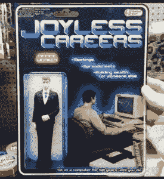
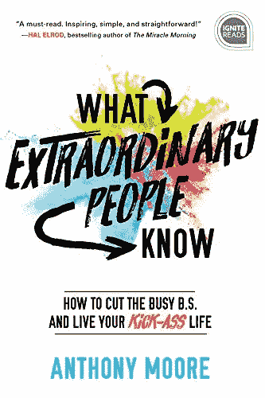
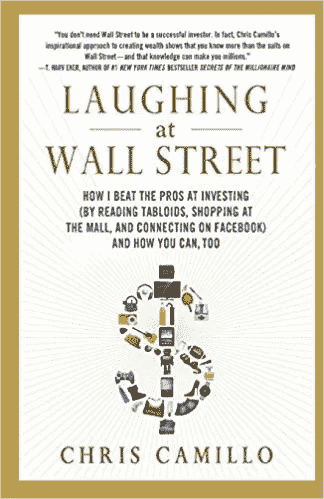
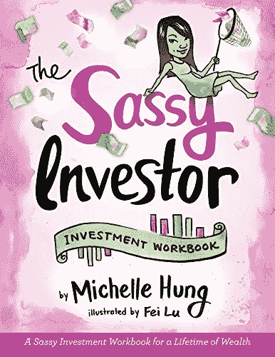
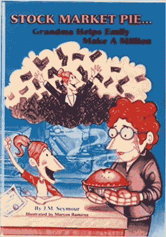
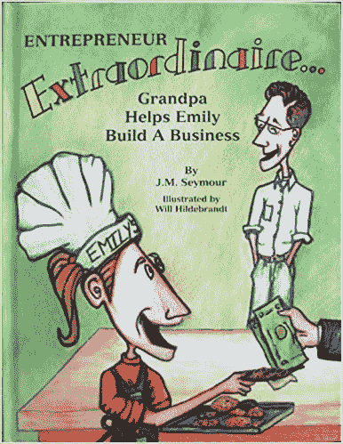

# 金融幻想家的快乐礼物清单

> 原文：<https://medium.datadriveninvestor.com/financial-imagineers-merry-giftmas-list-financial-imagineer-41834520df7a?source=collection_archive---------7----------------------->

又到了一年中的这个时候，所有的公司都出来拿你的血汗钱，你渴望为你爱的人提供一个美好的圣诞节体验。虽然它开始像圣诞节一样花费很多，为什么不投资把获得更多自由、幸福和财务健康的钥匙送给你爱的人呢？

赠送一些增强能力的东西，比如金融知识的积木。激励你的孩子，为他们提供工具和力量，让他们最终能够在未来创造最好的自己。

> 财商是知道如果你把你的生活精力花在那些只能带来短暂满足感并且不支持你的价值观的东西上，你的生活会变得更少。

这是金融幻想家礼物清单，2.0 版——一份给金融家、家人和朋友的圣诞礼物清单！探索愉快。

The “joyless career man”? Going for meetings, doing spreadsheets and building wealth for someone else?

The new and only “soul-crushing meeting” game!

The latest NES game “Wall $treet Kid”!!!

Buy more crap this year?

**开个玩笑，好东西就在下面！请继续阅读:**

## [**非凡的人知道什么:如何摆脱忙碌的废话，过你的精彩生活(Ignite Reads)安东尼·摩尔**](https://amzn.to/2S18tWz)

如何成为自己人生的英雄？“非凡”的秘诀是什么？

被困在平庸中太糟糕了。在你的生活中很容易识别出这种疾病的症状:你是不是长期无聊？你醒来时知道今天会很糟糕吗？你是否一直在抵抗空虚感、疲惫感，以及知道自己在浪费生命的感觉？

好吧，去他妈的！每一天的每一刻，你都可以选择不平凡。你可以选择成为一个让你无比自豪的人，一个完成惊人目标和成就伟大的人。“非凡的人知道什么”指导你如何摆脱平庸的陷阱:从让你的生活高速运转所需的灵感、工具和教训开始——来自行为改变和个人成长专家安东尼·摩尔。作为一个把自己的生活从平凡变得不平凡的人，摩尔创造了一条三步走的道路来摆脱平庸，成为你自己生活的英雄。

你准备好赢了吗？如果是，请点击下方:

Click here to buy: [https://amzn.to/2S18tWz](https://amzn.to/2S18tWz)

## [**克里斯·卡米洛《嘲笑华尔街》**](https://amzn.to/35mxsHo)

克里斯·卡米洛不是股票经纪人、金融分析师或对冲基金经理。然而，在 2007 年初，在大萧条以来最严重的金融危机中，他在股票市场投资了 2 万美元，仅用了三年时间就增加到了 200 万美元多一点。

他是怎么做到的？通过观察他周围的世界。

除了自己敏锐的观察，克里斯还利用家人、朋友、同事以及脸书和 LinkedIn 等在线网络创建了他所谓的“趋势发现网络”这些网络——而不是华尔街的大人物——帮助克里斯识别市场趋势，从而赢得投资。你也有强大的关系网，以及相对于华尔街的先天优势——只是你还不知道而已。

在这本有趣的，故事驱动的，没有术语的书中，克里斯证明了你不需要大笔的钱，花哨的市场数据，或无尽的时间来获得非凡的财富。他向我们展示了没有受过任何金融教育的普通消费者如何能够通过学习识别隐藏在日常生活中的改变游戏规则的信息来超越华尔街最聪明的人，这些日常生活包括看电视、阅读小报、在办公室工作、在购物中心购物、在餐馆就餐或拼车去参加足球训练。你只需要关注自己生活中的兴趣和趋势。无论你有 100 美元还是 100，000 美元可以投资，你都可以成为一名成功的投资者，为你和你的家人创造一个安全的未来。

克里斯·卡米洛创造财富的励志方法表明，你比华尔街的西装革履者知道得更多，而这些知识可以让你成为百万富翁。

这不是你的标准投资书籍，它不会涵盖大多数其他书籍的内容，这正是我喜欢它的原因。这本书与众不同，对于已经读过普通投资书籍的人来说是一本好书。

礼物一个令人耳目一新的方法来找到正确的投资想法！

Click here to buy: [https://amzn.to/35mxsHo](https://amzn.to/35mxsHo)

如果你喜欢这本书的内容，你一定会喜欢克里斯和他的朋友们的 Youtube 频道“傻钱”。

## [**拉米特·塞西**T5【我教你致富】](https://amzn.to/35mxsHo)

个人理财专家拉米特·塞西被《福布斯》称为“财富奇才”，被《财富》杂志称为“新晋大师”。现在，他更新和扩展了他的新时代的现代货币经典，提供了一个简单，强大，没有 BS 的 6 周计划，只是工作。

这本书将从如何粉碎你的债务和学生贷款的想法和方法开始，继续教授如何建立高于平均水平的高收益账户，然后慢慢进入如何自动化你的财务，为你的成功做准备。

反对许多节俭主义者和建议减少需求的人，拉米特更支持挣更多的钱来过更富裕的生活。他将教你如何让你的钱到达更远的地方，而不是像往常一样减少你每天的拿铁咖啡或者不吃鳄梨吐司。

在这本书的后半部分，他将探索如何制定一个简单的投资策略，如何处理大额购买，如汽车或房子，包括婚礼或生孩子——没有压力。

此外，由于这是 10 周年纪念版，它有 80 多个新页面，包括新工具，关于金钱和心理的新见解，以及一些关于以前的读者如何利用这本书创造更丰富生活的惊人故事。

活得丰富！

Click here to buy: [https://amzn.to/35mV12R](https://amzn.to/35mV12R)

## [时髦的投资者 Michelle Hung 的投资工作手册](https://amzn.to/2LWjHrs)

米歇尔·洪是时髦投资者的创始人。作为金融知识的倡导者，她肩负着传播财务独立的重要性以及如何实现财务独立的使命。

一步一步投资的初学者指南，适合所有想要控制自己财务的时髦女性！从吝啬鬼到自由人。)花钱的人，这本有趣又吸引人的活动手册让来自各种教育背景的女性了解更多关于金钱以及如何建立一个安全的财务未来。

太多时候，女性依赖他人来管理她们的财务。无论是他们的配偶还是财务顾问，许多人都发现自己对自己的钱沾沾自喜。更糟糕的是，当金钱袖手旁观，什么也赚不到的时候，女人们就在欺骗自己，她们有可能在一生中赚到数千美元。

从教育到执行，这本丰富多彩的活动手册带领所有年龄和人生阶段的女性通过必要的步骤获得财务知识和独立。这意味着将权力放回所有勤劳的女性手中，激励所有人在管理和储蓄金钱方面发挥更积极的作用。

通过教育获得自信。投资不一定是令人生畏的。

Click here to buy: [https://amzn.to/2LWjHrs](https://amzn.to/2LWjHrs)

## [股票市场馅饼…奶奶帮助艾米丽赚了一百万作者 J.M. Seymour](https://amzn.to/38M7LCq)

股票市场馅饼:奶奶帮助艾米丽赚一百万是一个伟大的入门书籍，任何人都有兴趣学习基本的储蓄和投资概念。

故事主线是年轻的艾米丽从她的祖母那里收到了一份股票礼物。艾米丽学会了欣赏礼物的价值，当她和祖母一起做馅饼的时候，她开始讨论储蓄和投资。

Emily 开发了一个聪明的馅饼制作比喻来说明投资概念。

股票市场馅饼功能详细的信息栏和词汇，使其成为一个伟大的参考书。这本书研究充分，插图丰富，对于任何有兴趣“分享股市馅饼”的人来说，都是一个很好的学习工具

Click here to buy: [https://amzn.to/38M7LCq](https://amzn.to/38M7LCq)

## [杰出的企业家爷爷帮助艾米丽创业，作者 J.M. Seymour](https://amzn.to/2RNKWIe)

《非凡的企业家》以艾米丽的失望开始，她最喜欢的饼干又一次卖完了。

当 Emily 表现出创业精神时，爷爷会帮助她将想法和精力转化为饼干业务。《非凡企业家》是一个有趣的故事，充满了美味的食物，让每个人都有企业家精神。

这本书解释了商业风险背后的企业家思维过程。这对任何初露头角的企业家来说都是一个巨大的资源。丰富的边栏解释，详细的附录和词汇表使它成为一本必备的参考书。

这是一本为年轻读者量身定制的书，以有趣、透彻和易懂的方式描述了创业机会。父母和孩子都喜欢学习如何识别他们的创业技能，并利用它们来创造自己的工资支票！

Click here to buy: [https://amzn.to/2RNKWIe](https://amzn.to/2RNKWIe)

[赢钱 t 恤](https://amzn.to/2EeSDiN)

你准备好赢钱了吗？

Click here to buy: [https://amzn.to/2EeSDiN](https://amzn.to/2EeSDiN)

[这里的](https://amzn.to/2PjVMUH)也是女性的一个版本。

在此，我希望你有一个没有压力的礼物购物体验，并希望这个列表能给你一些关于给你爱的人送什么礼物的新想法。

两年前，我在这里发表了一篇类似的文章[。](https://www.financial-imagineer.com/2017/11/27/santas-kick-ass-christmas-list-for-financial-imagineers/)

祝你圣诞快乐！

马特(男子名ˌ等于 Matthew)

想了解更多金融方面的信息，请关注[脸书](https://www.facebook.com/financialimagineer/)或[推特](https://twitter.com/FI_imagineer)。

免责声明:请注意，上面使用的产品链接是附属链接，Financial Imagineer 将获得补偿。

*原载于 2019 年 12 月 14 日*[*https://www.financial-imagineer.com*](https://www.financial-imagineer.com/2019/12/14/financial-imagineers-merry-giftmas-list/)*。*