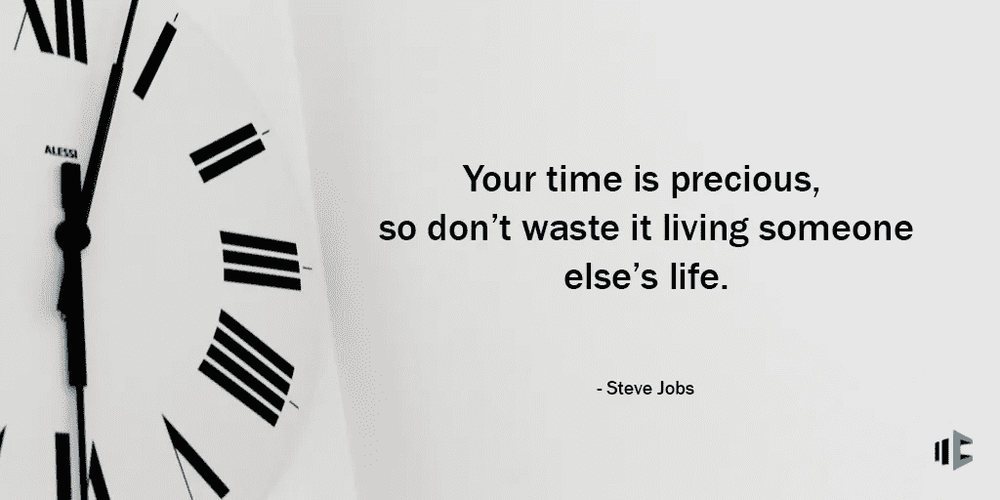

# 财务独立:所有人的目标

> 原文：<https://medium.datadriveninvestor.com/financial-independence-a-goal-for-all-11129546cf5?source=collection_archive---------18----------------------->

## 变得如此经济安全，以至于忘记了今天是发薪日。

影响千禧一代和婴儿潮一代个人的两个话题:学生贷款和退休。无论你是现在的学生，刚毕业的学生，或者有学生贷款的家庭成员，上升的利率和大学费用正在对你的日常生活产生巨大的影响。

相反，任何一个头脑正常的人都期待着他们可以停止工作的那一天，如果那一天真的到来的话。不只是停止工作，因为这是你的最终目的地，而是因为你在经济上能够负担得起。一旦你的月收入和年收入超过了你的开销，债务全部还清，那就是自由！残酷的现实是只有一小部分人能达到这一点。这是为什么呢？

我们需要取消“退休”这个词。我们一天要用好几次这个词，但是很多人不明白它的意思。它只不过是养老金的副产品，养老金是科学管理者、精算师和分析师发明的胡萝卜味的棍子，目的是让 65 岁的人在一场及时有效的考验中“退休”。

当然，在养老金的巅峰时期，退休正蓬勃发展。在佛罗里达、加利福尼亚或夏威夷过冬成了数百万普通有经验的美国人想当然的消遣。如此多的退休人员享受着工会养老金，几十年来，似乎每个人都是如此。

然而，在 2018 年和 2019 年，当只有警察、消防员、学校教师和少数其他公共部门工作人员仍然赚取固定福利养老金时，对大多数人来说，“退休”正在失去意义。

就像《金色年华》和《老年公民》一样，它开始听起来过时了。但是什么会取代它呢？我建议“财务独立。”从不久的将来开始，你不会再问别人“你退休了吗？”你会问，“你经济独立了吗？”他们会笑着说两件事中的一件，“绝对”或“还没有！”

当人们能够负担得起的时候，他们就会停止工作。在那一天，他们将是独立的，就像“经济独立”一样他们不一定都很富有，但他们可能没有债务，这是讨论中最重要的因素之一。

这是我 30 岁前要达到的最大目标之一。想象一下，你不用偿还学生贷款、信用卡债务、汽车贷款、抵押贷款或如今人们融资的任何东西的生活。

独立听起来永远不会像“退休”那么古老。它不会暗示你的年龄。如今，退休不再是年龄的终点，而是一个数字和收入目标。每个人都会走不同的路，有不同的目标，希望有一个可衡量的财务独立时间表。

对于很大一部分人来说，社会保障的完全退休年龄仍将是一个里程碑，但独立可以比这早或晚得多。尤其是当平均社会保障支出刚刚超过 1100 美元/月时，我不会把它作为我的计划。无论如何，千禧一代都不应该指望这个计划会存在。它破产了，政府所做的只是补贴它不可避免的崩溃。

热爱并对自己所做的事情充满热情的人会一直工作下去；无论如何，退休对他们来说并不意味着什么。“独立前”的人仍将通过工资延期购买股票、债券和共同基金(尽管术语“退休计划”可能会逐渐消失)。仍在工作的人甚至可能比以往更早、更努力地开始储蓄和投资，希望尽早实现财务独立。

我认识的千禧一代，昨天好像还想要财务独立。然而，当你只为周末而活时，事情就没那么简单了。与退休不同，“独立”对他们来说没有贬低或轻蔑的含义。每个美国人从 20 岁出头就开始以这样或那样的方式渴望独立。这是美国赖以建立的理想。可悲的是，大多数人失去了激情，并在以后的生活中放弃了梦想。

对于所有千禧一代、朋友、同事和我个人不认识的人，我给你的建议是保持耐心，尽可能地通过阅读和投资尽可能多的钱来掌握财务知识。你可能在想，“为什么？”首先，为什么不。其次，我会问你这个问题，“你的财务独立日期是什么时候？”

每个人都应该过得很好。然而，并不是每个人都值得拥有这么好的生活。但对于数百万没有匹配的 401(k)计划的人来说，更不用说数千万没有任何计划的人了，401(k)计划自开始以来并没有做多少事情。事实也仍然是，401(k)计划从未被设计为给工人带来类似养老金的退休收入，该计划只提供了将储蓄转化为收入或缓解长寿风险的基本工具。

这些计划只不过是卖给了华尔街的大多数人，他们考虑的是自己的利益，而不是你的利益。竞争与合作。零和收益。能不能改成双赢？我相信，通过正确的教育，更多地谈论金融知识，以及企业家一如既往地继续创新，就能做到这一点。

几项可能向退休行业开放创新的法案悬而未决。到目前为止，他们得到了两党的支持。一些人消除变革的障碍，另一些人提供教条式的政策。后果无法预料。民主党领导的众议院委员会和共和党领导的参议院委员会是否会谦逊地就这些法案的最终措辞达成妥协，或者总统是否会在不涉及他的自我的情况下批准一项协议，这也是未知数。但是我跑题了…

就目前而言，正如我在 2014 年写的那样，财务独立是每个人都应该关注的目标。他们的焦点在哪里，能量就会流向哪里。总得有人在人群前面带路。问问你自己，“为什么不是我？”是什么阻碍了你？

大多数人的第一答案是耐心。其次是不懂财务。大部分都在我们的控制之内。掌控方向盘，引导它沿着正确的金融道路前进。做一个有品质的人，过有品质的生活方式。这是你应得的，为了你自己，你的家庭，你的自我价值，你爱的人，以及你的理由。

**我最大的努力，**

**多诺万·沃格尔**