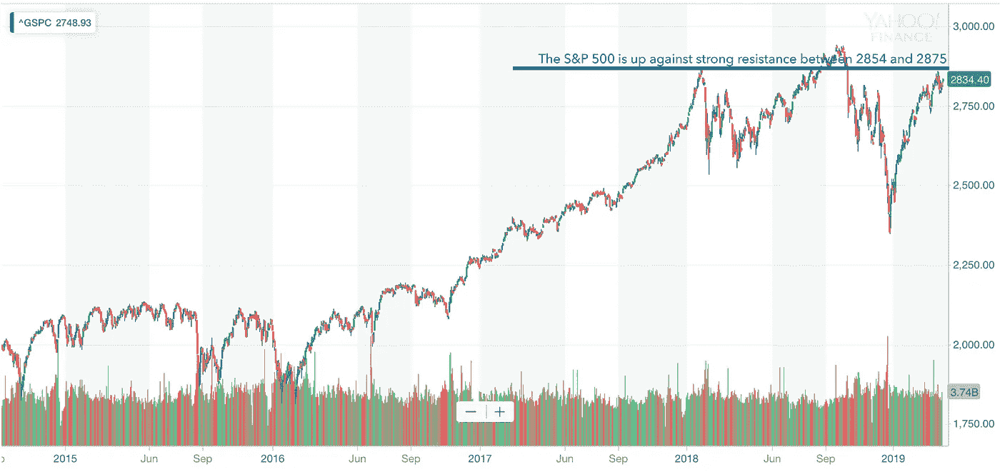

# 金融市场展望:2019 年 4 月 1 日的一周

> 原文：<https://medium.datadriveninvestor.com/financial-markets-look-ahead-week-of-april-1-2019-9893d43bbefe?source=collection_archive---------13----------------------->

2019 年第一季度——尽管美国联邦政府延长关闭、美中之间持续的贸易[僵局](https://en.wikipedia.org/wiki/China–United_States_trade_war)以及全球主要经济体[疲软](https://medium.com/datadriveninvestor/financial-markets-look-ahead-week-of-march-25-2019-3990c2b49a1e)——仍是华尔街 20 多年来最好的开局，也是自 2009 年以来最好的季度表现。当季标准普尔 500 指数上涨约 13%，道琼斯工业平均指数上涨约 11%，纳斯达克指数上涨超过 17%。从技术层面来看，多个指数创出了更高的低点(一个看涨的信号)，尽管衰退是整个季度讨论的一贯话题。

虽然媒体普遍在庆祝一个成功的季度，但对主要跟踪小盘股的罗素 2000 指数(Russell 2000 index)的仔细研究表明，该指数出现了自 3 月初以来的较低低点。根据我的经验，相对于大盘股，小盘股对外部宏观经济因素的反应更快，罗素 2000 指数在 3 月份实际下跌了 3%，尽管该指数在第二季度取得了令人印象深刻的 14%的涨幅。

金融类股——尤其是大盘股——平均表现不佳(T0 )( T1 ):涨幅约为 6%,而标准普尔 500 指数整体涨幅为 13%。那么，我们对第二季度和今年剩余时间有什么期待呢？

1.  根据美国美联储银行联邦公开市场委员会会议[从 2019 年 3 月 21 日开始的](https://www.freightwaves.com/news/economics/fed-says-no-rate-hikes-lower-gdp-growth-in-2019)报告，美国国内生产总值(同比)增长预计将从 2018 年的 3.0%放缓至 2019 年的 2.1%。除了预计的 GDP 增长下降之外，美联储还表示，将在 2019 年剩余时间内维持利率不变或低于当前水平。这是一个熊市信号，市场在 3 月 15 日对这条[消息](https://www.scmp.com/economy/global-economy/article/3002625/us-federal-reserve-surprisingly-ends-rate-hike-cycle-says-no)做出了负面反应。
2.  美国失业率预计将保持在历史低位，接近 3.7%，美国核心通胀率预计将保持在 2%左右。这些都是非常健康的数字，反映了美国经济的总体健康状况，但也是当前的健康状况。然而，我们必须记住，股票市场反映的是未来的预期，而不是当前的健康状况。
3.  美国制造业可能增长 3.9%，部分原因是减税。美中贸易谈判的预期解决方案将为美国和中国的制造业提供进一步的推动力。
4.  由于全球挑战，2019 年公司收益可能会受到抑制(与 2018 年相比)，我预计当 4 月份开始公布第一季度业绩时，我们将开始看到这一趋势。

总而言之，在未来几个月，我预计美国股市将继续上涨，尽管速度会放缓，而且会出现间歇性的调整。标准普尔 500 不太可能突破 2018 年的高点。

Source: Yahoo! Finance

从技术角度来看，标准普尔 500 在上周突破了 2812 点的关键支撑位，上周果断收于该水平上方，本周收于 2834.40 点。随机数据也是积极的，因此我们可以预计标准普尔 500 在未来几周将会上涨，并测试 2854 和 2875 的阻力位。2875 价位上次实现是在 2018 年 1 月 26 日。DJIA 和纳斯达克的图表类似，但罗素 2000 指数的情况有所不同，该指数几周来一直在创造更低的低点(熊市信号)。类似地，金融部门一直表现出较低的低点，其随机性为负。虽然正在进行的美中贸易谈判的任何积极结论都将有助于股市的上涨，但积极监控罗素 2000(或其他小型股)指数是谨慎的；如上所述，这些指数往往更适应宏观经济环境的变化。

尽管存在需求方面的担忧，但原油在 Q1 成为赢家。Q1 市场原油价格上涨近 32%，收于 60.18 美元。这是自 2009 年以来原油表现最好的季度之一，其推动因素包括欧佩克+强制减产、对伊朗和委内瑞拉的制裁以及利比亚的供应问题。美国政府进一步指示所有石油贸易公司和炼油厂避免与委内瑞拉打交道，否则将面临美国的制裁，目前尚不清楚美国政府是否会延长给予八个国家的贸易豁免，允许它们从伊朗进口石油。在这种供应面形势的背景下，美中贸易谈判的任何进展都将有助于油价，因为需求面形势可能会有所改善。在这种情况下，我们可以预计油价将进一步坚挺，并测试 61.90 的阻力，随后是 64.24 的更强大的阻力。如有不利发展，58.40 有支撑。

黄金上周在外围(周线图)下跌，接近 1297。这也标志着连续两个月收盘走低。如果黄金收盘低于 1282，那将是金价下跌趋势的确认，正如我在 3 月 18 日的笔记中提到的。任何与美中贸易战有关的积极发展都可能将金价推低至这一水平以下。

*跟我上* [*推特*](https://twitter.com/LecturingTrader?lang=en) *。*

免责声明:以上内容不构成任何形式的建议(财务、税务、法律或其他)。对任何证券的投资都受多种风险的影响，上文对任何证券或一篮子证券的讨论不包含相关风险因素的列表或描述。在进行投资之前，一定要进行自己的独立研究，并考虑自己的风险偏好。