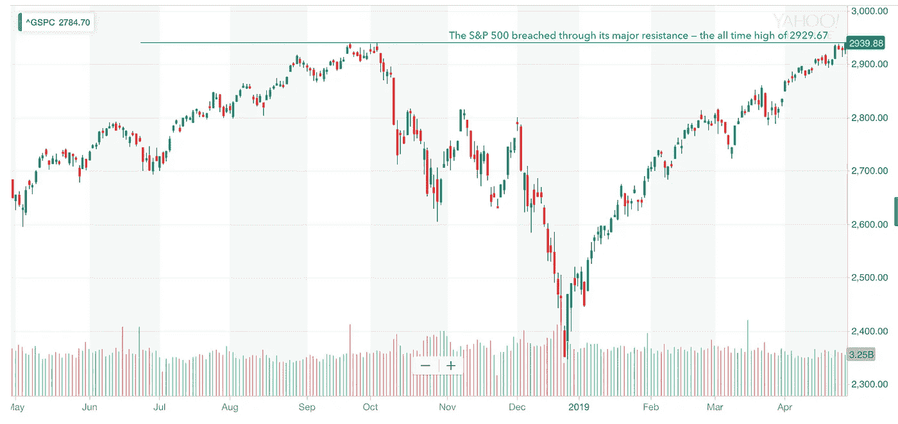

# 金融市场展望:2019 年 4 月 29 日的一周

> 原文：<https://medium.datadriveninvestor.com/financial-markets-look-ahead-week-of-april-29-2019-ba0cb7b88b9a?source=collection_archive---------4----------------------->

记录注定要被打破，这正是上周美国股市发生的事情。除了小盘股罗素 2000 指数，所有主要指数都创下新高:道琼斯工业平均指数达到 26543 点；纳斯达克指数达到 8146 点，标准普尔 500 指数达到 2940 点。罗素 2000 指数远低于其历史高点(1602 点)，正在努力回到那些令人兴奋的水平。在我看来，这是今年迄今为止最不受重视的故事。

Source: Yahoo! Finance

除了股市的强劲表现，上周还有一系列有趣的数据出炉。耐用品[订单](https://seekingalpha.com/article/4257017-durable-goods-orders-show-strength-march)——反映商业投资——同比增长 2.7%，而二月份修正后的数字为-1.1%。密歇根大学消费者信心指数[小幅下降](http://www.sca.isr.umich.edu)至 97.2(前一个月为 98.4)，但保持了去年以来的总体稳定趋势。根据 FactSet 的数据，迄今为止，已经有 46%的标准普尔 500 指数公司[公布了](https://www.wsj.com/articles/this-earnings-season-a-miss-hurts-even-more-11556107202) Q1 业绩，其中 75%的公司每股收益高于预期，59%的公司销售额高于预期。这两个数字都符合五年的平均水平。最令人惊讶的数据是国内生产总值，第一季度增长了 3.2%(预期为 2.2%)。通常情况下，人们会期待市场对此类数据做出非常积极的反应，但周五数据公布时情况并非如此。股票市场上涨了 0.6%，10 年期国债收益率下降了 3.4 个基点。美元也有所下跌。

 [## 为什么包容性财富指数比 GDP 更能衡量社会进步？-数据驱动…

### 你不需要成为一个经济奇才或金融大师就能知道 GDP 的定义。即使你从未拿过 ECON 奖…

www.datadriveninvestor.com](https://www.datadriveninvestor.com/2019/03/08/why-inclusive-wealth-index-is-a-better-measure-of-societal-progress-than-gdp/) 

试图突破 97.7 阻力位(自 11 月以来)的美元终于在周三果断地这样做了，并在周四跟进至 98.32 的高点。在周五公布了令人意外的良好 GDP 数据后，我预计美元将大幅走高，但美元在日线图上出现了熊市，本周收于 98.05。虽然这意味着短期内看跌，但其他指标——如趋势线、移动平均线、移动平均线收敛和发散(MACD)和随机指标——表明力量。欧元区经济仍然疲软，上周欧元兑美元突破 1.12 的主要支撑，收于 1.115。在欧元疲软的背景下，未来几周美元可能会进一步走强。

上周创下新高的标准普尔 500，根据其技术实力，将可能停留在 2929 点的关键支撑位上方。它在 2893 点有额外的支撑。也就是说，未来一周将公布一系列经济数据，密切跟踪经济基本面以寻找市场走向的线索将非常重要。现在市场的关键变量将是美国和欧元区之间贸易争端的升级，包括在欧洲使用中国 5G 电信技术的棘手话题。

尽管美元走强，股市创下历史新高，国内生产总值(GDP)数据也很好，但金价上周还是上涨了。这一举动有悖常理。同样，10 年期美国国债收益率在 GDP 数据公布后下跌，并突破短期支撑位，表明收益率进一步走软。这是否意味着市场不相信 GDP 数据？也就是说，黄金有很多阻力需要克服；下跌趋势线仍然完好无损，技术上，它还没有创造更高的低点。1300 水平是黄金的主要阻力，1274 继续是强有力的支持。

周一，原油突破 64.4 的阻力，在持续的供应担忧的推动下，迅速上涨至 66.6 的高点。然而，在本周后半周，该指数从该水平回落，显然是为了回应特朗普总统对欧佩克+国家高油价的警告。原油在一个巨大的熊市逆转中结束了一周，以 62.8 收盘。我在以前的笔记中列举的供应问题仍然存在，除此之外，我还要加上俄罗斯对欧洲供应的质量问题。最令人担忧的是，本周美国之前给予其主要贸易伙伴的豁免——允许他们从伊朗购买石油——将[到期](https://www.npr.org/2019/04/22/716096391/trump-administration-sends-warning-to-countries-that-continue-to-import-oil-from),目前还不清楚伊朗将如何回应。去年，伊朗威胁要中断通过霍尔木兹海峡的石油供应。这是一个非常不稳定的情况，任何 T2 的失误都有可能影响几个月甚至几年的供应。鉴于供应形势紧张，美国经济持续强劲，中国经济逐渐好转，我预计原油价格将再次走强。64.4 的价格水平将成为主要阻力，当原油突破上周的高点 66.6 时，我们可以预计目前的趋势将会恢复。

*跟我上* [*推特*](https://twitter.com/LecturingTrader?lang=en) *。*

*免责声明:以上文本不构成任何形式的建议或推荐(财务、税务、法律或其他)。对任何证券的投资都受多种风险的影响，上文对任何证券或一篮子证券的讨论不包含相关风险因素的列表或描述。在进行投资之前，一定要进行自己的独立研究，并考虑自己的风险偏好。*