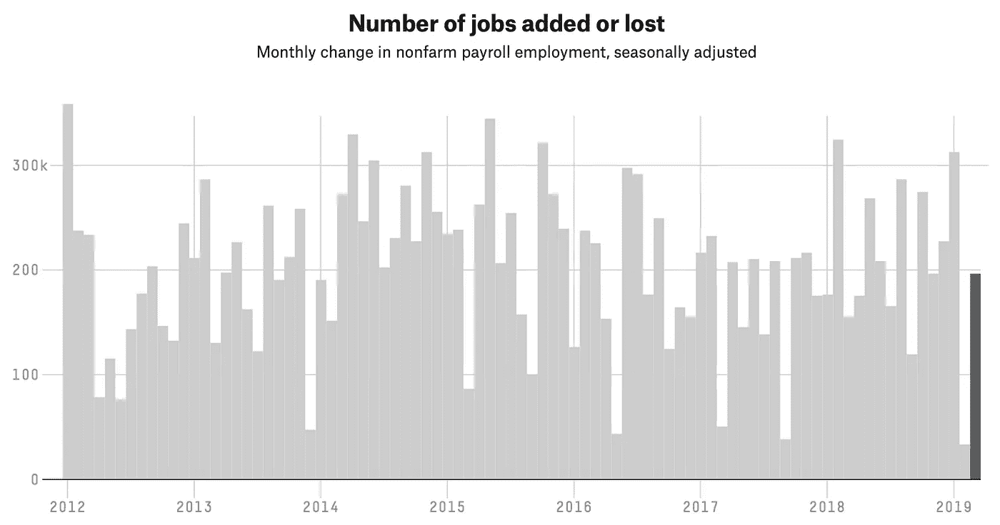

# 金融市场展望:2019 年 4 月 8 日的一周

> 原文：<https://medium.datadriveninvestor.com/financial-markets-look-ahead-week-of-april-8-2019-f93ecd67e434?source=collection_archive---------18----------------------->

美国劳工统计局(Bureau of Labor Statistics)发布的 3 月份美国月度就业报告(T1)于周五发布，伴随着市场的巨大宽慰，尤其是在 2 月份令人惊讶和令人沮丧的数字以及 3 年期和 10 年期国债收益率曲线(T2)反转(T3)之后。美国经济在 3 月份增加了 196，000 个就业岗位，而预期为 175，000 个，这大大高于 2 月份(修订后)的 33，000 个。三个月的平均值现在是 180，000，这标志着一个健康的劳动力市场(尽管经济*失去了* 6，000 个制造业工作岗位)，但它还没有强大到足以让美国美联储银行考虑加息。顺便提一下，这篇关于 fivethirtyeight.com 的文章是关于就业报告的很好的引子。我强烈推荐。

Source: [https://projects.fivethirtyeight.com/jobs-report-growth-unemployment/](https://projects.fivethirtyeight.com/jobs-report-growth-unemployment/)

鉴于特朗普总统对国防和基础设施支出的重视，制造业就业创造在未来几个月应该会保持强劲。美国的失业率几个月来一直保持在 3.8%，这支持了我的假设，即鉴于欧盟和中国等全球主要经济体的持续疲软，美国经济没有停滞，而是在逐渐放缓。美国供应管理协会(Institute for Supply Management)的制造业采购经理人指数(PMI)在 3 月份为 55.3，而 2 月份为 54.2，这表明制造业的增长速度正在加快，尽管非制造业 PMI 显示出减速迹象，3 月份为 56.1，而 2 月份为 59.7。美国新独栋房屋的销量比 1 月份增长了 4.9%，经季节调整后，2 月份的年率为 667，000 套。这是自 2018 年 3 月以来该指标的最高读数。简而言之，宏观经济指标没有显示出对美国经济的任何中短期担忧。

关于美国和世界经济状况的另一个令人鼓舞的数据是中国副总理刘鹤的评论，他正率领一个中国代表团前往华盛顿，以敲定美中贸易谈判的条款。何副总理评价“达成了新的共识”；也就是说，最终敲定的交易预计还需要几周时间。

 [## 2019 年需要关注的 20 个数字营销趋势和技术——数据驱动的投资者

### 展示本周的电子学习模块。做一个终身学习者！关于技术、金融、工作场所的每日剂量…

www.datadriveninvestor.com](https://www.datadriveninvestor.com/2019/02/04/20-digital-marketing-trends-techniques-to-watch-out-for-in-2019/) 

在美国之外，我们看到了中国经济触底反弹的初步迹象。正如我过去多次写的(这里和这里)，中国政府已经实施了几项措施来避免全面衰退，这些措施很可能在年中开花结果。财新中国综合制造业 PMI 从 2 月份的 49.9 升至 3 月份的 50.8(高于预期的 50.1)。这是四个月来的首次增长。随着新出口订单的增加，新订单增长也加速至 4 个月高点。就业自 2013 年 10 月以来首次增长。服务业 PMI 从二月份的 51.1 提高到三月份[的 54.4。美中贸易谈判预期的积极解决方案只会进一步巩固和加速中国经济最近的增长。更重要的是，我预计中国经济的改善将是全球增长的一个顺风。](https://tradingeconomics.com/china/services-pmi)

虽然与中国的贸易谈判可能在几周内结束，但与欧盟的另一轮谈判可能很快就会开始。症结将是农产品。我预计这次谈判将进一步削弱已经陷入困境的欧盟经济；已经陷入衰退的义大利，最近[将其增长目标从 1%下调至 0.1%。](https://www.cnbc.com/2019/04/04/italian-stocks-slide-on-reports-of-a-sizable-growth-downgrade.html)

总体而言，尽管美国和中国经济的宏观经济前景看起来不错，但欧盟经济仍在努力寻找底部。英国退出欧盟问题决议和美中贸易谈判是目前全球经济的两个关键未知数。鉴于强劲的经济数据和疲软的欧元区经济(欧元和英镑相对于美元的权重过大)，美元在过去三周已经走强，并可能进一步走强。总之，强势美元对新兴市场经济体和美国跨国公司不利。美元在 97.7 有很强的阻力，尽管它此前三次都未能突破这一阻力，但鉴于美国经济此时的相对实力，我预计它将在未来几周突破这一阻力。尽管如此，美中贸易谈判的任何突破或结束都可能在未来几周和几个月削弱美元。

标准普尔 500 上周在 2875 点附近打破了另一个阻力，距离 2018 年(和历史)高点仅 48 点。我上面提到的两个未知因素可能会阻止标准普尔 500 突破这一高点。原油在过去五周的每一周都有所上涨，欧佩克+国家持续削减供应，美国对伊朗和委内瑞拉的制裁，利比亚政治不稳定的发展，以及美中贸易谈判的预期解决方案，都是原油价格上涨的原因。

随着投资者的风险偏好慢慢回升，黄金面临压力。上周，黄金设法收于 1282 上方，这是一个重要的支撑，它可能会横向移动，并在未来几周内再次测试 1282 水平。

*跟我上* [*推特*](https://twitter.com/LecturingTrader?lang=en) *。*

*免责声明:以上文本不构成任何形式的建议或推荐(财务、税务、法律或其他)。对任何证券的投资都受多种风险的影响，上文对任何证券或一篮子证券的讨论不包含相关风险因素的列表或描述。在进行投资之前，一定要进行自己的独立研究，并考虑自己的风险偏好。*