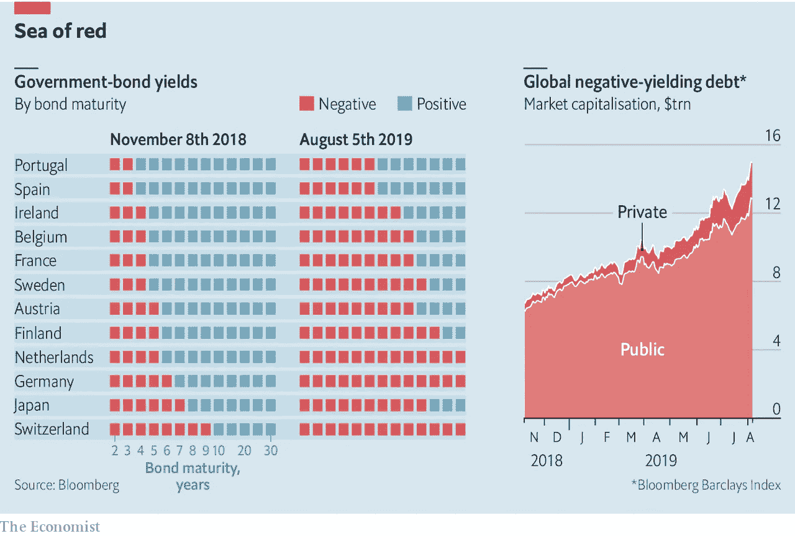

# 金融市场展望:2019 年 8 月 12 日的一周

> 原文：<https://medium.datadriveninvestor.com/financial-markets-look-ahead-week-of-august-12-2019-6380cb615bd6?source=collection_archive---------8----------------------->

永无止境的美中贸易战似乎正在演变成一场更加令人担忧的货币战；两周前，美国美联储委员会(T2 中央银行)十多年来首次降低了利率。接着在上周，中国允许人民币对美元贬值，突破了 1 美元兑 7 元人民币的重要心理关口。我不确定为什么这个价格水平如此重要，但回顾人民币的定价，它自 2010 年以来的最低定价是 1 美元兑 6.95 元人民币，这是唐纳德·特朗普(Donald Trump)当选美国总统时达到的水平。然而，比实际价值更重要的是，中国政府让人民币走弱:由于中国密切监控——并控制——人民币汇率，这种“下滑”被视为报复性的。这使得中国商品在全球市场上更便宜，被视为一种不诚实的行为；美国立即给中国贴上了货币操纵国的标签，尽管国际货币基金组织并不这么认为。

整个市场都感受到了这种影响:在美国，股市出现了 2019 年最大单日跌幅。美国 10 年期国债收益率跌破 1.74%。金价突破 1450 美元，收于 1476 美元。波动性激增。正如我过去所写的那样，双方的分歧比“贸易战”一词所暗示的更深；这是一场争夺未来全球霸权的战斗，这个问题不太可能在短期内得到解决。我们可能会看到一些短暂的“协议”和修补，但我预计两国之间的潜在压力将持续到 2020 年 11 月美国总统选举之后。

 [## 为什么包容性财富指数比 GDP 更能衡量社会进步？|数据驱动…

### 你不需要成为一个经济奇才或金融大师就能知道 GDP 的定义。即使你从未拿过 ECON 奖…

www.datadriveninvestor.com](https://www.datadriveninvestor.com/2019/03/08/why-inclusive-wealth-index-is-a-better-measure-of-societal-progress-than-gdp/) 

来自美国的统计数据表明，美国经济仍然强劲，但有下行趋势。美国经济在 7 月份增加了 164，000 个非农就业岗位，但必须指出的是，3 个月的平均水平(140，000)远低于去年同期的平均水平(200，000+)。美国整体失业率处于历史低位 3.7%，7 月份工资上涨 0.3%。据 JOLTS [报告](https://www.bls.gov/news.release/jolts.nr0.htm)称，金融危机爆发仅 10 年后，美国的就业人数就比失业人数多 140 万。经季节性调整的 IHS Markit 美国服务业商业活动指数[7 月份为 53.0，而 6 月份为 51.5。根据 IHS 市场报告，“……商业活动的好转总体上是稳固的，是三个月来最快的。服务提供商将这一增长归因于新业务的增加和客户需求的改善。也就是说，扩张速度低于年初，也低于系列平均值(55.1)。”7 月份，美国服务业增长放缓至三年来最低水平，这可能是贸易相关担忧的结果。T4 供应管理协会报告称，7 月份非制造业活动下降至 53.7(6 月份为 55.1)。这些数据非常重要，因为服务业占美国经济的三分之二，任何疲软都可能是未来发展的先行指标。](https://www.markiteconomics.com/Public/Home/PressRelease/a610f304a4604718b5384566e770e053)

从全球来看，情况并没有好转。欧元区经济继续低迷，汽车行业前景日益恶化(这意味着德国陷入了更大的麻烦)。在英国，第二季度国内生产总值同比下降 0.2%。未来两个月对英国经济至关重要；正如人们普遍预期的那样(我也同意)，无协议的英国退出欧盟将在短期内给英国经济带来问题。欧洲持续的经济挑战的结果是，超过 15 万亿美元的政府和私人债务现在[提供](https://www.economist.com/finance-and-economics/2019/08/08/as-yields-turn-negative-investors-are-having-to-pay-for-safety) *负*收益率！(举一个过于简单的例子，一般来说，如果你想向某人借 100 美元，你会还他们更多的钱——比如 105 美元——以弥补通货膨胀和你可能不还的风险。在负利率的情况下，你借了 100 美元，并提出归还少于 100 美元的*,他们接受了这笔交易！).*

[Source](https://www.economist.com/finance-and-economics/2019/08/08/as-yields-turn-negative-investors-are-having-to-pay-for-safety): The Economist

美国 10 年期国债本周收低，收于 1.745%，此前触及周内低点 1.595%。一旦美国政府将中国列为汇率操纵国，中国就指示其国家机构停止购买美国农产品。美国随后宣布不再允许美国科技公司与华为做生意。此外，美联储再次受到唐纳德·特朗普总统降息的压力，这也是由于全球央行的行动；上周，印度、新西兰和泰国降息，其他发展中国家进一步降息也在意料之中。从技术上看，美国 10 年期国债正在显示疲软，可能会在未来几周触及 2016 年 7 月创下的前期低点 1.37%。

美元本周进一步下跌，收于 97.55。上周五，该指数触及 97.03 的日内低点。鉴于前一周的降息，这是意料之中的，也有关于美国故意让美元贬值的说法，尽管国家经济委员会主任拉里·库德洛已经否认了这些传言。

正如预期的那样，标准普尔 500 在本周初失去了阵地，触及 2822 点的低点，略高于 2812 点的主要支撑，并在 2918 点收盘——这是一个大的复苏。这种复苏也表明了 2812 点的价格水平有多重要。正如我最近几周所写的，美国经济仍处于扩张模式，我相信美国股市将在短期内上涨，测试标准普尔 500 2942 点的价格水平。最大的未知数仍然是特朗普总统的推文，它可以在短时间内促成或破坏一场反弹。

金价本周上涨逾 4%，收于 1508 点，为三年多来表现最好的一周。全球增长担忧、利率和债券收益率下降、美联储降息预期以及美中贸易战升级，帮助黄金升至约六年前的水平。黄金的另一个有趣现象是，以中国人民银行为首的全球央行正在购买大量黄金。技术上，移动平均线、趋同/趋异和随机性都是积极的，考虑到全球持续的风险环境，黄金可能会上涨。在 1560 点有很强的阻力，在这个价位可能会有一些利润。另一个与黄金相关的有趣投资是比特币，它正迅速变成一种安全的 T2 资产。

原油全周收低，全周收于 54.27，最低触及 50.52。沙特阿拉伯通过早于此前宣布的计划限制产量来支撑原油价格，引发了周五的强劲复苏。周线图上的锤子蜡烛表示可能的复苏；也就是说，基本的供应/需求状况没有发生重大变化，所以正如我[上周提到的](https://medium.com/datadriveninvestor/financial-markets-look-ahead-week-of-august-5-2019-1f6ad05eed94)，原油可能会继续在 52.4 至 60.5 的价格区间内交易，并偏向该区间的低端。

*如果觉得我的笔记有用，别忘了关注我的* [*中*](/@lecturing.trader?source=post_page---------------------------) *和* [*推特*](https://twitter.com/LecturingTrader?lang=en&source=post_page---------------------------) *。*

免责声明:以上内容不构成任何形式的建议(财务、税务、法律或其他)。对任何证券的投资都受多种风险的影响，上文对任何证券或一篮子证券的讨论不包含相关风险因素的列表或描述。在进行投资之前，一定要进行自己的独立研究，并考虑自己的风险偏好。