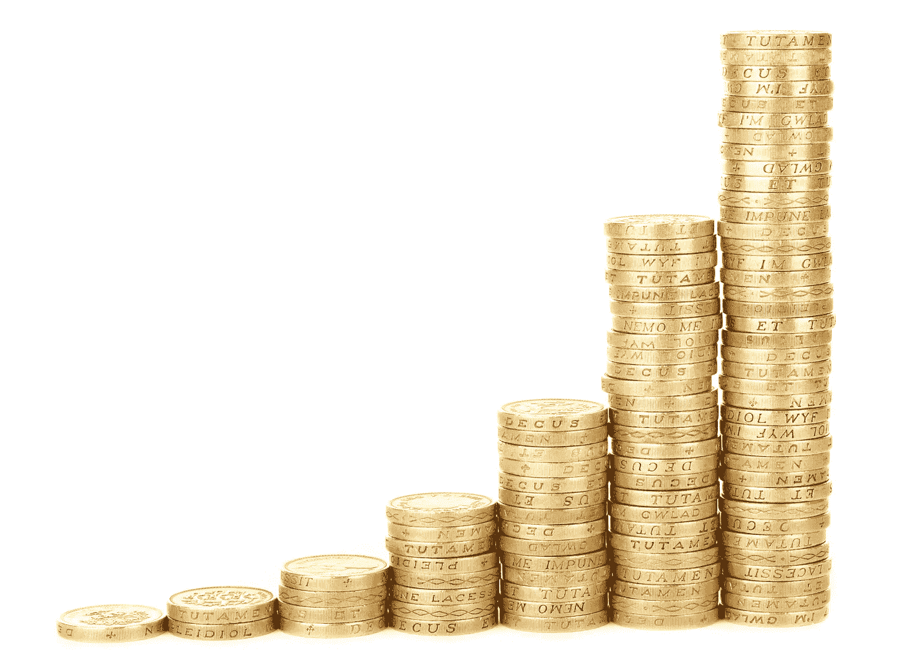
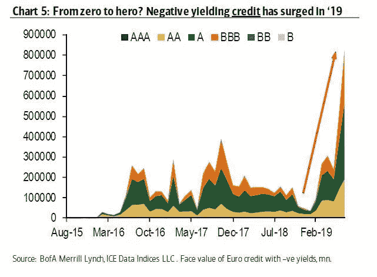

# 金融市场展望:2019 年 8 月 5 日的一周

> 原文：<https://medium.datadriveninvestor.com/financial-markets-look-ahead-week-of-august-5-2019-1f6ad05eed94?source=collection_archive---------3----------------------->

上周我[写了](https://medium.com/datadriveninvestor/financial-markets-look-ahead-week-of-july-29-2019-8c451c50db8a):

> 标准普尔 500 上周上涨了 1.675%……但价格走势显示出一丝疲惫。标准普尔 500 在 2975 和 2942 有很强的支撑，我预计本周会有一些盈利。

毫不奇怪，在美国美联储委员会十多年来第一次降息的背景下，股票市场上周下跌(T4 上一次降息是在 2008 年 12 月)。看着美联储的价格行动和评论，我怀疑市场已经消化了 50 个基点的降息(美联储只降息了 25 个基点),上周出人意料的好数据给了美联储一些信心，认为经济在这个时候不需要额外的支持。令人失望的 25 个基点的降息加上美联储提到的“周期中期调整”——这让人对未来的降息产生了怀疑——然后唐纳德·特朗普总统出人意料地宣布(通过推特)从 9 月 1 日起对中国产品征收 10%的新关税，导致了 2019 年市场最糟糕的一周:标准普尔 500 指数本周下跌 3.1%，收于 2932.05 点。

我觉得特蕾西·阿洛威的假设很有说服力，他认为川普总统正在利用对中国不断升级的关税作为迫使美联储在 T2 进一步降息的策略。正如我上周在[讨论](https://medium.com/datadriveninvestor/financial-markets-look-ahead-week-of-july-29-2019-8c451c50db8a)时所说，关税对中国的影响是有意义的，但正如 Q2 持平的通胀和普遍乐观的企业盈利所证明的那样，它们对美国的影响是微弱的——到目前为止。美联储主席杰罗姆·鲍威尔此前曾评论贸易战前景的改善是保持利率稳定的原因，特朗普总统在令人失望的降息后迅速解决了这个问题；时机是不会错的。

 [## 为什么包容性财富指数比 GDP 更能衡量社会进步？|数据驱动…

### 你不需要成为一个经济奇才或金融大师就能知道 GDP 的定义。即使你从未拿过 ECON 奖…

www.datadriveninvestor.com](https://www.datadriveninvestor.com/2019/03/08/why-inclusive-wealth-index-is-a-better-measure-of-societal-progress-than-gdp/) 

如果脱离全球经济来看，美国经济仍然强劲且在扩张。占美国经济活动三分之二以上的消费者支出在六月增长了 0.3%。如果不是消费者支出强劲增长，由于出口疲软和商业投资减少，Q2 国内生产总值的增长率将远低于 2.1%。推动经济的另一个因素是健康的就业创造。美国经济在 7 月份增加了 164，000 个工作岗位；工资也比预期增长得快。简而言之，劳动力市场依然强劲。强劲的劳动力市场，加上低抵押贷款利率(30 年期固定利率趋势为 3.75%；同比下降 75 个基点)导致 6 月份待售房屋销售增长 2.8%。

美国经济中令人担忧的一个主要领域是制造业。经季节性调整的 IHS Markit 美国制造业采购经理人指数(T0)在 7 月份达到 50.4，与 6 月份的 50.6 相比略有下降。然而，趋势令人担忧:这是自 2009 年 9 月金融危机以来最慢的总体扩张速度。供应管理协会的制造业指数的七月[读数](https://seekingalpha.com/article/4280587-ism-manufacturing-index-soft-expansion-continues-july)下降到三年来的最低点 51.2%(六月为 51.7%)。6 月份，建筑支出[比上月下降了 1.3%。简而言之，正在进行的对华贸易战有可能让美国制造业脱轨(即使考虑到波音的情况)。](https://www.census.gov/construction/c30/pdf/release.pdf)

在美国以外，全球经济继续遭受打击；尤其是，欧元区经济似乎看不到任何希望。IHS Markit 的欧元区制造业 PMI[7 月份为](https://www.markiteconomics.com/Public/Home/PressRelease/5ea690f5df6b47c2b4789aa9d34e5e3e)46.5(6 月份为 47.6)，这表明连续第六个月收缩，并表明运营状况出现自 2012 年 12 月以来的最大恶化。正如普通读者所知，低于 50 的数字表明经济收缩。正如我在上周对全球经济状况的分析中所详述的，欧元区的衰退是由德国主导的。汽车行业的形势尤其严峻，与美国的情况一样，商业投资——以及对资本货物的需求——正在下降。

中国制造业经济在 7 月份略有改善，尽管仍处于收缩状态。令人鼓舞的是，7 月份财新中国通用制造业 PMI [上升](https://www.markiteconomics.com/Public/Home/PressRelease/c777ba6bdb9249529adea78034658761)至 49.9(6 月份为 49.4)；重要的是，新订单和产出的分类指数都回到了扩张区域。正如我之前对[的假设](https://medium.com/@lecturing.trader/financial-markets-look-ahead-week-of-february-4-2019-f929d9fd5bbd)，中国政府扭转中国经济的各种举措似乎正在发挥作用，只是被与美国正在进行的贸易战的影响所抵消。正在进行的贸易战的爆炸半径很大，因为亚洲的整个制造业供应链都感受到了美国对中国进口商品征收关税的冲击(中国组装产品，但依赖其他亚洲经济体的原材料和零部件；由于贸易战，中国对这些经济体的零部件订单也在放缓)。因此，日本和东盟国家的出口驱动型经济继续保持收缩。

美联储周中宣布后，美元指数上涨，但在特朗普总统发布关于对中国进口商品征收额外关税的推文后，美元指数放弃了所有涨幅。美元指数收于 98.10，本周小幅上涨。从技术上看，移动平均线、趋同/趋异和随机性仍然是积极的，因此美元在未来几周有可能上涨，97.7 是强有力的支撑。突破这一水平将意味着疲软。尽管美元仍显示出一些强势，但美国 10 年期国债收益率一直呈现出非常悲观的前景。当周跌幅超过 11.1%，目前较 2018 年 10 月的近时间高点下跌超过 43%。这是一个明显的熊市趋势，鉴于美国经济的相对实力和正收益率，这可能是由于流入美国国债的资金增加所致；目前其他地方几乎没有好的投资机会:甚至欧洲 BBB 评级的公司债券目前也在提供负收益率！

标准普尔 500 在 2943 点附近突破了一个非常重要的支撑位，收于 2932 点——一周下跌近 3.1%。技术指标明显是负面的，标准普尔 500 可能会重新测试 2812 点左右的重要支撑位。

在地缘政治不确定性和紧张局势的阴影下蓬勃发展的黄金本周上涨 2.3%，收于 1452.5。技术指标在月线和周线上都是积极的，日线图也是积极的，这表明黄金将从当前水平上涨，测试 1488 的关键阻力。

另一方面，当全球经济高速增长——导致更高的需求——或者出现重大供应中断时，原油价格会上涨。今天，我们看到全球增长放缓，供应健康。虽然伊朗周边存在地缘政治不确定性，但目前供需平衡有利于供应；因此，从中期角度来看，我看空原油。上周原油收低至 55.19(从 56.2)。我认为，在霍尔木兹海峡没有任何重大升级的情况下，原油价格可能会在 52.5 至 60.2 之间横盘整理，明显偏向该区间的低端。

*如果觉得我的笔记有用，别忘了关注我的* [*中*](/@lecturing.trader?source=post_page---------------------------) *和* [*推特*](https://twitter.com/LecturingTrader?lang=en&source=post_page---------------------------) *。*

*免责声明:以上文本不构成任何形式的建议或推荐(财务、税务、法律或其他)。对任何证券的投资都受多种风险的影响，上文对任何证券或一篮子证券的讨论不包含相关风险因素的列表或描述。在进行投资之前，一定要进行自己的独立研究，并考虑自己的风险偏好。*