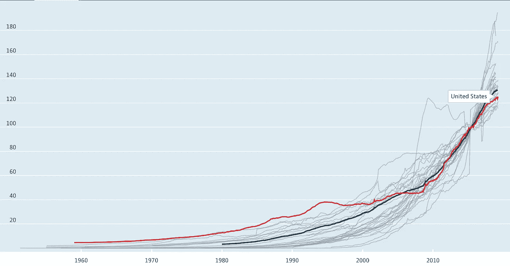

# 金融市场展望:2019 年 7 月 1 日的一周

> 原文：<https://medium.datadriveninvestor.com/financial-markets-look-ahead-week-of-july-1-2019-27ae8dacb10a?source=collection_archive---------5----------------------->

这些天来，我们目睹了一些非常有趣的事情:市场屡创新高，但却恳求央行降低利率。一些读者问我为什么降低利率如此重要？虽然我不能确定，但以下是我从投资者角度对此的一些想法:

1.  随着投资者追逐更高的回报，零风险(以本币发行的政府债务)债务的较低利率可能会导致投资者关注高风险资产。这推高了股市价格。另一种思考方式是，假设经济状况稳定，那么如果无风险利率降低，这意味着投资者现在在与以前相同的风险下获得更低的回报。如果出现这种情况，投资者将寻求投资于单位风险回报率更高的资产，股市也将受益。我在本笔记的末尾添加了一个稍微更具技术性的讨论。附注:以本币发行的政府债务被视为零风险，因为政府永远不存在债务违约的风险；它可以简单地印刷更多的货币来偿还债务！

 [## 为什么包容性财富指数比 GDP 更能衡量社会进步？-数据驱动…

### 你不需要成为一个经济奇才或金融大师就能知道 GDP 的定义。即使你从未拿过 ECON 奖…

www.datadriveninvestor.com](https://www.datadriveninvestor.com/2019/03/08/why-inclusive-wealth-index-is-a-better-measure-of-societal-progress-than-gdp/) 

2.较低的利率允许公司改变他们的资本结构，提高股本回报率。比方说，一家公司从投资者那里筹集了 100 美元来经营它的业务，每年回报 10 美元的利润。这意味着股本回报率为 10%(投资者每年的股本投资回报率为 10%)。然而，如果该公司不是以股本形式筹集所有资金，而是以债务形式筹集所需资金的一半，会发生什么？该公司的利润会少一点，因为它现在必须支付债务利息；让我们假设该公司在支付利息后“只有”8 美元的利润。然而，请注意，股本回报率实际上是上升的！现在是 16%(8 美元除以 50 美元)。各种融资形式(股权、债务等)的分割。)是公司的资本结构，改变它可以显著改变投资者的投资回报(这在很大程度上是私募股权行业的基础)。近年来，大量的上市公司——尤其是在美国——诉诸于这样的资本结构[调整](https://www.aboveavalon.com/notes/2019/4/24/apples-400-billion-buyback-program)来提高股本回报率和提升股价(例如，通过负债从市场回购股票，从而减少股票数量和增加[每股收益](https://www.investopedia.com/terms/e/eps.asp)；由于一家公司的 [P/E](https://www.investopedia.com/terms/p/price-earningsratio.asp) 一般不是由[资本结构](https://www.investopedia.com/terms/c/capitalstructure.asp)驱动的，较高的 EPS 导致较高的股价)。这种股价上涨并不代表公司的任何实际“增长”，更多的是金融工程，而不是其他任何东西。事实上，如果鲁莽行事，这种行为可能对企业有害，尤其是在企业负债过多的情况下。利率上升不仅会使这些举措变得困难，还会严重损害那些寻求发行新债来偿还到期旧债的企业。这是一个巨大的问题，会加剧下一次的经济衰退，因为全球的公司债务处于历史最高水平。

3.较低的利率会使当地货币贬值(因为投资者会投资于经济相似但利率较高的其他国家的债务)。当一个国家的货币贬值时，其他国家购买其产品会变得更便宜，从而推动出口；这是川普总统向美国美联储委员会施压降低利率的关键原因之一。

通常，较低的利率可以帮助经济增长，因为它使资本更容易获得。然而，鉴于自过去十年的衰退以来，全球配置的资本过剩，我想知道在这个时候我们是否需要更多的资本。从更大的意义上来说，虽然我们上一次可能正确地避免了一场全面的全球萧条，但所有这些[注入全球经济的自由资金很可能使世界陷入这样一种境地:我们将越来越多地指望廉价资金来挤压世界经济的任何增长。在以后的笔记中会有更多的介绍。](https://data.oecd.org/money/narrow-money-m1.htm#indicator-chart)

**Narrow Money Supply (M1)** | Source: OECD | 2015 = 100

2019 年上半年已经过去；标准普尔 500 徘徊在上周创下的历史高点附近。标准普尔 500 6 月份上涨 6.9%，年初至今上涨 17%；这是其自 1955 年以来最好的半年表现。道琼斯工业平均指数和纳斯达克指数的情况类似。小盘股罗素 2000 指数涨幅较小(约 13%)，但最近上涨较快。我发现这非常有趣，因为正如普通读者所知，我经常将罗素 2000 指数作为影响实体经济的指标。其他国家的股市也表现不错:日本、印度、韩国和新加坡的年初至今增长率都是个位数，中国的上证综指年初至今上涨了 18%，澳大利亚股市年初至今上涨了 18%，新西兰股市年初至今上涨了 20%。马来西亚和印度尼西亚是例外。

那么，为什么全球越来越多的政府正在考虑降息呢？我们正在见证大规模认知失调吗？泡沫不就是这样产生的吗？说到认知失调，德国接近衰退，尽管其市场指数年初至今取得了令人印象深刻的 15%的增长。我曾多次写道，德国在过去几个月经历了一段困难时期，由于美国和 T2 的汽车销售放缓，德国出口驱动的汽车行业陷入困境，如果英国在没有与英国退出欧盟达成协议的情况下离开欧盟，德国可能会面临进一步的挑战，这看起来很有可能(英国是德国汽车最大的出口市场)。另一个例子是印度:自 2016 年去货币化以来，增长一直在减速，失业率达到 45 年来的[高点](https://timesofindia.indiatimes.com/business/india-business/joblessness-at-45-year-high-but-nso-adds-a-caveat/articleshow/69604908.cms)，但印度股市在 2019 年上半年上涨了 9.8%。

美国经济状况有所好转，但趋势正在恶化；Q1 国内生产总值(GDP)年增长率为 3.1%，失业率仍处于历史低位，经济增长势头良好。也就是说，随着 Q2 GDP 增长预期下调(约 1.6-1.8%)，以及美中贸易、英国退出欧盟和伊朗的不确定性，我预计市场会稍微停顿一下。此外，尽管关键数据本身并不糟糕，但趋势并不令人欣慰。消费者信心——在连续三个月上升后——[在 6 月份大幅下降](https://www.bloomberg.com/news/articles/2019-06-25/u-s-consumer-confidence-falls-to-lowest-since-september-2017)，达到 2017 年 9 月以来的最低水平。(6 月份为 121.5，5 月份为 131.3)。6 月份，帝国州制造业调查暴跌 26 点至-8.6，这是 T2 有记录以来最大的月度跌幅。供应管理协会制造业采购经理指数从 4 月份的 52.8 下降到 5 月份的 52.1(T4)；尽管这仍然是一个扩张性指标，但这是特朗普总统任期内的最低读数。既然美国和中国已经同意重启陷入停滞的贸易谈判，那么看看美联储是否会降息以及降息幅度会有多大将是一件有趣的事情。我认为，尽管美国的经济状况还不允许降息，但美联储将被迫降息，以回应全球其他央行的降息举措。

过去几个月，美国房地产市场也在放缓。根据 Case-Shiller 指数，4 月份房价同比增长 3.5%，尽管抵押贷款利率较低，但这是过去七年来的最低增长率。自 1950 年以来，美国每次衰退之前都会出现房地产低迷，这是值得关注的事情。

标准普尔 500 在 6 月 20 日突破了 2952 点附近的主要阻力，并在上周跌破该水平。我预计在当前水平会有一些获利回吐，标准普尔 500 在 2912 点和 2878 点有支撑。随机数据目前是积极的，但中期业绩将主要受 Q2 公司收益和第三季度指引的推动。

黄金试图达到 1450 水平，但在交易周的最后三天大幅回落。美国和中国之间贸易谈判的恢复将对黄金产生负面影响，但降息将提供顺风。从技术角度来看，周线图上的大锤表明本周可能会出现大量获利回吐，1400 点将提供支撑。如果突破这个水平，我预计 1356-1367 区间将提供良好的支撑。谈到贸易战，美国和中国之间存在根本分歧，这可能导致贸易战不会很快得到解决；因此，我中期看好黄金。

原油上周小幅上涨，收于 58.20。美中恢复贸易谈判的消息对原油是积极的，但除非全球增长前景很快出现明显改善，否则我预计原油价格将偏向下行。目前，原油面临更多不利因素(美国生产强劲，全球增长前景疲软)，因此，我看空原油，等待中东地缘政治的新发展。

*如果觉得我的笔记有用，别忘了关注我的* [*中*](https://medium.com/@lecturing.trader) *和* [*推特*](https://twitter.com/LecturingTrader?lang=en) *。*

*免责声明:以上文本不构成任何形式的建议或推荐(财务、税务、法律或其他)。对任何证券的投资都受多种风险的影响，上文对任何证券或一篮子证券的讨论不包含相关风险因素的列表或描述。在进行投资之前，一定要进行自己的独立研究，并考虑自己的风险偏好。*