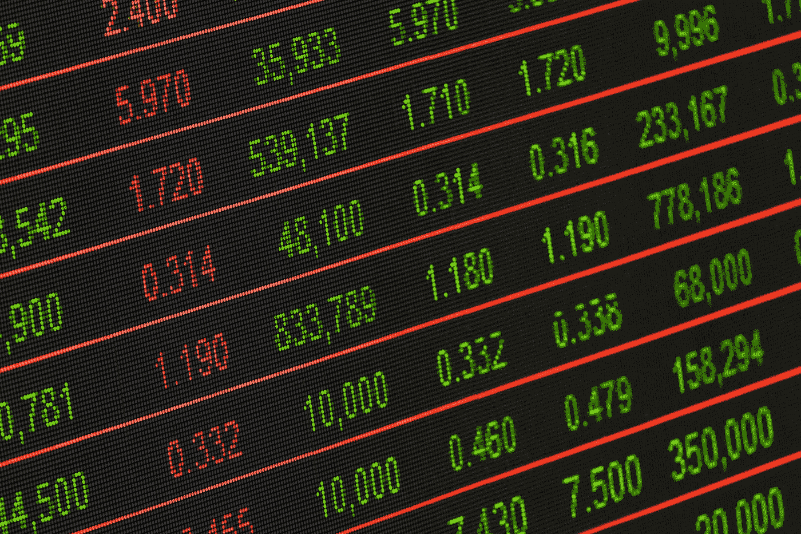

# 金融市场展望:2019 年 7 月 15 日的一周

> 原文：<https://medium.datadriveninvestor.com/financial-markets-look-ahead-week-of-july-15-2019-2ac96e3d9a2d?source=collection_archive---------4----------------------->

市场似乎只挑选好消息。

道琼斯工业平均指数上周创下历史新高，达到 27332 点，超过了去年 10 月份的 26951 点，这得益于几个积极的消息。首先，有传言说美国和中国之间可能恢复贸易谈判。第二，美联储主席杰罗姆·鲍威尔发表了非常温和的[评论。然而，尽管已经有了恢复贸易谈判的](https://www.federalreserve.gov/newsevents/testimony/powell20190710a.htm) [*会谈*](https://www.cnbc.com/2019/07/12/peter-navarro-dont-believe-anything-you-read-in-the-chinese-or-us-press-about-trade-negotiations.html) ，但实际上什么也没有发生。中国尚未恢复从美国购买大豆。它还为贸易谈判设置了新的先决条件，包括取消美国对中国商品的关税。最后，上周有关于中国阻止美国高管离开中国的令人担忧的报道。即使谈判很快恢复，也不太可能在未来一年内达成一个干净的、双方都能接受的结果，因为正如我在这个网站上经常写的那样，美国和中国正在全球舞台上争夺同一个“空间”，因为这场战斗的本质是赢家通吃。

 [## 为什么包容性财富指数比 GDP 更能衡量社会进步？|数据驱动…

### 你不需要成为一个经济奇才或金融大师就能知道 GDP 的定义。即使你从未拿过 ECON 奖…

www.datadriveninvestor.com](https://www.datadriveninvestor.com/2019/03/08/why-inclusive-wealth-index-is-a-better-measure-of-societal-progress-than-gdp/) 

尽管美国经济仍相当健康，但全球经济仍在挣扎。上周，由于与美国的贸易问题，欧盟委员会下调了明年欧元区的增长和通胀预测，现在可能会采取新的刺激措施来稳定欧洲经济。它将 2020 年的 GDP 预测从 1.5%修订为 1.4%，并将 2019 年剩余时间和 2020 年全年的通胀目标修订为 1.3%，远低于欧洲央行 2.0%的目标利率。标准普尔全球评级公司[将其对亚太地区今年和 2020 年的经济增长预测下调至 5.1%，称由于美中贸易战的持续，该地区的资本支出增长放缓。根据经济合作与发展组织(OECD)首席经济学家](https://www.thestar.com.my/business/business-news/2019/07/10/trade-worries-to-impact-growth-investment-in-asia-pacific-sp-says/)[的说法，到 2021-22 年，贸易争端的加剧可能会使全球 GDP 减少 0.7%。贸易增长率也明显下降，从两年前的 5.5%下降到目前的 2.0%(在欧洲等一些地区接近 0%)。英国退出欧盟和伊朗等悬而未决的问题是全球经济的进一步阻力。](https://www.cnbc.com/video/2019/07/09/geopolitical-risks-undermining-global-growth-oecd-chief-economist.html)

债券收益率反映了全球风险厌恶情绪:债券收益率已经下降了几个月，在一些国家，债券收益率已经变为负值。目前，全球超过 12 万亿美元的债券收益率为负，包括欧洲的一些 T2 垃圾债券！—一些国家已经采取降息措施来刺激经济。这开始给美元带来压力，其结果是唐纳德·特朗普总统一再呼吁美国降息(以削弱美元，从而援助美国出口)。在周三向美国众议院提交的[证词](https://www.federalreserve.gov/newsevents/testimony/powell20190710a.htm)中，美联储主席杰罗姆·鲍威尔强调了全球经济面临的问题以及美国经济面临的风险，这本身就是对美国经济担忧的承认；投资者将他对风险的承认视为今年晚些时候将降息的信号，并将美国主要股市推至历史高点，而没有真正考虑到由于全球经济的基本面疲软，降息可能是必要的。关于为什么利率对股票市场如此重要的更多信息，请阅读我 7 月 1 日的[笔记](https://medium.com/datadriveninvestor/financial-markets-look-ahead-week-of-july-1-2019-27ae8dacb10a)。

鲍威尔向国会作证后，在强劲的就业报告和贸易谈判声明的支持下上涨的美元下跌。市场现在比以往任何时候都更加确定，美联储将在本季度将基准利率下调至少 25 个基点，并可能在年底前再下调两次。特朗普总统指示其政府探索削弱美元的方法，这对美元是一大利空，尽管尚不清楚美联储是否会在这方面与政府合作。此外，美国削弱美元的行动可能会被欧洲央行的货币宽松政策抵消，导致各国央行之间的一种底部竞赛。上周，美元指数突破下跌趋势线，但未能克服 97.7 的阻力，收于 96.83。美元指数在 96.14 附近有强大的支撑，随后在 95.5 有额外的支撑。从短期到中期来看，我预计美元将会承压，尤其是在秋季，届时美国的[债务上限](https://www.nytimes.com/2019/07/12/us/politics/debt-ceiling.html)讨论将会浮出水面。

与 DJIA 一样，标准普尔 500 上周创下历史新高，收于 3013.7 点。技术上，移动平均线，收敛/发散(MACD)和其他随机指标都是正数，表明上升趋势在继续。然而，自 2 月份以来，小型股罗素 2000 没有参与这次上涨。截至上周，罗素 2000 指数较 2018 年 9 月底的前期高点下跌约 9.9%。我假设关税战对小型企业的伤害比对大型企业的伤害更大，正如我在[这篇](https://medium.com/datadriveninvestor/financial-markets-look-ahead-week-of-july-1-2019-27ae8dacb10a)笔记中所写的，大型企业可能更多地受益于宽松的货币政策，而不是基本面的经济实力。我们不应该忽视这样一个事实，收益季节即将开始，在接下来的 4-6 周内，价格走势将受到收益的影响，更重要的是受到指导的影响。

自 5 月 31 日开始大幅上涨后，金价一直在 1，387 至 1，429 之间横盘整理。这是由几个因素推动的:全球经济继续减速，6 月份中国出口同比下降 1.3%，贸易战看不到尽头，各国央行继续推动黄金需求，伊朗等地缘政治风险仍然存在。很可能每当黄金突破 1429 阻力位，就会快速上移，如果回撤，那么在 1387-1355 之间会有很强的支撑。

原油本周取得了令人印象深刻的收益，收于 60.39 美元，原因是墨西哥湾的石油生产因热带风暴巴里的预防措施而放缓，以及伊朗和英国之间的紧张局势因伊朗再次开始浓缩铀的消息而加剧。也就是说，国际能源机构(IEA)预测，尽管欧佩克+国家继续减产，但美国石油产量的飙升将超过低迷的全球需求，并导致未来几个月美国库存增加。因此，短期内，原油有可能重新测试 63 水平。

*如果你觉得我的笔记有用，别忘了关注我的* [*中*](/@lecturing.trader) *和* [*推特*](https://twitter.com/LecturingTrader?lang=en) *。*

*免责声明:以上文本不构成任何形式的建议或推荐(财务、税务、法律或其他)。对任何证券的投资都受多种风险的影响，上文对任何证券或一篮子证券的讨论不包含相关风险因素的列表或描述。在进行投资之前，一定要进行自己的独立研究，并考虑自己的风险偏好。*