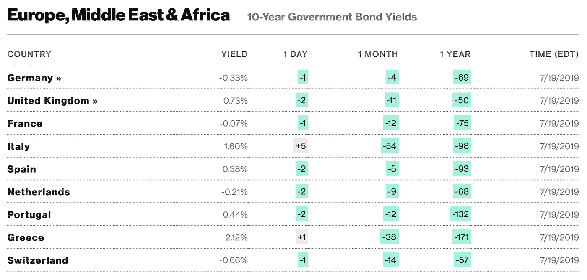

# 金融市场展望:2019 年 7 月 22 日的一周

> 原文：<https://medium.datadriveninvestor.com/financial-markets-look-ahead-week-of-july-22-2019-49acdd0467c8?source=collection_archive---------7----------------------->

等待降息的游戏还在继续。美国股市接近历史高点，但投资者急切地——而且越来越紧张地——等待美国美联储董事会宣布降息。我在之前的[笔记](https://medium.com/datadriveninvestor/financial-markets-look-ahead-week-of-july-1-2019-27ae8dacb10a)中写道，为什么投资者越来越多地寻求降息:潜在经济似乎正在失去动力，甚至需要某种形式的金融工程来保持(市场的)势头。

尽管美国经济仍在以相对不错的速度增长，但全球经济却并非如此，全球经济减速已经有一段时间了。2019 年第二季度，中国国内生产总值(GDP)同比增速放缓至 6.2%，为 27 年来最低季度增速。正如我上周在[写的那样，尽管有相反的声明，但在贸易谈判方面没有任何实际进展——比如高级政府官员之间的面对面会谈，我不指望这个问题能早日得到解决。虽然中国的经济形势仍然紧张，但欧洲的情况也好不到哪里去，尽管利率很低(在某些情况下，](https://medium.com/datadriveninvestor/financial-markets-look-ahead-week-of-july-8-2019-227d687b0c99)[负](https://www.bloomberg.com/markets/rates-bonds)),通货膨胀仍然受到抑制，经济增长难以实现。

Source: Bloomberg

英国退出欧盟是另一个令人担忧的地区，随着 Boris Johnson 成为下一任英国首相的热门人选，围绕英国退出欧盟的戏剧很可能还会持续一段时间。除了中国和欧洲，迄今为止一直抵制降息的国家，如南非、韩国和印度尼西亚，在过去几天宣布降息 25 个基点。

 [## 为什么包容性财富指数比 GDP 更能衡量社会进步？|数据驱动…

### 你不需要成为一个经济奇才或金融大师就能知道 GDP 的定义。即使你从未拿过 ECON 奖…

www.datadriveninvestor.com](https://www.datadriveninvestor.com/2019/03/08/why-inclusive-wealth-index-is-a-better-measure-of-societal-progress-than-gdp/) 

在上述全球经济不确定性的背景下，美联储采取措施提振美国经济是很自然的，在我看来，降息 25 个基点几乎是肯定的；我不会对一次降息 50 个基点感到惊讶。美联储的最终计划可能由长期前景(减速)和近期数据的平衡驱动:6 月份美国零售销售(占美国经济活动的三分之二)[增长](https://www.marketwatch.com/story/retail-sales-pop-again-in-june-in-good-sign-for-consumer-driven-us-economy-2019-07-16)0.4%，而预期增幅为 0.1%。帝国州制造业指数，6 月份为-8.6(表明收缩)[7 月份为 4.3(表明扩张)。](https://www.marketwatch.com/story/empire-state-manufacturing-index-rebounds-in-july-after-steep-drop-2019-07-15)

美国四大主要指数本周收盘走低，但与三大指数(道琼斯工业平均指数、标准普尔 500 指数和纳斯达克指数)不同，罗素 2000 指数在没有测试 5 月份创下的前期高点的情况下走低。小盘股指数的这种明显疲软令人担忧，因为小盘股往往对经济形势的变化反应更快。对于未来一周，我预计市场将试探性地迎来美联储的降息声明和企业的收益公告。2912 和 2954 的价格水平是 S&P500 的两个主要支撑位。

金价本周上涨 1.2%，收于 1426.50 点。它做出了突破 1429 水平并重新测试 1450 水平的积极举动。当市场感到恐惧时，黄金会上涨，鉴于贸易战、全球经济减速以及实际战争的可能性(例如与伊朗的战争)，我预计黄金短期内会上涨。在 1400 点有很强的支撑。

原油本周收盘下跌 7.4%，因墨西哥湾的生产在上周的热带风暴巴里之后恢复。尽管欧佩克+国家削减了产量，目前世界上还是供大于求。如果伊朗局势没有升级，原油价格可能会进一步下跌，在 52.5 找到支撑。过去几周，原油价格一直在 52.5 至 60 之间横盘整理，如果原油突破 52.5 水平，那么它可能会重新测试 2018 年的低点。

*如果你觉得我的笔记有用，别忘了关注我的* [*中*](/@lecturing.trader) *和* [*推特*](https://twitter.com/LecturingTrader?lang=en) *。*

免责声明:以上内容不构成任何形式的建议(财务、税务、法律或其他)。对任何证券的投资都受多种风险的影响，上文对任何证券或一篮子证券的讨论不包含相关风险因素的列表或描述。在进行投资之前，一定要进行自己的独立研究，并考虑自己的风险偏好。