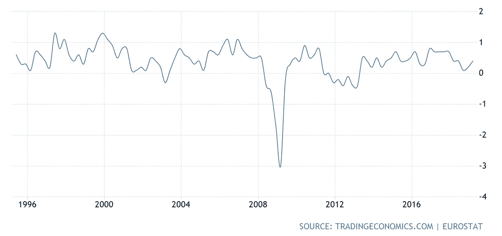
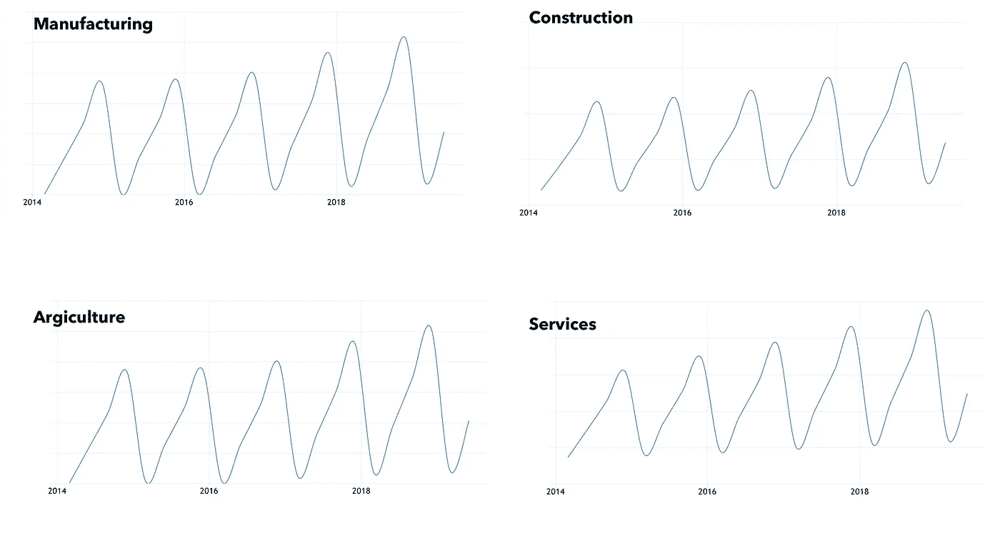
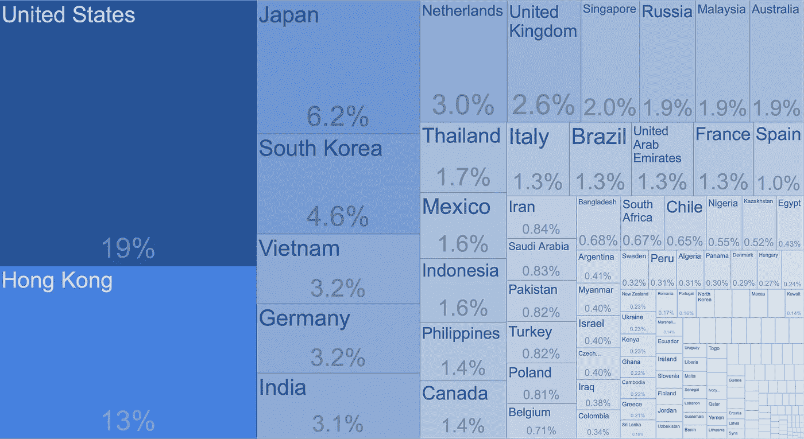
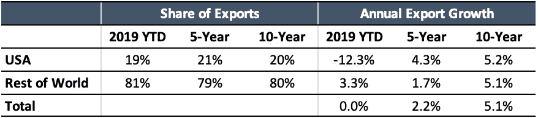

# 金融市场展望:2019 年 7 月 29 日的一周

> 原文：<https://medium.datadriveninvestor.com/financial-markets-look-ahead-week-of-july-29-2019-8c451c50db8a?source=collection_archive---------8----------------------->

美国的股票市场正在运行！标准普尔 500 和纳斯达克今年迄今(YTD)分别上涨了 21%和 25.5%，没有考虑全球的负面评论。在过去的几个月里，我反复询问美国经济和金融市场是否能在全球经济放缓的情况下保持增长。鉴于市场持续走强，是时候问一个问题了:全球经济真的陷入困境了吗？

世界经济有四大组成部分:美国约占全球国内生产总值的 25%；中国和欧盟各占全球 GDP 的 15%；世界其他国家(世界其他地区)占全球 GDP 的 45%，尽管这些国家形成了一条长尾，没有一个经济体能够显著推动这一趋势。

 [## 为什么包容性财富指数比 GDP 更能衡量社会进步？|数据驱动…

### 你不需要成为一个经济奇才或金融大师就能知道 GDP 的定义。即使你从未拿过 ECON 奖…

www.datadriveninvestor.com](https://www.datadriveninvestor.com/2019/03/08/why-inclusive-wealth-index-is-a-better-measure-of-societal-progress-than-gdp/) 

欧元区经济似乎陷入了困境，以德国为首的制造业严重萎缩。欧元区制造业产出指数 7 月份为 47.0(6 月份为 48.5)，为 75 个月低点。风险厌恶情绪在欧洲高涨，奥地利、丹麦、芬兰、法国、德国、荷兰、瑞典和瑞士的政府债券[收益率为负](https://www.investing.com/rates-bonds/european-government-bonds)。Q2 19 年欧元区 GDP“仅”增长 0.4%。然而，尽管这似乎是一个非常低的增长率，但从历史上看并非如此。事实上，在过去 10 年的任何一个季度*，欧元区经济的年增长率都没有超过 1%。*

**

***Eurozone Quarterly GDP Growth (%)***

*这并不意味着一切都是美好的；IHS Markit 的首席商业经济学家克里斯·威廉姆森(Chris Williamson)捕捉到了即将出现的几种风险，他本月[说](https://ihsmarkit.com/research-analysis/eurozone-growth-falters-as-manufacturing-downturn-deepens-jul19.html)“…制造业已经成为越来越令人担忧的原因。地缘政治担忧、英国退出欧盟、日益加剧的贸易摩擦以及汽车行业不断恶化的表现，尤其使制造业陷入了更深的低迷，调查显示，商品生产行业的季度收缩率约为 1%”。我的感觉是，欧元区有一群轮换的成员国，一直处于聚光灯下，让事情变得有趣。这一次不同的是，问题儿童是德国，欧洲的晴雨表经济。*

*接下来是中国。普遍的说法是，由于国内金融疲软(由于银行业的坏账和国内消费放缓)和出口放缓(由于全球经济恶化和与美国的贸易战)，中国正深陷困境。任何来自中国的数据都是不可靠的(见下文——所有行业的 GDP 增长曲线基本相同，只是 Y 轴不同！所以我查看了其他国家的进口数据，以了解中国的情况。*

**

***China GDP Growth Curves by Major Sector***

*美国在中国出口中所占的份额在过去十年中基本保持稳定，在过去十年中仅从 21%略微下降到 19%。*

**

*Source: [Trading Economics](https://tradingeconomics.com/china/exports-by-country)*

*年初至今，中国对美国的出口下降了 12%;相比之下，年初至今，中国对世界其他地区的出口*增长了* 3.3%(事实上高于 1.7%的五年平均水平)。这意味着美国对中国的贸易战(长期但暂时)是中国出口放缓的主要——也可能是全部——驱动力。出口占中国 GDP 的 20%左右，因此当前与美国的贸易战对中国 GDP 增长的影响约为 40 个基点。将年初至今的 GDP 增长调整 40 个基点将使中国的 GDP 增长超过 7%，回到 2016 年的水平，这使我相信中国政府去年采取的各种刺激经济的措施(我在这里写了这些)正在使经济受益，但这些措施的好处被与美国的贸易战抵消了。*

**

***China Export Share by Region***

*美国经济[在第二季度增长](https://www.theguardian.com/business/live/2019/jul/26/asian-shares-stock-markets-ecb-economy-sterling-pound-euro-dollar-us-gdp-growth-business-live)2.1%，而估计值在 1.6-1.8%的范围内，相比之下，Q1 2019 年的增长率为 3.1%。这与 Q2 2018 年 3.5%的增长率相比是不利的，必须指出的是，自 Q2 2017 年以来，四个季度的平均 GDP 读数一直在下降，这表明经济在逐渐减速。上个季度的增长是由个人消费支出(PCE)推动的，个人消费支出(T2)增长了 4.3%，这是六个季度以来最好的表现。全球经济的明显低迷和与中国的持续贸易战似乎正在影响投资情绪:私人国内投资总额下降了 5.5%，这是自 2015 年第四季度以来的最差表现。如果这种趋势持续下去，必将对美国经济产生长期的负面影响。*

*美国经济运行在两条轨道上:服务业和制造业。约占经济三分之二的服务业正稳步增长。IHS Markit Flash 美国服务业商业活动指数[7 月份上涨](https://www.markiteconomics.com/Public/Home/PressRelease/185bc294d61c400d9b6463a1d54864be)至 52.2(6 月份为 51.5)，为三个月来最大涨幅。另一方面，制造业继续表现疲软。7 月份美国制造业采购经理人指数[为](https://www.markiteconomics.com/Public/Home/PressRelease/185bc294d61c400d9b6463a1d54864be)50.0(6 月份为 50.6)；这是 119 和 118 个月的低点。根据同一项调查，制造业失去动力是由汽车行业放缓(这也是德国经济放缓的原因)和全球经济不确定性造成的。出口销售受到抑制，新的国际订单以 2016 年 4 月以来的最快速度下降。然而，国内需求继续上升；耐用品的新订单比 6 月份的预测增长了一倍多。核心资本货物订单[增长](https://www.reuters.com/article/us-usa-economy/u-s-business-investment-stabilizing-economy-slowing-idUSKCN1UK1XO)19 %,而预期仅为 0.2%,这表明企业在设备上的支出正在增加。*

*截至 7 月 26 日，44%的标准普尔 500 公司已经[公布了](https://www.factset.com/hubfs/Resources%20Section/Research%20Desk/Earnings%20Insight/EarningsInsight_072619.pdf) Q2 收益。其中 77%的公司报告了令人惊讶的正 EPS，61%的公司报告了令人惊讶的正收入。更令人担忧的是，在提供第三季度指引的 38 家公司中，有 28 家公司提供了负面的每股收益指引。*

*美国众议院[通过了为期两年的债务上限延期和预算法案，避免今年秋天政府进一步关闭。它还允许未来两年在现有预算上限的基础上增加 3240 亿美元的可自由支配支出。在 2020 财年，可自由支配的支出现在设定在 1.37 万亿美元左右，这对中期经济应该是积极的，尽管所有这些额外债务的长期影响仍然是大多数投资者和政府官员尚未探索的领域。](https://www.nytimes.com/2019/07/22/us/politics/budget-deal.html)*

*简而言之，全球经济发出了喜忧参半的信号，偏向下行。市场的未来走向现在将取决于美国美联储委员会的评论，而不是他们本周可能宣布的降息幅度。至少 25 个基点的降息已经反映在价格中(上周美元走强，而人们通常会认为，随着即将到来的降息，美元将会走软)。美元指数克服了下跌趋势线，然后突破了 97.7 的阻力(这也是其 2018 年的高点)，收于 97.99，涨幅为 0.875%。尽管美元指数是基于一篮子货币计算的，但其上周基于好于预期的 GDP 数据的激进举动让我停下来重新评估我的一些假设。美元指数的移动平均线、趋同/背离和其他随机因素明显为正，并且很有可能突破 98.28 的 2019 年高点，97.7 的水平将成为支撑。*

*标准普尔 500 上周上涨 1.675%，收于 3025.86 点的新高，但价格走势显示出一丝疲惫。标准普尔 500 在 2975 和 2942 有很强的支撑，我预计本周会有一些盈利。*

*黄金本周收低至 1418.5，因积极的经济数据(美国 GDP)和美元走强抑制了黄金价格的升值。一个月来，黄金一直在 1387 和 1450 之间横盘整理。鉴于美联储降息 50 个基点的预期在上周有所减弱，黄金可能会在这两个水平之间盘整，然后才会采取行动。*

*原油价格本周小幅上涨，收于 56.16 美元。尽管美国的经济数据总体上是积极的，但美国需求改善的前景被有关全球经济的糟糕评论所否定。就目前而言，尽管霍尔木兹海峡局势紧张，供应方仍在胜出。我的期望是，美国和伊朗之间的私下讨论将克服孤立的侵略性事件，如击落无人机和捕获油轮。然而，鉴于中东的不确定性，原油价格可能会在 52.7 至 60.3 之间徘徊，偏向该区间的低端。*

**如果觉得我的笔记有用，别忘了关注我的* [*中*](/@lecturing.trader?source=post_page---------------------------) *和* [*推特*](https://twitter.com/LecturingTrader?lang=en&source=post_page---------------------------) *。**

**免责声明:以上文本不构成任何形式的建议或推荐(财务、税务、法律或其他)。对任何证券的投资都受多种风险的影响，上文对任何证券或一篮子证券的讨论不包含相关风险因素的列表或描述。在进行投资之前，一定要进行自己的独立研究，并考虑自己的风险偏好。**