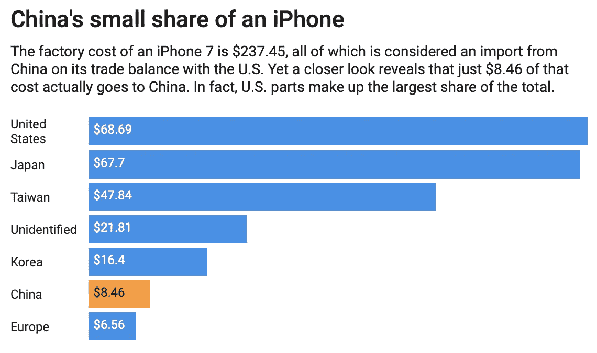
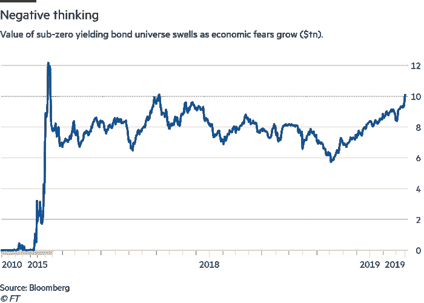

# 金融市场展望:2019 年 6 月 10 日的一周

> 原文：<https://medium.datadriveninvestor.com/financial-markets-look-ahead-week-of-june-10-2019-fa14ba309d70?source=collection_archive---------4----------------------->

Photo by [Erwan Hesry](https://unsplash.com/@erwanhesry?utm_source=unsplash&utm_medium=referral&utm_content=creditCopyText) on [Unsplash](https://unsplash.com/search/photos/red-light?utm_source=unsplash&utm_medium=referral&utm_content=creditCopyText)

全球经济正在放缓。

自 2018 年初以来，我们一直在见证亚洲和欧洲经济放缓。尽管我在今年的大部分时间里一直乐观地认为全球经济将会好转——在中国政府积极的货币和财政行动以及美国和中国之间的贸易*谈判*有望结束的背景下——但现在看来，贸易战的爆炸半径比许多人预期的要广得多。除了对中国经济的影响，贸易战还伤害了美国经济和中国供应链上许多国家的经济。

这些国家提供在中国制造商品所需的原材料和零部件。举个[的例子](http://theconversation.com/we-estimate-china-only-makes-8-46-from-an-iphone-and-thats-why-trumps-trade-war-is-futile-99258)，iPhone 的价值实际上只有 4%是在中国产生的(通过制造)；其余的高科技零部件来自日本、台湾和韩国。对中国制造商品的需求不断恶化，影响了所有这些国家的出口驱动型经济。

Source: [The Conversation](http://theconversation.com/we-estimate-china-only-makes-8-46-from-an-iphone-and-thats-why-trumps-trade-war-is-futile-99258)

中国是采取货币和财政措施稳定经济的先行者，现在全球其他国家都在效仿。印度储备银行上周宣布了六个月内的第三次降息..增长动力明显减弱..“澳洲联储[自 2016 年以来首次下调](https://www.global-rates.com/interest-rates/central-banks/central-bank-australia/rba-interest-rate.aspx)利率。

 [## 为什么包容性财富指数比 GDP 更能衡量社会进步？-数据驱动…

### 你不需要成为一个经济奇才或金融大师就能知道 GDP 的定义。即使你从未拿过 ECON 奖…

www.datadriveninvestor.com](https://www.datadriveninvestor.com/2019/03/08/why-inclusive-wealth-index-is-a-better-measure-of-societal-progress-than-gdp/) 

[纽西兰](https://tradingeconomics.com/new-zealand/interest-rate)、[马拉西亚](https://www.freemalaysiatoday.com/category/leisure/2019/06/07/why-the-overnight-policy-rate-affects-malaysians-pockets/)和[菲律宾](https://www.gmanetwork.com/news/money/economy/696761/philippines-to-cut-interest-rates-despite-uptick-in-inflation-capital-economics/story/)最近几周也降低了利率，印尼央行在 2018 年六次加息[表明](https://www.bloomberg.com/news/articles/2019-06-07/indonesia-rate-cut-will-depend-on-timing-deputy-governor-says)降息“将取决于时机”。债券市场认同央行的观点；美国国债收益率接近多年低点，德国和日本国债收益率处于负值。分析师估计，价值 10 万亿美元的负收益债务正在流通，而仅仅四年前，这一数字接近于零。

Source: [Link](https://www.ft.com/content/b131da2e-4f02-11e9-b401-8d9ef1626294)

在美国，贸易战已经产生了[抵消](http://Early analysis indicates that the current trade war with China has already had the effect of)特朗普总统 2017 年减税的预期好处的影响，尽管美国经济经历了创纪录的低失业率，但 2019 年的月度数据微妙地表明经济放缓。在 2019 年的前五个月，经济平均增加了 164，000 个就业岗位，而 2018 年平均每月增加 223，000 个。此外，周五发布的 5 月份就业报告将之前发布的 3 月和 4 月份的数据修正为 75，000 人。加上 4 月份零售额和工厂订单的下降，这描绘了一幅美国经济低迷的画面。

美国股市上周平均上涨了 4%，这不是因为经济强劲，而是因为预期美国美联储会降息；这在某种程度上间接地证实了美国经济增长的放缓。10 年期国债收益率触及 2.084%的 21 个月低点，表明避险情绪和不确定性增强。

美国糟糕的经济数据以及美联储降息的预期对美元产生了重大影响。美元指数在短短六个交易日内从 98.20 的高点跌至 96.58 的低点。从技术面来看，美元在 98.20 面临重大阻力，向下修正，突破 97.7、97.3、96.9 一系列支撑位，收于 96.6。这一趋势明显看跌，我预计美元将在未来几周测试 95.7 的水平。

标准普尔 500 在 5 月份下跌了约 6.5%，但在降息的预期下，仅在一周内就收复了 4.4%的失地。在这个过程中，它已经夺回了 2812 和 2855 的关键水平，并几乎突破了 2878，本周收于 2873。我预计，在与墨西哥争端“解决”的背景下，标准普尔 500 将于周一突破 2878 点。现在的问题是，鉴于全球主要经济体放缓的迹象越来越明显，股市还能上涨多少。从基本面来看，Q2 的预期是美国经济增长 1.6-1.8%(而 Q1 是 3.1%)。从技术上看，标准普尔 500 2945 点将成为一个三重顶部——一个主要障碍——如果不能突破这一水平，除非经济出现任何显著的积极发展，否则将标志着市场见顶。

黄金连续第三周收高，创下 2019 年新高，收于 1344.90。过去的一周是不寻常的，因为股票、债券和黄金市场都上涨了。美元走软和对低利率的预期(这表明投资者转向安全资产)是黄金的强劲顺风。从技术上看，1365 水平是 2018 年的高点，是黄金的主要阻力；1325 是最近的支撑。

前两周收盘走低的原油触及周内低点 50.6，但在最后两个交易日有所回升，收于 54.05，本周小幅上涨。原油价格受到美元走软和沙特暗示欧佩克+国家将延长减产的推动。从技术上来说，原油现在是看涨的(在周线图上锤子正在发展)，我预计价格侵蚀现在会消退。也就是说，如果潜在的全球经济陷入困境，图表中任何数量的锤子都不会帮助原油价格回升。

*如果觉得我的笔记有用，别忘了关注我的* [*中*](https://medium.com/@lecturing.trader) *和* [*推特*](https://twitter.com/LecturingTrader?lang=en) *。*

免责声明:以上内容不构成任何形式的建议(财务、税务、法律或其他)。对任何证券的投资都受多种风险的影响，上文对任何证券或一篮子证券的讨论不包含相关风险因素的列表或描述。在进行投资之前，一定要进行自己的独立研究，并考虑自己的风险偏好。