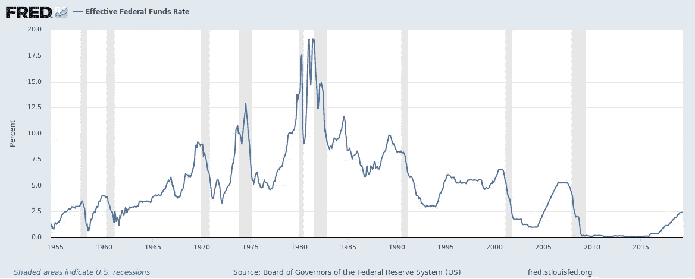
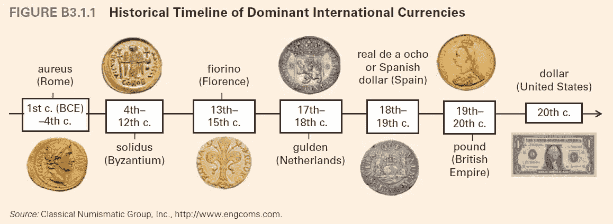

# 金融市场展望:2019 年 6 月 24 日的一周

> 原文：<https://medium.datadriveninvestor.com/financial-markets-look-ahead-week-of-june-24-2019-c0524d20a1d?source=collection_archive---------5----------------------->

Photo by [Michał Parzuchowski](https://unsplash.com/@mparzuchowski?utm_source=unsplash&utm_medium=referral&utm_content=creditCopyText) on [Unsplash](https://unsplash.com/search/photos/jenga?utm_source=unsplash&utm_medium=referral&utm_content=creditCopyText)

*各国央行正在用利率玩一场***的游戏。**

*全球增长正在放缓，但股市却在创新高。过去的一周不同寻常，所有主要资产类别都出现了上涨。标准普尔 500 创下新高，达到 2964 点，本周收于 2950 点，年初至今健康上涨 17.7%。美国 10 年期国债也大幅上涨；该指数一度跌破 2.0%，本周收于 2.059%(今年以来累计下跌 23%)。*

*黄金突破了 1356 的沉重阻力，收于 1400(这恰好是 6 年来的高点)。随着这一举措，黄金今年的涨幅超过了 9.5%。看起来，市场的漫画——多头和空头——正在显现:似乎有一个独特的投资者群体寻求政府债券和黄金的安全性，而另一个群体通过股票投资积累了更多风险。*

* [## 为什么包容性财富指数比 GDP 更能衡量社会进步？-数据驱动…

### 你不需要成为一个经济奇才或金融大师就能知道 GDP 的定义。即使你从未拿过 ECON 奖…

www.datadriveninvestor.com](https://www.datadriveninvestor.com/2019/03/08/why-inclusive-wealth-index-is-a-better-measure-of-societal-progress-than-gdp/) 

然而，股市的上涨似乎是基于这样一种信心，即各国央行将维持——甚至降低——利率。央行可能担心经济衰退，似乎愿意满足这一愿望。这就引出了下一次全球衰退何时到来的问题(欧洲和中国即将陷入衰退，但美国目前仍坚守阵地)，或者衰退是否不再是经济周期的一部分？为什么各国央行一再干预？为什么美国美联储银行考虑降低利率，因为担心经济可能会放缓？这其中有多少是经济因素，又有多少是政治因素？由于利率已经处于历史低位，美联储的箭囊中已经没有多少弓箭了。

Source: [US Federal Reserve](https://fred.stlouisfed.org/series/FEDFUNDS)

我以前曾经写过，目前中美之间的贸易战不仅仅是直接的贸易；这关系到未来的霸权。中国已经逐步为人民币成为世界储备货币创造了必要的条件。我怀疑，随着与中国的贸易战持续进行，美国正试图利用其全部金融实力，直接对中国经济造成重创，并通过代理对中国金融体系和货币造成重创。用拳击术语来说，美国目前的决策可能代表着试图打出一记致命一击。这一点很重要，因为至少在过去 500 年里，控制全球储备货币的国家一直是事实上的世界超级大国，即使因果关系有待争议。成为事实上的世界超级大国是一项非常有利可图的生意。

Source: [Zero Hedge](https://www.zerohedge.com/article/history-worlds-reserve-currency-ancient-greece-today)

作为第二次世界大战后布雷顿森林[协定](https://en.wikipedia.org/wiki/Bretton_Woods_system)的结果，美元成为世界储备货币。虽然这多少有点隆重地确立了美元作为全球储备货币的地位，但真正巩固美元在世界货币中的霸主地位的是[石油美元](https://www.thebalance.com/what-is-a-petrodollar-3306358)。显示[余额](https://www.thebalance.com):

> 石油美元是支付给石油出口国以换取石油的任何美元。由于美元是一种全球货币，所有的国际交易都以美元计价。因此，石油出口国必须获得美元。他们中的大多数拥有自己的石油工业。这使得他们的国民收入依赖于 T4 美元的价值。如果下降，他们的收入也会下降。1945 年 2 月 14 日，富兰克林·罗斯福总统与沙特阿拉伯正式结盟。他会见了沙特国王阿卜杜勒阿齐兹。美国在达兰修建了一个机场，作为军事和商业培训的回报。这也巩固了美元和石油之间的关系。石油美元诞生了。这一联盟如此重要，以至于在阿以冲突的意见分歧中幸存了下来。

The importance of the Dollar rose with that of Crude Oil, and I’d argue that the long decline of Crude Oil will also draw to a close the supremacy of the Dollar. In the near term, various macroeconomic and political factors aren’t favoring the Dollar. As I mentioned above, the US government is using the Dollar as a weapon in a financial war against China. In the background, China has for years been building international support for a move away from the US Dollar as the global reserve currency; [several](https://www.reuters.com/article/us-china-yuan-asean/china-promotes-use-of-yuan-among-southeast-asian-nations-idUSKCN1P51EV) [Asian](https://www.malaymail.com/news/malaysia/2018/09/03/dr-m-predicts-chinese-yuan-will-replace-usd-as-trade-currency/1668901) nations now conduct bilateral [trade](https://www.businessinsider.com/yuan-now-the-second-most-used-currency-2013-12) using the Chinese Yuan or through local currency swap agreements. Even the European Union has been toying with the idea of new financial instruments (such as [Instex](https://www.bloomberg.com/news/articles/2019-06-10/u-s-weighs-more-iran-sanctions-over-potential-trade-with-europe)) to overcome the US’ sanctions on Iran. There has also been [talk](https://www.scmp.com/comment/opinion/article/3014258/pain-tariffs-and-sanctions-behind-china-and-russias-push-dethrone) of China, Russia, and Saudi Arabia (Petrodollar all-weather partner!) creating a currency or instrument for the purposes of trading in oil. As I’ve highlighted in several of my previous notes, China, Russia, India, and many other nations have been diversifying their Dollar assets into Gold. I suspect this is because there is a general concern globally that the Dollar will lose value going forward.* 

*The S&P 500 is likely to take a breather this week and profit taking may limit its upward move. The US government’s announcement limiting US technology access for five additional Chinese firms isn’t going to help resolve the trade war and the Chinese side, which usually takes on a proactive approach to trade meetings appears to have developed cold feet (or lack of interest) with respect to resolving the issue. It is unlikely that the meeting between President Xi Jinping and President Donald Trump this week in Japan on the sidelines of the G-20 will yield any results, but any negative outcome from this meeting — even a bad soundbite or tweet — could tank the S&P 500 as a lot of the upside is likely priced into the markets already. It is important that the S&P 500 remain above the 2874 level; a clearer picture will emerge once quarterly earnings reports start arriving in July.*

*受美联储鸽派立场、未来几个月降息预期增强以及美国国债收益率持续下跌的推动，美元上周下跌约 1.4%，所有这些都推动了美元周围的负面情绪。从技术角度来看，美元指数在 96.35 突破了一个支撑位，其下一个支撑位在 95.55。随机数据是负面的，我预计美元本周将进一步下跌。*

*过去的一周对黄金来说太棒了。海湾地区的紧张局势、全球债券收益率下降、降息预期以及美元疲软都促使投资者逃向安全资产，因此也逃向黄金。黄金果断克服 1355-1367 之间的阻力，收于 1400，涨幅 4.35%，创六年新高。展望未来，我预计黄金将成功测试并突破 1423 水平。如果价格反转并突破 1367 支撑位，我将重新评估我的假设。*

*在美国和伊朗紧张局势升级的背景下，原油上周大幅上涨近 9%。海湾地区的紧张局势可能会持续下去，任何一方的任何误判都可能会在几周甚至几个月内严重影响这条全球最繁忙的原油供应线。也就是说，需求方面没有明显变化，所以如果紧张局势降温，原油价格也会下降。鉴于美中贸易战进展缓慢，尽管全球央行采取宽松立场，但全球经济增长正在放缓，因此未来几周可能会出现一些与原油相关的利润入账；它可能会向下测试 55.3 的水平。*

**如果你觉得我的笔记有用，别忘了关注我的***和* [*推特*](https://twitter.com/LecturingTrader?lang=en) *。***

***免责声明:以上文本不构成任何形式的建议或推荐(财务、税务、法律或其他)。对任何证券的投资都受多种风险的影响，上文对任何证券或一篮子证券的讨论不包含相关风险因素的列表或描述。在进行投资之前，一定要进行自己的独立研究，并考虑自己的风险偏好。***