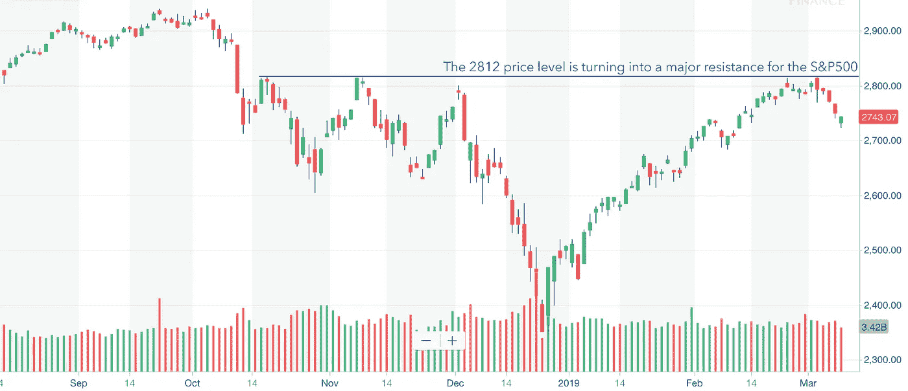

# 金融市场展望:2019 年 3 月 11 日的一周

> 原文：<https://medium.datadriveninvestor.com/financial-markets-look-ahead-week-of-march-11-2019-4f83a067dd8?source=collection_archive---------23----------------------->

*跟我上* [*推特*](https://twitter.com/LecturingTrader?lang=en) *。*

上周，标准普尔 500 再次未能突破 2812 点这一非常强的阻力位。虽然美国国内确实有一些令人失望的消息(主要是新增就业机会的减少)，但我认为美国市场目前的困境与美国经济关系不大，而与全球经济状况恶化关系更大。这是我几个月来一直关注的问题，我相信我的观点正在逐渐被市场所证实。以下是我在 2018 年 10 月写的:

> 我预计，当发展中市场已经处于调整区间一段时间后，美国股市不会上涨。目前来看，谨慎是关键词。

Chart courtesy of Yahoo! Finance

上周股市的下跌更多是因为来自中国和欧洲的负面消息。中国二月份的出口下降了 20.7%，贸易顺差跌至 41.2 亿美元，低于预期的 263.7 亿美元。中国[宣布](https://www.scmp.com/economy/china-economy/article/2188625/china-lowers-2019-gdp-growth-target-6-65-cent-range)将 2019 年国内生产总值(GDP)增长目标从 6.5%(30 年低点)下调至 6.0%。通常情况下，中国会通过大力投资基础设施来应对增长放缓，以保持两位数的 GDP 增长目标。然而，这种降低 GDP 目标的策略——尽管与前几年的方法有所不同——肯定会帮助中国控制其不断攀升的债务水平。中国政府还决定减税 2980 亿美元来促进私营部门的增长，并承诺如果需要的话会进一步刺激。中国经济放缓将影响其亚洲贸易伙伴的增长前景(尤其是那些属于其延伸制造业供应链的贸易伙伴)。上周，亚洲股市全线下跌，上证综指跌幅达 4.4%。

 [## 股票市场投资的机器学习——数据驱动的投资者

### 当你的一个朋友在脸书上传你的新海滩照，平台建议给你的脸加上标签，这是…

www.datadriveninvestor.com](https://www.datadriveninvestor.com/2019/01/30/machine-learning-for-stock-market-investing/) 

欧洲央行(ECB) [将其对欧盟 2019 年的增长预期从 1.7%(2018 年 12 月做出)下调至 1.1%，并将通胀目标从 1.6%下调至 1.2%。欧洲央行行长马里奥·德拉吉(Mario Draghi)也公布了新一轮贷款，以推动欧元区银行放贷，帮助刺激经济。他还](https://www.cnbc.com/2019/03/07/ecbs-draghi-slashes-growth-forecasts.html)[宣布](https://www.cnn.com/2019/03/07/economy/ecb-interest-rates-mario-draghi/index.html)利率将在年底前继续保持在目前的低水平。这是欧洲央行不到 3 个月前宣布的退出量化宽松计划的重大逆转。我曾[表达过](https://medium.com/@lecturing.trader/financial-markets-look-ahead-week-of-january-7-2019-255910c5f93f)对欧洲央行之前的计划有些惊讶，令人鼓舞的是，欧洲央行终于意识到欧元区经济有多糟糕。

美国就业数据出人意料地下滑——2 月份美国经济仅增加了 2 万个就业岗位，而预期为 18 万个。作为背景，1 月份美国经济增加了 31.1 万个就业岗位。那么是什么导致了这种巨大的减速呢？IHS Markit 制造业采购经理人指数(PMI)2 月份为 53.0，1 月份为 54.9。这表明经济在扩张，尽管速度较慢。非制造业 PMI 为 59.7，而 1 月份为 56.7，这表明扩张加速。因此，在得出美国经济正在放缓的结论之前，我会等待下个月的就业数据。

简而言之，美国经济依然强劲，但美国股市可能会继续受到全球经济疲软的影响。

全球经济放缓正推动资金流向更安全的资产。主要市场的债券收益率都在下降:美国 10 年期国债收益率触及 2019 年低点 2.63%，并可能继续走低。美元上周上涨，触及 97.70 的阻力，在就业报告发布后回落至 97.36。我预计，随着欧元区经济放缓，美元将走强，因为欧元在一篮子货币中的权重为 57.6%，这决定了美元的强势。

自 2 月 28 日突破主要趋势线以来，黄金一直表现疲软。上周，除了在令人沮丧的美国就业报告发布后的周五(当时上涨了 0.97%)之外，这一趋势一直走低。周线图上的锤子型蜡烛线暗示下跌趋势可能反转。黄金在 1306 和 1330 有阻力，在 1280 和 1254 有支撑。虽然目前市场出口对黄金的普遍情绪是看涨的，但美元走强可能会抑制黄金的涨势，我预计未来几周黄金将横向移动，甚至会有小幅下跌的趋势。

在过去的 14 天里，原油在 57.40 和 55.37 之间窄幅波动。全球经济放缓肯定会对原油价格构成负面影响，美国产量和库存水平的提高可能会加剧油价的下行压力。要不是欧佩克+国家同意并维持减产，油价本可以重新测试 40 美元的低位。有趣的是，尽管中国经济增长放缓，但 2 月份中国原油进口激增 21.6%，至每日 1023 万桶，为有史以来第三高水平。未来一周，油价保持在 55.30 上方(当前通道的下端)很重要。如果这个价位被突破，下一个支撑位在 52.34。

上周，由于来自中国(贸易数据和较低的 2019 年 GDP 目标)、欧洲(欧洲央行承认欧元区问题和下调增长目标)和美国(就业报告)的令人失望的消息，标准普尔 500 在五个交易日中每天都收低。唯一的一线希望是，周五市场能够在交易日结束前收复大部分早盘失地。除了道琼斯指数，其他三大指数都收于 200 天移动平均线以下。对于标准普尔 500，下一个主要支撑位在 2680，阻力位在 2812。

*免责声明:以上内容不构成任何形式的建议或推荐(金融、税收、法律或其他)。对任何证券的投资都受多种风险的影响，上文对任何证券或一篮子证券的讨论不包含相关风险因素的列表或描述。在进行投资之前，始终进行自己的独立研究并考虑自己的风险偏好*