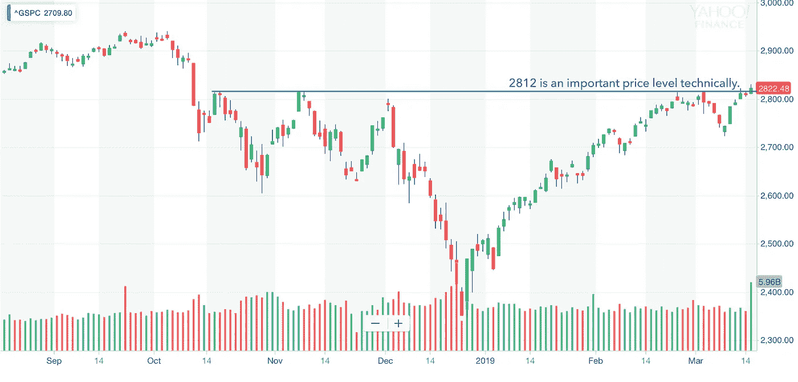

# 金融市场展望:2019 年 3 月 18 日的一周

> 原文：<https://medium.datadriveninvestor.com/financial-markets-look-ahead-week-of-march-18-2019-3aac34bea8fc?source=collection_archive---------9----------------------->

*跟我上* [*推特*](https://twitter.com/LecturingTrader?lang=en) *。*

标准普尔 500 终于在上周突破了 2812 点的主要阻力，收盘于 2822.48 点。考虑到前一周关于中国(GDP 增长进一步放缓)、欧洲(面临衰退)和美国(就业增长方面错失良机)的糟糕经济消息，这一周开始时非常消极，这是值得注意的。

 [## 为什么包容性财富指数比 GDP 更能衡量社会进步？-数据驱动…

### 你不需要成为一个经济奇才或金融大师就能知道 GDP 的定义。即使你从未拿过 ECON 奖…

www.datadriveninvestor.com](https://www.datadriveninvestor.com/2019/03/08/why-inclusive-wealth-index-is-a-better-measure-of-societal-progress-than-gdp/) 

在上周的笔记中，我写到二月份的就业报告可能是一个异常；美国劳工部上周五报告称，一月份的职位空缺达到了 758 万，这表明即使劳动力市场更加紧张，全球经济似乎也在收缩，雇主们仍然渴望招聘。批发贸易、房地产和与信息相关的行业出现大幅增长。实际上，职位空缺的数量已经连续第 11 个月超过了失业人数，对我来说，这是与工作相关的最重要的指标。根据美国商务部的数据，一月份，非国防耐用品订单创下了六个月来的最大增幅，上升了 0.8%。总体而言，耐用品订单增长了 0.4%(低于预期的-0.5%)。工业产出仅增长 0.1%(高于 0.4%的预期)。

需求方面的事情仍然是积极的。密歇根大学消费者信心指数从二月份的 93.8 上升到三月份的 97.8。这些水平表明，尽管全球经济疲软，美国经济可能能够在一段时间内保持强劲。此外，美国美联储董事会主席杰罗姆·鲍威尔在接受哥伦比亚广播公司《60 分钟》采访时形容美国经济为“健康的 T2”，并表示他认为美国经济没有理由不能继续扩张。

尽管如此，我们不能忽视全球经济的持续疲软。上周的中国官方数据显示，今年前两个月，T4 的工业产出下降了 5.3%，为 17 年来的最低点。这表明，尽管中国政府实施了大量刺激措施，但世界第二大经济体尚未触底。在我以前的笔记中，我曾提出这些措施可能需要几个月的时间——深入到 Q2 19 年——来稳定中国经济，我仍然相信中国经济不久将开始出现转机。有趣的是，中国立法者在周五[批准了](https://www.marketwatch.com/story/china-approves-law-against-forced-tech-transfers-to-appease-us-2019-03-14)一项反对外国公司强制转让技术的新法律——这是美国和其他国家的主要要求——这将有望有助于解决美中贸易谈判，预计谈判将于四月中旬结束。这是中国人做出的巨大让步，很可能会产生长期影响:这要么意味着中国相信他们会在技术上做得很好——并对其长期前景充满信心——要么意味着中国实际上处于比一般想象更糟糕的困境中；无论哪种情况，我们都处于未知领域！

在英国，议会[投票](https://www.nytimes.com/2019/03/15/opinion/brexit-vote-extension-parliament-may.html)反对在没有达成协议的情况下离开欧盟，还投票赞成将离开日期从目前的 2019 年 3 月 29 日推迟。尽管这似乎是一种进步，但我觉得有趣的是，主流观点认为欧盟将接受一个被推迟的英国退出欧盟。如果他们没有呢？

从技术角度来看，标准普尔 500 很明显——也有点令人惊讶——突破了 2812 点的阻力，本周收于 2822.48 点。尽管科技股的表现优于大多数其他板块，但股市普遍上涨。与中国的贸易谈判的任何积极动向都将有助于标准普尔 500 保持在 2812 水平之上。尽管如此，股市的上涨并未反映债券市场的情绪，因为收益率触及 2019 年低点，表明投资者心中存在一些担忧。如果标准普尔 500 指数在 2812 点上方停留 2-3 天，进一步投资市场可能是明智的。

Chart Courtesy of Yahoo! Finance

美元放弃了前一周的大部分涨幅，收于 96.49 英镑，英镑走强，原因似乎是与英国退出欧盟有关的积极消息。抵消英镑影响的是欧元区经济持续疲软导致的欧元疲软。在欧元区经济好转之前，美元可能会在 95.82 至 97.70 之间波动。

在美元走软的支撑下，金价重返 1300 点，本周收于 1302 点。与中国的贸易谈判取得实质性进展可能会进一步削弱美元，从而进一步帮助黄金。美联储和欧洲央行都已退出 2019 年的加息，因此未来几个月拥有黄金的成本将受到限制。从技术角度来看，黄金在 3 月 5 日创造了一个更低的低点，因此短期趋势仍然是看跌的。黄金在 1278 有支撑，在 1310 有阻力。

另一方面，原油一直在缓慢走高，并在此过程中创出更高的高点。该指数本周收于 58.39 点，本周涨幅为 4%。原油令人惊讶的是，尽管中国经济正以令人担忧的速度下滑，但中国对石油的需求却空前高涨。根据高盛的数据，[中国的石油消费在一月和二月每天增长 34 万桶。就供应而言，美国的增产被欧佩克+国家的减产和委内瑞拉、利比亚等国偶尔出现的供应中断所抵消。在我看来，原油价格的下一个主要因素将是伊朗制裁(第二阶段),这可能会中断供应，或至少引起足够的担忧，导致原油价格大幅上涨！](https://shipandbunker.com/news/am/792860-crude-up-41-percent-as-goldman-insists-oil-market-is-robust)

*免责声明:以上内容不构成任何形式的建议或推荐(金融、税收、法律或其他)。对任何证券的投资都受多种风险的影响，上文对任何证券或一篮子证券的讨论不包含相关风险因素的列表或描述。在进行投资之前，一定要进行自己的独立研究，并考虑自己的风险偏好。*