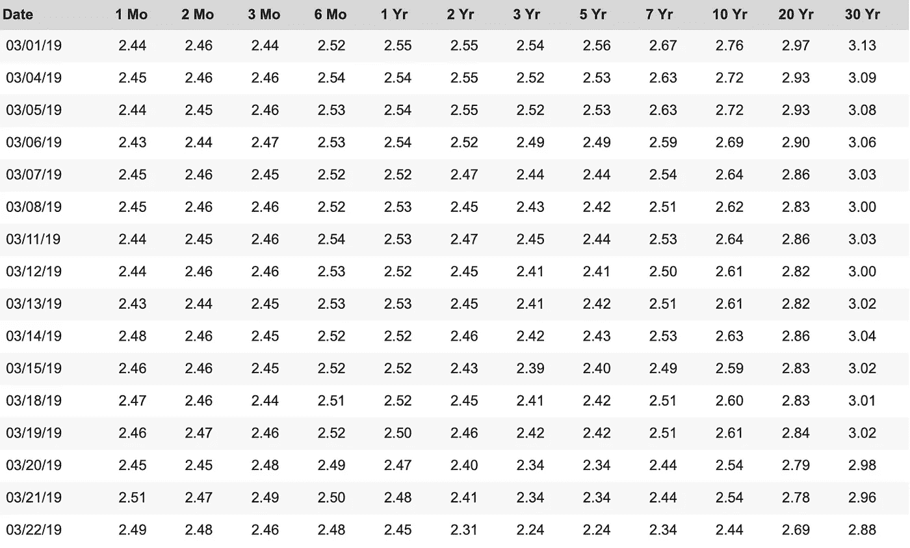

# 金融市场展望:2019 年 3 月 25 日的一周

> 原文：<https://medium.datadriveninvestor.com/financial-markets-look-ahead-week-of-march-25-2019-3990c2b49a1e?source=collection_archive---------9----------------------->

Photo by [Sweet Ice Cream Photography](https://unsplash.com/@sweeticecreamwedding?utm_source=medium&utm_medium=referral) on [Unsplash](https://unsplash.com?utm_source=medium&utm_medium=referral)

上周的市场发展都是关于美国美联储银行对美国经济长期前景的大转弯。这是全球主要央行长达数月的政策逆转模式的高潮。

首先，曾采取货币紧缩政策的中国、[在 2018 年 9 月](https://medium.com/@lecturing.trader/financial-markets-look-ahead-week-of-november-5-2018-1e34e8ccc8fb)来了个 180 度大转弯，宣布了一系列刺激措施来提振日益疲软的经济。接下来，[宣布](https://medium.com/@lecturing.trader/financial-markets-look-ahead-week-of-december-24-2018-f470d553a7c1)于 2019 年 1 月 1 日结束量化宽松计划的欧洲中央银行[在两个月内逆转了](https://www.nytimes.com/2019/03/07/business/ecb-european-economy-stimulus.html)路线。现在轮到了美联储，尽管美国总统特朗普施加了压力，但美联储迄今仍坚持货币紧缩政策。令人惊讶的是，美联储周三宣布，它将不会在 2019 年加息，并将迅速结束其解除资产负债表资产的计划。这令人惊讶，因为美国经济仍处于良好状态(尽管关键指标已脱离近期高点)。华尔街最初为加息将在今年剩余时间暂停的消息欢呼，但很快放弃了涨幅，因为它开始消化一个令人清醒的想法，即加息暂停可能预示着经济疲软。

 [## 另一场精心策划的全球经济危机正在逼近？如果我们的数据经济可以帮助它，就不会了-数据…

### 我们的 DApp 的开发，称为 DECENTR，目前正与我们的 R&D 同步进行，作为我们即将到来的…

www.datadriveninvestor.com](https://www.datadriveninvestor.com/2019/03/06/another-engineered-global-economic-crisis-looming-not-if-our-data-economy-can-help-it/) 

随着收益率曲线[反转](https://www.nytimes.com/2019/03/22/business/yield-curve-inverted-recession.html)，这些担忧在周五进一步加剧，3 个月期美国国债[的收益率自 2007 年以来首次高于 10 年期美国国债](https://www.treasury.gov/resource-center/data-chart-center/interest-rates/pages/textview.aspx?data=yield)。此外，2 年期和 10 年期美国国债之间的收益率差触及 10 个基点的低点。通常，2 年期和 10 年期债券之间的收益率反转发生在 3 个月期和 10 年期债券之间的收益率反转之前。这种反转意义重大，因为此前所有的衰退都是在这种反转之前发生的。

US Treasury Yields | Source: [US Treasury](https://www.treasury.gov/resource-center/data-chart-center/interest-rates/pages/textview.aspx?data=yield)

关于收益率曲线反转的几个要点:

1.  平均而言，在收益率曲线反转后，衰退需要 18 至 20 个月才能正式开始。
2.  只有持续大约四分之一的时间，反演才被认为是有效的。
3.  在此期间，市场在修正前一般会上涨 15%。

目前，债券市场似乎已经考虑到了到 2019 年底利率将下降 60%的因素。当美联储预见到需要刺激经济时，通常会降低利率；换句话说，债券市场正在消化未来几个月经济增长的减速。

美国经济相当强劲，通胀勉强抬头，利率处于低位，就业接近满负荷。美中贸易谈判可能会在下个月友好地结束，并为全球经济提供一个契机。那么这种担忧来自哪里呢？

我认为这种风险有两个主要驱动因素。首先，正如我在过去几个月里多次讨论的那样，在世界其他地区经济苦苦挣扎的时候，指望美国经济继续快速增长是不现实的。欧元区综合采购经理人指数在 3 月达到 51.3(2 月为 51.9)，欧元区制造业采购经理人指数在 3 月达到 71 个月低点 47.6(2 月为 49.3)。任何低于 50 的指数都被认为是收缩的信号。德国制造业连续第三个月收缩，其 10 年期国债收益率自 2016 年 10 月以来首次为负。法国综合 PMI 在 3 月达到 48.7(相比之下，2 月为 50.4)。3 月(相比 2 月的 51.5)法国制造业 PMI 跌至 3 个月低点 49.8。虽然英国退出欧洲的日期已经被推迟了几个月，但英国退出欧盟仍然没有任何解决方案。

第二，我们不能再忽视房间里的一头大象，它有可能严重伤害美国和其他主要经济体:那就是主要经济体前所未有的债务水平。债务危机的影响无疑将比任何普通的衰退都要严重。在美国，大幅减税(去年实施)加上不受控制的支出水平预计将在未来 10 年内使美国未偿债务从目前的[22 万亿美元增加到 33 万亿美元——这意味着每年增加 1 万亿美元的债务。除了政府债务，](https://www.thebalance.com/who-owns-the-u-s-national-debt-3306124)[公司的债务也非常高，最近超过了 9 万亿美元。持续的低利率制度刺激企业积累更多债务，进一步加剧了这种状况。](https://wolfstreet.com/2019/03/23/countries-with-most-monstrous-corporate-debt-pileup-u-s-wimps-out-in-25th-place-debt-to-gdp/)

令人担忧的是，在美国债务水平上升的同时，历史上一直是美国债务最大购买者的国家，如中国、俄罗斯和日本，不仅减少了对美国国债的购买，还开始清算他们持有的美国国债。这意味着美国债务的未来发行将需要通过内部和新来源的结合来管理。

关键问题是:在如此低的收益率下，会有足够多的人购买美国国债吗？如果答案是否定的，会有什么后果？我将在另一篇文章中进一步探讨这些问题。

3 月(2 月为 55.5)美国综合 PMI 产出指数达到 54.3，为 6 个月来的新低。3 月制造业 PMI 为 52.5(2 月为 53.0)，为 21 个月低点。尽管任何高于 50 的数据点都被认为是扩张性的，但趋势肯定不好。在这方面，迅速解决美中贸易争端可能有助于刺激增长。

从技术角度来看，标准普尔 500 突破了 2812 点，似乎正在 2812 点上方盘整，本周收于 2800 点。周线图显示疲软，下一个支撑位在 200 天移动平均线 2755。在这一点上，我认为只有在 2812 点以上才可以买入。

黄金设法保持在 1300 的价格水平之上，连续三周上涨。黄金的下一个阻力位是 1327，然后是 1350(恰好是其 2019 年的高点)。利率下降对黄金有利，但美元走强限制了收益。疲软的欧元区经济拉低了欧元，从而进一步推高了美元。受欧元区持续疲软和衰退担忧的推动，避险买盘似乎正在支撑美元。

原油周五放弃了本周的所有涨幅，收于 59.04。尽管供应面相对保持不变，但由于欧元区持续疲软的数据，人们对需求再度感到担忧。美联储的 180 度大转弯被进一步解读为预示着美国和其他地区的疲弱增长。鉴于目前的利空消息，原油可能会在未来几周内横盘整理，57.5 是一个支撑。

*跟我上* [*推特*](https://twitter.com/LecturingTrader?lang=en) *。*

*免责声明:以上文本不构成任何形式的建议或推荐(财务、税务、法律或其他)。对任何证券的投资都受多种风险的影响，上文对任何证券或一篮子证券的讨论不包含相关风险因素的列表或描述。在进行投资之前，一定要进行自己的独立研究，并考虑自己的风险偏好。*