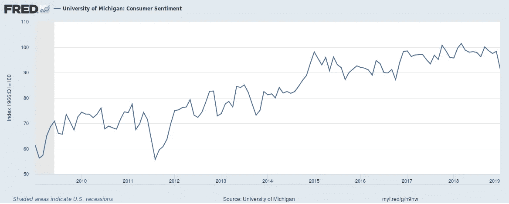

# 金融市场展望:2019 年 3 月 4 日的一周

> 原文：<https://medium.datadriveninvestor.com/financial-markets-look-ahead-week-of-march-4-2019-e7b4a95bb972?source=collection_archive---------17----------------------->

上周一些重要的经济数据影响了美国市场。美国制造业活动扩张速度为 2016 年 11 月以来最慢:供应管理协会的制造业采购经理人指数( [PMI](https://tradingeconomics.com/united-states/manufacturing-pmi) )为 53，低于此前的 54.9。这两个数字都被调低了。

同样，密歇根大学 2 月份消费者信心指数为 93.8，高于预期的 95.8。(我必须指出，在过去十年的背景下，这些数字仍然非常健康——见下图)。

University of Michigan, University of Michigan: Consumer Sentiment [UMCSENT], retrieved from FRED, Federal Reserve Bank of St. Louis; [https://fred.stlouisfed.org/series/UMCSENT,](https://fred.stlouisfed.org/series/UMCSENT,) March 3, 2019.

2018 年第四季度[国内生产总值](https://fred.stlouisfed.org/series/A191RL1A225NBEA)数据好于预期(2.6%比 2.2%)，2018 年全年国内生产总值达到 2.9%，这是过去 12 年来联合最高的国内生产总值增长率(2015 年和 2006 年国内生产总值也增长了 2.9%)。第四季度消费者支出年化增长率[为](https://www.reuters.com/article/us-usa-economy-spenidng/us-consumer-spending-factory-data-point-to-weak-first-quarter-gdp-growth-idUSKCN1QI4P7) 2.8%，但环比下降 0.5%，私人国内总收益[放缓至](https://www.cnbc.com/2019/02/28/gdp-q4-2018.html)4.6%(这应该放在前一时期强劲增长 15.2%的背景下看待)。

> [DDI 编辑推荐——青少年杂色傻瓜投资指南:8 个步骤让你拥有比你父母梦想的还要多的钱，作者大卫·加德纳](http://go.datadriveninvestor.com/invest1/matf)

我预计，随着就业市场和工资的持续强劲增长，消费者支出将在未来几个月保持健康，尽管我之前在债券市场和收益率的背景下讨论过的赤字支出有所增加。这是我继续密切跟踪的事情。从近期来看，来自白宫的评论表明，美中贸易谈判进展顺利，可能会在下个月中旬以积极的方式结束。10 年期美国国债收益率从 2.631 的低点飙升至 2.759，这是 1 月 21 日以来的最高水平。这表明风险偏好正在回归市场；另一个“证据”是上周金价的走势。黄金——前一周测试了 1350 的价格水平(正如我在上次报告中预测的那样)——回落到 1299，这是上次在 1 月 24 日看到的价格水平。

上周，S&P500 指数爬过 2800 点，收于 2803.69 点。蜡烛线的大小和过去五个交易日的横向波动表明投资者的犹豫。这种情况可能会持续到美中贸易谈判结束。黄金已经突破了 1306 的重要支撑位，短期内显示疲软。我预计短期内黄金将测试 1284 的支撑。

另一方面，原油将美国 GDP 数据解读为利空数据(除了来自中国的悲观数据)。2 月份中国制造业活动降至 3 年低点，月度制造业 PMI 降至 49.2(1 月份为 49.5)，表明经济持续收缩。原油本周收低至 55.8，在 55.4 有中间支撑，在 51.4 有主要支撑。从长期来看，我仍然看好原油，并预计美中贸易谈判的结束，加上中国刺激经济的努力，将为原油提供一个重要的顺风。

*跟我上* [*推特*](https://twitter.com/LecturingTrader?lang=en) *。*

*免责声明:以上文本不构成任何形式的建议或推荐(财务、税务、法律或其他)。对任何证券的投资都受多种风险的影响，上文对任何证券或一篮子证券的讨论不包含相关风险因素的列表或描述。在进行投资之前，一定要进行自己的独立研究，并考虑自己的风险偏好。*