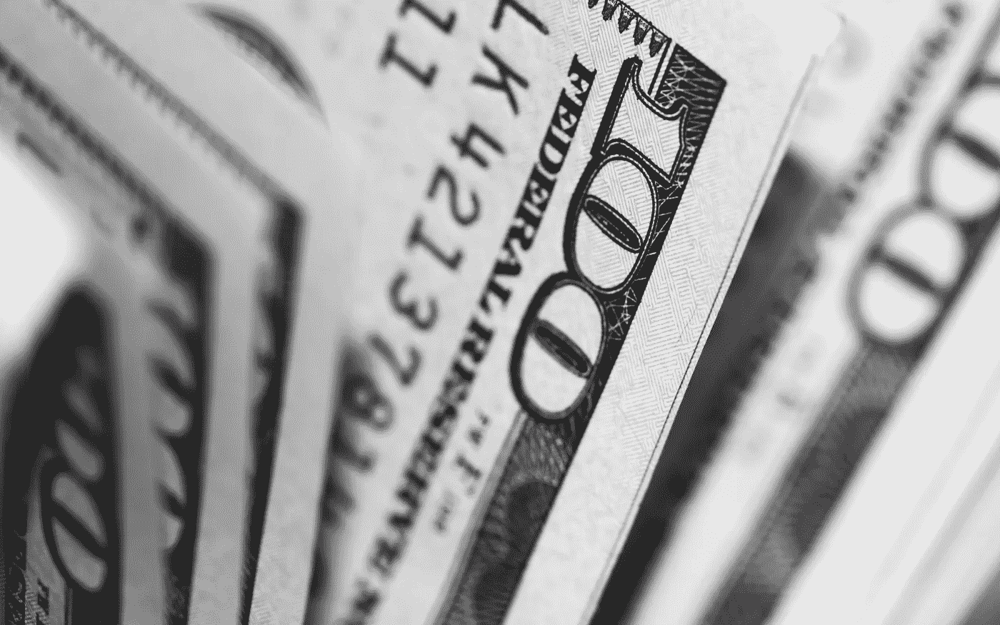

# 金融市场展望:2019 年 5 月 6 日的一周

> 原文：<https://medium.datadriveninvestor.com/financial-markets-look-ahead-week-of-may-6-2019-192ffb84e8d9?source=collection_archive---------6----------------------->

上周的头条是美国的就业报告。美国经济[4 月份新增](https://www.bloomberg.com/news/articles/2019-05-03/u-s-jobs-top-forecast-with-263-000-gain-wages-miss-estimates)26.3 万个工作岗位，为 2018 年 7 月以来最大增幅。美国的失业率现已达到 3.6%的 50 年低点[。这是基于今年第一季度国内生产总值令人印象深刻的增长，也是 T4 令人惊讶的增长。](https://www.bloomberg.com/news/articles/2019-05-03/u-s-jobs-top-forecast-with-263-000-gain-wages-miss-estimates)

Photo by [Pepi Stojanovski](https://unsplash.com/photos/MJSFNZ8BAXw?utm_source=unsplash&utm_medium=referral&utm_content=creditCopyText) on [Unsplash](https://unsplash.com/search/photos/dollar?utm_source=unsplash&utm_medium=referral&utm_content=creditCopyText)

同样在上周，联邦公开市场委员会一致投票决定将关键的联邦基金利率保持在 2.25%至 2.5%之间不变，理由是经济更加强劲，经济增长强劲。我预计，任何与衰退相关的讨论都将暂时退居其次，尽管并非所有经济数据都指向强劲的经济；特别有趣的是供应管理协会的数据。ISM 美国服务业采购经理人指数在 4 月份出人意料地放缓(从 3 月份的 55.3 降至 53.0)；4 月份非制造业采购经理人指数为 55.5，而 3 月份为 56.1。尽管这仍处于扩张区域，但也是该指数自 2017 年 8 月以来的最低水平。制造业采购经理人指数也创下 30 个月来的新低，为 52.8(比 3 月份的 55.3 下降了 2.5)。商业信心指数跌至 52.8，是近三年来的最低值。尽管数据乐观，但这些都是经济放缓的迹象。

 [## 为什么包容性财富指数比 GDP 更能衡量社会进步？-数据驱动…

### 你不需要成为一个经济奇才或金融大师就能知道 GDP 的定义。即使你从未拿过 ECON 奖…

www.datadriveninvestor.com](https://www.datadriveninvestor.com/2019/03/08/why-inclusive-wealth-index-is-a-better-measure-of-societal-progress-than-gdp/) 

在强劲的就业报告和创纪录的低失业率的支持下，所有主要指数上周都有所上涨。纳斯达克和标准普尔 500 都创下了历史新高，而道琼斯指数只比历史高点低了 200 点。我一直跟踪的小型股罗素 2000 指数是经济放缓的早期指标，该指数最终突破了 1600 点的重要阻力。过去两周的价格走势表明，罗素 2000 指数将在未来几周加速上涨，而美国和中国之间的最终贸易协议可能会巩固这一走势。标准普尔 500 和纳斯达克现在都处于未知领域。

尽管就业报告非常好，但美元指数下跌，收于 97.7 的重要支撑位下方；本周收于 97.47。美国 4 月份服务业商业活动指数为 53.0，低于 3 月份的 55.3。这标志着自 2017 年 3 月以来产出增长最慢，加上新业务增长率放缓，对美元不利。

与此同时，欧元区——其经济已挣扎数月——开始显示出一些复苏迹象，欧元兑美元汇率此前曾触及 1.1135 的低点(在截至 4 月 26 日的一周内)，但小幅收于 1.11955。2019 年第一季度，欧元区 GDP 环比增长 0.4%，同比增长 1.2%。IHS Market 欧元区制造业采购经理人指数(PMI 月份小幅上升[至 47.9，而 3 月份为 47.5(尽管这仍表明经济收缩，是 6 年来第二低的数字)。对欧元区经济和欧元来说，最大的未知因素是](https://tradingeconomics.com/euro-area/manufacturing-pmi)[即将到来的欧洲议会选举](https://en.wikipedia.org/wiki/2019_European_Parliament_election)，这可能会看到右翼政党和欧元怀疑论者获得力量。任何政治不稳定对欧元来说都不是好兆头。英国央行的鹰派立场，加上对无交易英国退出欧盟的日益安心，帮助英镑兑美元升值；在确定美元的未来趋势时，本周美元的价格走势将非常重要；就目前而言，我预计趋势将是横向的。

金价上周触及 2019 年低点(1267)，但周五有所回升，收于 1280。随着强劲的经济数据和股市达到或接近历史高点，黄金作为安全资产的需求正在减少。有趣的是，一方面，世界上最大的黄金支持的交易所交易基金(GLD)的持有量一直在下降，这表明投资者普遍回避黄金，而央行却在积极购买黄金。由[中央银行](https://www.ft.com/content/3d1b0f16-6cbc-11e9-80c7-60ee53e6681d)——以[俄国](https://www.rt.com/business/458281-russia-leading-gold-buyer/)为首——购买的黄金与去年同期相比增加了 68%。美联储维持利率稳定的决定，加上对衰退的担忧减轻，似乎正在打压金价。价格趋势明显走低，如果要重获 2019 年的高价，黄金需要克服一系列阻力。

原油放弃了前一周的大部分涨幅，并创下新低，最终收于 61.86 美元。价格中的价格可归因于原油库存飙升-处于 2017 年 9 月的水平-以及美国创纪录的产量水平(每天 1270 万桶)。这足以抵消一系列的担忧，包括来自委内瑞拉、利比亚、[、伊朗](https://www.aljazeera.com/programmes/countingthecost/2019/05/trump-iran-oil-gamble-affect-global-economy-190504073832283.html)的供应中断，以及一些欧佩克+国家持续的自愿减产。沙特阿拉伯表示，尽管特朗普总统施加了压力，但减产协议可能会延长至今年剩余时间。最后，我们还没有看到伊朗对美国制裁的任何反应，正如我以前写的，伊朗的反应会对原油价格产生有意义的影响。原油在 59.14 有支撑，在 65.90 有阻力。未来几周，我预计原油将在这一区间内徘徊。

*关注我* [*推特*](https://twitter.com/LecturingTrader?lang=en) *。*

*免责声明:以上文本不构成任何形式的建议或推荐(财务、税务、法律或其他)。对任何证券的投资都受多种风险的影响，上文对任何证券或一篮子证券的讨论不包含相关风险因素的列表或描述。在进行投资之前，一定要进行自己的独立研究，并考虑自己的风险偏好。*