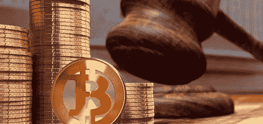

# 金融监管者对付密码的双刃剑

> 原文：<https://medium.datadriveninvestor.com/financial-regulators-double-edged-sword-against-cryptos-9aadabcc719d?source=collection_archive---------6----------------------->

让我首先说，尽管我是加密/区块链运动的巨大支持者，但我仍然相信应该有某种透明度，以便普通投资者不会被 ICO 骗子、黑客抢劫或内部工作欺骗。美国证券交易委员会(SEC)倡议在这方面推出一个[假 ICO 网站](https://www.howeycoins.com/index.html)来教育人们识破骗局，这是一个值得称赞的&正确做法。话虽如此，金融监管机构(特别是美国)采取的一些后续行动似乎表明，他们希望用铁毯子来压制一切，而不是试图解决核心问题。

当你看到科技、投资和企业金融界受到最大的加密诽谤者的影响时，这并不奇怪，例如比尔盖茨( [**【比特币杀人】**](https://www.finder.com.au/bill-gates-makes-claims-about-cryptocurrency-deaths) )、杰米戴蒙( [**【谁在乎比特币】**](https://blog.chain.com/a-letter-to-jamie-dimon-de89d417cb80) )和沃伦巴菲特( [**【老鼠药平方】**](https://qz.com/1271029/warren-buffett-hates-bitcoin-charlie-munger-compares-crypto-to-turds/) )，他们看不到分散货币的价值潜力——不是因为没有，而是因为他们看不到！

美国和加拿大监管机构最近发起了一项名为 **#Cryptosweep** 的联合倡议，以调查假冒 ico。目前大约有 70 起案件正在调查中& 40 家此类公司已经收到了停止令。很高兴知道坏玩家正在被淘汰，但我希望它不会最终成为一个没有标准来确定一个合法项目的全面禁令。令人担忧的是事情并没有就此结束。美国司法部(U.S. Department of Justice)展开了一项“刑事调查”,以查明比特币的价格是否有所上涨。硬币被交易者操纵了！这对我来说有点难以理解。原因如下:

首先，如果监管机构如此担心加密货币的价格操纵，那么他们选择了错误的时机。以比特币为例，其价格从去年 12 月达到的峰值下跌了 60%以上，交易价格处于 5 个月来的最低水平，交易者希望价格飙升，而不是跌至谷底。我认为唯一受益的玩家是最近进入 Cryptos 的机构投资者。我想知道去年年底数字硬币的价格攀升到月球时，监管者在想什么。我看到的唯一操纵来自大玩家，他们想在占据更有利的位置之前，将剩下的霍德勒留在游戏中，因为他们第一次失去了机会。

第二，即使价格被操纵，这种情况在几乎所有的金融市场都会发生——以股票和外汇为例——这两个市场的波动都是由大玩家决定的，而不是日内交易者、摇摆交易者或 ST 交易者。事实上，在外汇市场，如果散户投资者的情绪非常倾向于一个方向，货币对就会向另一个方向移动，因为这是大玩家下注的地方。所以散户永远是收货方。

最后，就像他们说的，如果你不能对抗它，就加入它——只是在这种情况下，就像继续对抗它，但也想出类似的东西。事实上，美国有三种由法定货币支持的稳定硬币在流通或制造中(Tether，TrueCoin，USDCoin)。许多其他国家也在讨论这个问题，或者积极寻求发行由金融机构以某种方式控制的数字货币。英国、日本、瑞典都是最好的例子。菲亚特的这些数字替代品是否会与 Cryptos 具有相同的功能仍有待观察。我打算很快就这些稳定的硬币做另一个作品。与此同时，你可以阅读我关于“[fed coin](https://medium.com/datadriveninvestor/whats-the-deal-with-fedcoin-93278ed09fc9)”&”[无现金社会](https://medium.com/datadriveninvestor/cryptos-moving-us-to-a-cashless-society-faster-32e57ad6748d)”的文章，以深入了解各国央行正在考虑的电子货币。

欢迎任何反馈或意见。

对加密货币、金融科技行业、突破性技术感兴趣，或者正在寻找加密货币、外汇或股票交易想法的人——关注我的[Twitter](https://twitter.com/trade_nut)&[StockTwits](https://stocktwits.com/trade_nut)。关于外汇&股票的实时信号，请在[trade alike](http://www.tradealike.com)App(**@ Fakd**)上关注我

*原载于 2018 年 5 月 29 日*[*www.datadriveninvestor.com*](http://www.datadriveninvestor.com/2018/05/29/1135/)*。*