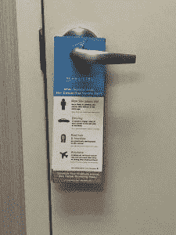

# 金融化继续分裂社会

> 原文：<https://medium.datadriveninvestor.com/financialization-continues-to-fracture-society-7e404340d118?source=collection_archive---------5----------------------->

# 以牺牲病人为代价获利

几周前，我预约了皮肤科医生来检查皮肤状况。没什么严重的，但还是需要治疗。我之前去过的一个地方的一名医学博士确认了这个预约。在被看到之前，我在一个贴有 4 张皮肤病学服务广告的办公室里等着。忍不住拍了照片，本帖收录了部分照片。我拍完照不久，门开了，走进来一个我以前没见过的女人。她自我介绍说自己是医生助理，并告诉我她将带着

关心我。虽然我已经和一个医学博士预约了，但我认为私人助理也能胜任。

 [## 为什么包容性财富指数比 GDP 更能衡量社会进步？-数据驱动…

### 你不需要成为一个经济奇才或金融大师就能知道 GDP 的定义。即使你从未拿过 ECON 奖…

www.datadriveninvestor.com](https://www.datadriveninvestor.com/2019/03/08/why-inclusive-wealth-index-is-a-better-measure-of-societal-progress-than-gdp/) 

助理说因为是第一次和她见面，我应该做个全身检查。她想“熟悉我的雀斑和痣。”我礼貌地告诉她，我以前去过办公室，没有必要检查。我的皮肤状况影响我的眼睛。我在预约前进行了一些在线研究，发现我可以用抗生素治疗。我把这个告诉了私人助理，她决定看看。她建议我买“眼睛填充物”对于那些不知道什么是眼部填充物的人来说，它们是注射透明质酸，让你看起来不那么累。他们根本没有治疗我的皮肤状况。这些好处纯粹是表面的。此外，这一过程有风险，更不用说超过 1000 美元的费用。

我去看了一个有独立问题的皮肤科医生，医生建议我做一些完全不相关和不必要的手术。为什么会这样？我的经历是皮肤科金融化的结果。

# 私募股权金融化

我去过的皮肤科诊所的所有者 Schweiger 皮肤科集团最近从一家私募股权公司获得了 1 亿美元的投资。与大多数金融投资一样，投资者期望他们投入风险的资本会有回报。当然，这种回报有望从患者身上产生。不幸的是，患者被迫接受不必要的就诊、检查和程序。一个以前治疗有需要的病人的领域已经变成了一棵高度资本化的摇钱树。

私人助理的薪酬比医学博士低，但仍能产生大量收入。管道也更深，因为成为私人助理比成为医学博士更快更便宜。皮肤科治疗皮肤病，其中许多需要持续应用局部疗法。举例来说，为了治疗痤疮，皮肤科医生可能会开清洁剂、软膏和像 Accutane 这样的药丸。治疗可能需要数年时间，这保证了皮肤科办公室及其投资者的经常性业务。施韦格皮肤病集团通过发布自己的品牌疗法系列，进一步将患者货币化。虽然医疗行业的金融化尤其令人震惊，但这并不是私募股权公司以弱势群体为代价获利的唯一例子。

# 金融化如何分裂社会

私募股权公司已经参与了养老院、移动家园公园和发薪日贷款提供商的管理。坦率地说，利用这些机会的私人股本公司为他们的普通合伙人和投资者赚了一大笔。私人股本行业不乏亿万富翁，但这种财富积累是件好事吗？毕竟，金融是零和游戏，所以当私人股本巨头获胜时，谁是输家？让我们探索一下私募股权公司已经开发的三个领域:

*   养老院

多年来，私募股权公司已经收购了像 HCR·曼诺尔这样的连锁养老院。世界第二大连锁养老院 home 曼诺尔于 2007 年被凯雷集团收购。去年三月，[HCR·马诺卡申请破产](https://www.advisory.com/daily-briefing/2018/11/28/nursinghome)。在凯雷的管理下，HCR·马诺卡公司违反健康法规的次数越来越多，解雇了数百名员工，并虐待病人。州检查人员发现有褥疮和感染的老年患者。

HCR·曼诺尔公司最终无法偿还凯雷杠杆收购后的债务。为了偿还债务，老年病人遭受了巨大的痛苦。不幸的是，老年人并不总是有办法或体力找到提供更好治疗的替代疗养院。这个事实当然被利用了。HCR·曼诺尔提供了一个恰当的例子，说明为什么养老院应该被指定为不受凯雷(Carlyle)等另类投资经理影响的保护机构。

*   移动家庭公园

约翰·奥利弗最近调查了私人股本行业进入移动住宅领域的情况。他分享说，虽然移动房屋相对于标准房屋更实惠，但私募股权公司正在降低它们的价格。术语“移动房屋”实际上是一个误称。移动它们的费用很高，所以它们经常停在满是其他活动房屋的公园里。

这些公园现在归私人股本公司所有，它们将土地出租给活动房屋所有者。巧合的是，(或许不是)，凯雷与 TPG 和百仕通一起投资了活动房屋公园。私人股本公司一直在将活动房屋园区的租金提高到不可持续的水平。这种做法将活动房屋业主推入了更深的财务困境，并导致一些人无家可归。私人股本公司的利润是以牺牲穷人为代价的。他们正在毁掉房客的生活。

*   发薪日贷款提供商

我们中的一些人可能熟悉发薪日贷款人采用的有毒做法。发薪日贷款机构对发放给低收入个人的现金垫款收取高得令人难以置信的利息。大部分本金通常来自借款人的工资。由于高利率，借款人可能陷入债务循环，最终以破产告终。尽管这一现实对借款人来说是毁灭性的，但对私人股本公司来说却是笔大生意。超过 5000 家发薪日贷款机构为私募股权公司所有。高息支付形式的现金流为私人股本公司及其投资者创造了巨额利润。

# 日益扩大的贫富差距

对弱势群体的持续剥削不仅仅伤害了弱势群体。这些做法耗尽了政府的国库，因为福利金是用来供养那些没钱购买基本必需品的人的。由于支付高额租金和利息，穷人无法摆脱贫困。随着金融化渗透到更多的市场，贫富之间的差距越来越大。我们需要对弱势群体进行更多的保护和监管，这可能最终有助于这些群体的规模缩小。如果我们要修复我们社会遭受的裂痕，这样的保护是必要的。

最初发布于:【https://bunkerbasics.com/financialization-fracture-society/ T3