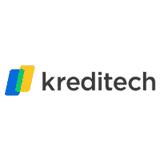
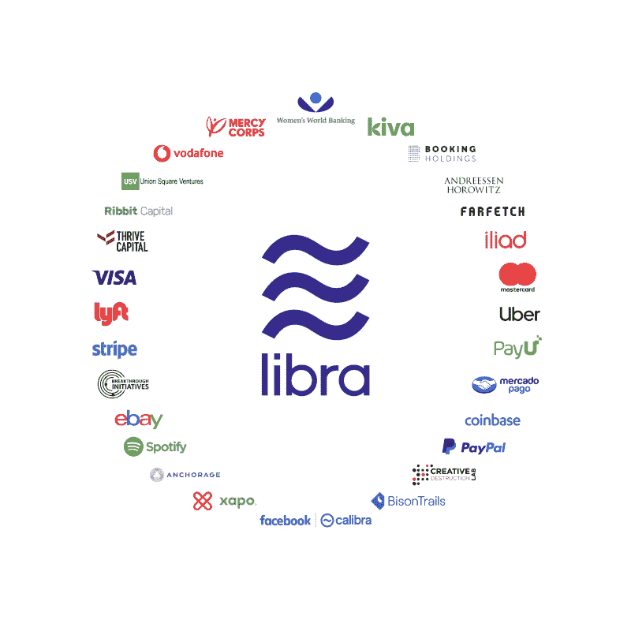
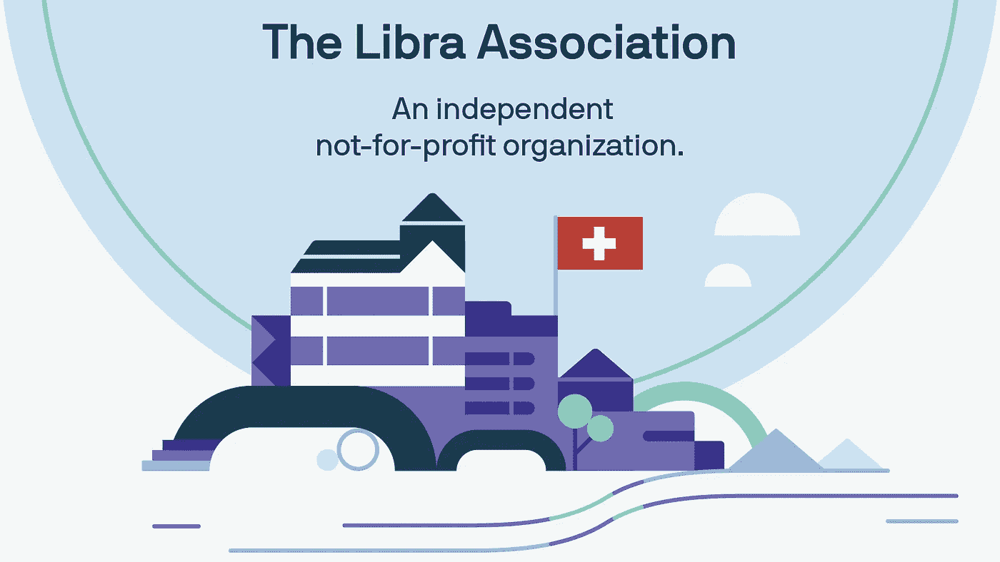
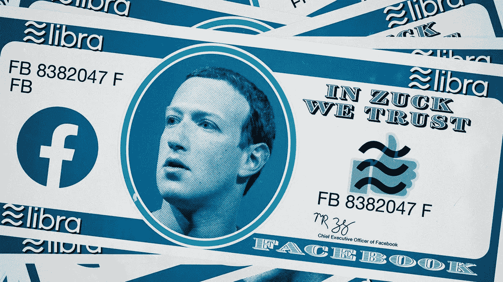

# FINCHTECH 感觉像是 FUNTECH。但是现在天秤座已经上路了

> 原文：<https://medium.datadriveninvestor.com/finchtech-felt-like-funtech-but-now-libra-is-on-its-way-c3cad443bd2b?source=collection_archive---------8----------------------->

## 战场是有标记的。壕沟建好了。木已成舟。

十年前的金融危机深刻地塑造了世界的社会文化气候。特别是在西方，很多人受到了影响，它创造了一种愤怒和不信任的[文化，这种文化败坏了民主](https://scienceofthetime.com/portfolio/distrust-doom-versus-the-peer-progressives/)，让川普成为美国总统，让假新闻成为国际家喻户晓的名字，我们的银行完全不受欢迎。

[CJBS Insight — University of Cambridge](https://insight.jbs.cam.ac.uk/2018/what-caused-the-leverage-cycle-run-up-to-2008-financial-crisis/)

迄今为止，对银行的普遍不信任并不意味着我们已经抛弃了它们。大概这不是忠诚和依恋的问题，而是缺乏可行的替代方案。我们可能仍然欣赏在柜台迎接我们的银行职员迷人而热情的态度——尽管她被自动带走的可能性越来越大。但在我们当代愤怒和不信任文化的中心，银行业的声誉已经一落千丈。唉，虽然，我们不能没有这些混蛋，每个人都叹息。

 [## 分散金融的出现|数据驱动的投资者

### 当前的全球金融体系为拥有资源、知识和财富的人创造了巨大的财富

www.datadriveninvestor.com](https://www.datadriveninvestor.com/2019/03/14/the-emergence-of-decentralized-finance/) 

> 迄今为止，对银行的普遍不信任并不意味着我们已经抛弃了它们。

Jamie Dimon — [Business Insider](https://www.businessinsider.com/jpmorgan-ceo-jamie-dimon-on-how-he-hires-2016-3)

但现在，在过去的几年里，金融科技开始崭露头角，并给人留下了诱人的印象。“他们都想吃我们的午餐”，美国最大的银行摩根大通的首席执行官杰米·戴蒙说，事实上，他不太可能很快挨饿——2019 年获得了 3100 万美元的加薪。随着银行服务的替代选择越来越多，一些重要的先锋派人士正在加入金融科技的行列。期待更多的金融科技创业公司进入这个领域。

他们中的许多人并不渴望成为传统银行。他们避开了传统银行的无情形象。金融科技初创公司通常专注于窃取银行一些最赚钱的服务。比如财富管理(robo advisors)、支付(M-Pesa，但也包括支付宝和 Applepay)、点对点贷款(Zopa，Lending Club)，或者众筹，这更多的是一种新的金融服务。都以比传统银行更低的价格交付。这一切赋予了金融科技罗宾汉般的吸引力。当金融科技与银行较量时，许多人将其视为精选的有趣科技——当然，除非你赚了 3100 万美元。

不久前，爱沙尼亚人 Taavet Hinrikus 搬到伦敦，为 Skype 工作。在那里，他得到了英镑的报酬。当他想用爱沙尼亚的货币向该国转账时，他必须支付令人眼红的 5%的转账费用。垄断银行就是这样的。幸运的是，其他人想把钱转到相反的方向，也讨厌不合理的转让费。现在，他们在点对点的 Transferwise.com 会面，那里的传输成本要低得多，每个人都很乐意分享杰米·戴蒙的午餐。

fintech 的崛起增强了整个金融业的活力和竞争热情。金融科技颠覆者设法削减成本，因为他们的管理费用更低，他们的信息和通信技术(ICT)优于普通银行。Fintech 的负担也更少(目前！)由政府规定。由于常规银行最近的不当行为，对它们的监管变得更加严厉。除了能够降低服务成本之外，金融科技在向某人贷款时，也能够比传统的 skool 银行更好地评估风险-这要归功于他们更复杂的 ICT 和人工智能系统。

[Kreditech](https://www.linkedin.com/company/kreditech)

以 Kreditech 为例。这家德国在线贷款公司向个人提供贷款，基于他们的信用度，这种信用度不是通过使用传统的信用信息(如收入和年龄，如果可能的话，还有以前的贷款行为)来分析，而是通过使用社交媒体数据来分析。一进入网站，表示有出借意向，就被要求分享浏览历史。这样，Kreditech 可以根据你的实际消费行为、你的朋友类型、你晚上去酒吧或赌博网站的频率提出建议。算法和人工智能在这方面处于领先地位——声称可以提供比传统银行的古老系统更准确的个人信用状况。Kreditech 甚至会记录你在注册贷款时是否会复制粘贴你的名字，以及你是否会立即去注册，而不是先阅读网站的一般信息。这两种情况都表明你有一种紧迫感，这种紧迫感不会让你成为一个非常可靠的借款人。金融科技只是更深更好地了解我们。因此，它能提供更智能、更流畅、更便宜的服务。

> 但是现在，几乎没有人认为传统银行是新的失败者。

[Tenor](https://tenor.com/view/robin-hood-hiss-money-count-thief-gif-10737365)

# 老大哥对罗宾汉对老大哥

传统银行正在反击。但这是一场艰苦的战斗。因为他们不可挽回的名誉受损。因为他们老式的 ICT 系统。另一个原因是，最聪明的千禧一代现在往往更喜欢在令人兴奋的金融科技初创公司工作，而不是曾经备受青睐的传统银行。银行认为这一切有些不公平。桑坦德银行集团首席执行官安娜·博廷声称，如今大型科技公司是传统银行业的终极挑战者，与银行相比，大型科技公司拥有更多现金，监管更少。所以大型科技公司才是真正的敌人，而不是那些可怜的银行。谈到大型科技的力量，博廷说得有道理。但是现在，几乎没有人认为传统银行是新的失败者。他们最近的行为伤害了太多人。这在我们的集体记忆中太新鲜了，让我们无法放弃我们的*幸灾乐祸*。

然而，银行正在采取行动。例如，传统的大型 ING 银行试图将其 DNA 向金融科技方向转变。它现在与一个模仿 Kreditech 的算法自动信用评分系统一起工作。在德国，它获得了监管机构的许可，允许客户仅通过带有人脸识别功能的互联网视频链接开立账户。反之亦然，金融科技正变得不像几年前那么酷。他们的算法人工智能方法通过收集我们的点击量，特别是社交媒体数据来评估我们的信用度，这与西方的隐私意识背道而驰。**金融科技不再是罗宾汉，而是老大哥。**

这是一个未定但竞争日益激烈的战场。现在脸书的天秤座正在挖自己的战壕。

[Yahoo Finance](https://finance.yahoo.com/news/libra-coin-backlash-what-the-other-founding-members-besides-facebook-say-160035120.html)

# 天秤座上路了

Libra 是脸书和 27 个合作伙伴宣布的国际数字货币 coin plus 附带的智能支付系统。当然，乍一看，Libra 对用户来说很棒。使用它会非常流畅，就像所有的脸书服务一样。它可以支付你的购物款，还可以让你通过该公司的信使服务给你的朋友寄钱。它会很便宜，因为付款人和收款人之间没有中间人:银行大多被锁在门外，不能再收费了。此外，Libra 也将做好准备，为其用户带来新的相关服务——这是 Big Tech 已经证明的强大倾向之一。例如，你未来的无人驾驶汽车不仅能为你评估回家的最快路线，还能评估使用快速通道是否值得花钱。付款将自动处理。当然是天秤座。

> 首先，它巧妙地打出了“区块链”这张牌。

天秤座将是用户友好的天堂。但脸书很难像一些金融科技初创公司那样扮演罗宾汉。相反，天秤座尝试了另外两种提升形象的策略。首先，它巧妙地打出了“区块链”这张牌。区块链的负面影响是，它支持的硬币经常出现混乱的货币波动。脸书向天秤座承诺了第一枚稳定硬币:稳定硬币。区块链的正面形象是，它与负责对等系统的民主草根阶层的兴奋感联系在一起。天秤座也建议搭顺风车。当然，不完全是，但至少有了天秤座，我们将有能力驯服不喜欢的银行。

作为第二个提升形象的策略，天秤座打出了一张对社会负责的牌。它声称为我们星球上的穷人提供基本的金融服务，这些人直到现在还不能在肮脏的银行开户，因为对他们来说，这些银行不是足够有利可图的客户。天秤座即将到来，谁能拒绝为穷人感到高兴？

[TechCrunch](https://techcrunch.com/2019/06/18/facebook-libra/)

尽管如此，关于“*爱天秤座*”的争论并不能掩盖问题:

*   **首先，社会文化气候再次发生变化。**五年前，我们的愤怒和不信任主要集中在传统银行，但从那以后，我们已经学会了更不信任大型科技公司。尽管脸书承诺连接世界，从而给所有人带来和平与理解，但我们现在意识到，脸书也是恐怖分子和巨魔、假新闻和有毒操纵的平台。这台提款机脸书一贯宁愿否认这一点，也不愿接受严肃而真诚的责任。剑桥分析是许多人的转折点。脸书将继续存在，但名誉将严重受损。之前的爱情烙印已经蒸发了。会影响天秤座的接收。
*   随着愤怒和不信任降临到脸书身上，该公司很乐意低调一点，强调它在 Libra 的冒险中并不孤单——Spotify、优步、万事达和 Visa 也加入了这个俱乐部。然而，没有人怀疑，就其本质而言，脸书将占据主导地位，至少因为它将处于技术领先地位。除此之外，天秤座协会的所有伙伴都是完全合作的。当事情到了紧要关头，企业总是将自身利益置于公共利益之上。天秤座协会的摇篮矗立在税务天堂瑞士是巧合吗？
*   天秤座声称要从经济上解放这个星球上的穷人，这也是一个陷阱。在非洲的大部分地区，M-Pesa 在为穷人提供基本的网上银行服务方面做得很好。M-Pesa 用比天秤座强迫穷人购买的智能手机便宜得多的手机做到了这一点。
*   **接下来是隐私问题。十多年来，硅谷一直谴责中国数字产业的无耻抄袭。[天秤座是第一个响亮而清晰的西方复制支付宝和微信在中国首先成功的例子。但是，这里有一个问题。中国消费者对隐私的关注远不如西方消费者。脸书已经承诺将 Libra 产生的每个用户的财务数据与其广告目标分开，以此抵消潜在的隐私不安。但是我们能相信他们吗？](https://medium.com/datadriveninvestor/kai-fu-lee-6130b0affd)**
*   当然，天秤座会以新的创新方式促进洗钱、逃税和金融操纵。假设这 1%的人察觉到希腊、格鲁吉亚或阿根廷等国出现了新的金融风险。与天秤座，它将能够撤回所有的钱在一个激烈的平稳移动。同样的举动，钱可以去下个月的风味(或迷你秒！)国家或市场。

尽管有这些反对意见，许多用户会喜欢天秤座的轻松和自由。当好东西顺利而廉价地到来时，怀疑主义往往会烟消云散。是的，我们知道当互联网上的服务免费时，我们用我们的数据付费。(这使得脸书将 Libra 生成的数据与其他数据分开的承诺格外令人怀疑。这违背了它的商业模式。)到目前为止，大多数人都乐于以一种无忧无虑的“我没什么好隐瞒的”态度，无视“免费服务意味着用你的数据付费”的知识。然而，西方反复无常的隐私感觉会给天秤座的根基添加流沙。

[The Verge](https://www.theverge.com/2019/6/26/18716326/facebook-libra-cryptocurrency-blockchain-irs-starbucks)

尽管普通人可能在隐私问题上表现平平，但政府不会。老学校银行也不会。政府不会，因为他们担心像天秤座这样的超级大国的出现会减少他们在国家经济政治中的机会。各国经常通过货币贬值来应对经济困难时期。当世界上一半的人用天秤座支付时，这个政府工具将失去一半的力量。还有，传统银行会打天秤。几家银行集团已经在开发他们自己的数字硬币——这给了他们额外的理由对 Libra 持怀疑态度。一个多世纪以来，政府和银行一直密切合作。大科技必须是一个非常熟练的诱惑者来拆散他们。

# 战场是有标记的。壕沟建好了。木已成舟。

**关于作者:**
*Carl Rohde 博士教授是一位关于“未来预测&创新”的国际主题演讲人，具有学术深度和实践现实性。在过去的十年中，他与 50 所大学和 10，000 多名学生合作。目标:让所有人都参与到更多的趋势和创新中。罗德在阿姆斯特丹、巴塞罗那和上海都有研究职位。卡尔·罗德还领导着 www.scienceofthetime.com 的一个全球市场和趋势研究人员的虚拟网络***。**

*作为一个教育知识机构(大学、理工学院或其他),你有兴趣参与国际酷城搜索并想了解更多吗？[请点击这里](https://scienceofthetime.com/service-title-2/?source=post_page---------------------------)。*

*在 Twitter 上关注[Carl Rohde](https://twitter.com/CarlRohde?source=post_page---------------------------)并在 Medium 上关注[。](https://medium.com/@carlrohde?source=post_page---------------------------)*