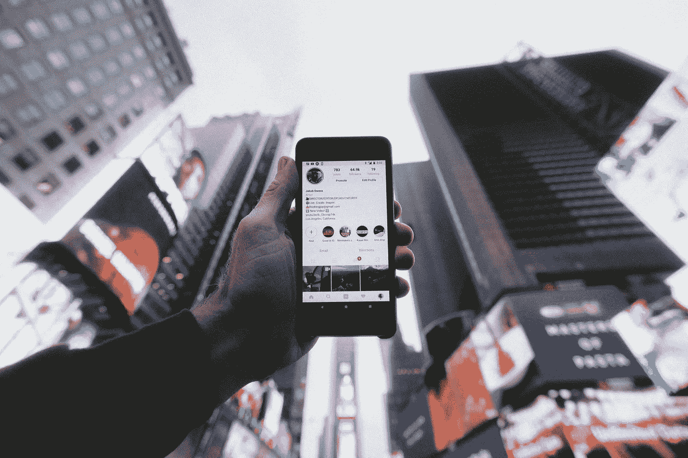
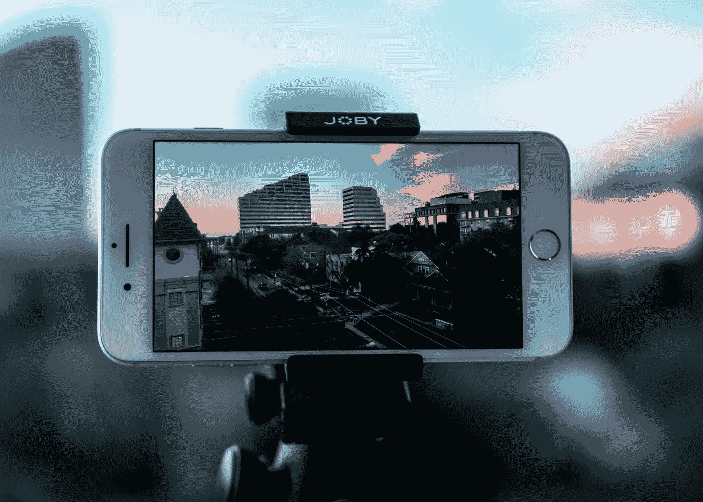
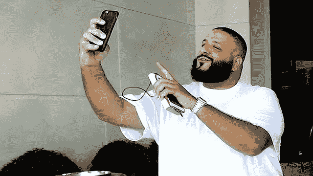

# 如何最大化你的社交媒体形象

> 原文：<https://medium.datadriveninvestor.com/find-your-social-medium-how-to-create-more-on-different-social-media-9cd32091c99e?source=collection_archive---------8----------------------->

## 首先，找到适合你的平台。

Photo by [Jakob Owens](https://unsplash.com/@jakobowens1?utm_source=unsplash&utm_medium=referral&utm_content=creditCopyText) on [Unsplash](https://unsplash.com/s/photos/social-media?utm_source=unsplash&utm_medium=referral&utm_content=creditCopyText)

如果你像我一样是一个在社交媒体上非常开放的人，那么你可能会喜欢在网上创建帖子并分享有趣的内容。如果没有，那也没关系。但你可能会错过创业机会。

像从你喜欢谈论的事情中获得报酬或者仅仅是创造的满足感这样的机会。

在这篇文章中，我想分享我用来分享想法、娱乐、美学、技巧、建议等等的 6 大社交媒体网络。

 [## 以最好的面貌面对未来|数据驱动型投资者

### 社交媒体营销从客户开始。广告、反馈和管理投诉交织在一起…

www.datadriveninvestor.com](https://www.datadriveninvestor.com/2020/03/01/take-charge-with-your-best-face-forward/) 

我接触过的很多人都说他们想开一个 YouTube 频道、一个博客、一个媒体跟随者……这样的例子不胜枚举。有时候我们害怕尝试这些平台。时间过得很快，如果我们不按照自己的激情行事，那么这种雄心就会慢慢消失。

## 无为是人生遗憾的一个不幸因素。

走实用路线并不保证能让你去你想去的地方。不管你想去哪里，选择一个方向，相信你的直觉，然后执行。

# **YouTube**

我从这里开始，因为我听到人们一直在谈论开始 YouTube 频道。由于智能手机几乎在每个人的手中，没有更多的借口不开始你一直想要的频道。

Photo by [Thomas Russell](https://unsplash.com/@truss?utm_source=unsplash&utm_medium=referral&utm_content=creditCopyText) on [Unsplash](https://unsplash.com/s/photos/recording-video?utm_source=unsplash&utm_medium=referral&utm_content=creditCopyText)

YouTube 的一个神话是，你需要一个专业的相机。在 iPhone 上拍摄的电影包括*雪蒸汽熨斗、橘子和 Unsane。*有可能。

你真的只需要这三个要素:1。带摄像头的手机 2。良好的互联网连接和 3。创造力。

显然，你可以考虑购买一台笔记本电脑来编辑视频，但这只是一个基本的开始。

在发布了你的第一个视频之后，你只需要等待接下来会发生什么，或者开始计划你的下一个项目。

太刺激了。刚开始的时候，尽量不要在意你的分析，比如浏览量和订阅量。我们都从零开始！

如果你太在乎你的分析，这会扼杀你的生产力。也不要抄袭其他 YouTubers 的风格。我建议使用一些你最喜欢的 YouTubers 作为灵感，但不要试图完全像他们一样。相信我，我试图成为下一个凯西·奈斯塔特，那是一个有趣的阶段。

## 一个好的 YouTube 周期是

1.  拍摄视频
2.  编辑(可选)
3.  在 YouTube 上发布
4.  与家人和朋友分享
5.  计划你的下一个视频
6.  重复

这些步骤是我用来保持一个可持续的时间表，我可以至少一个月上传一次或更多。

# **2。Instagram**

我看待 Instagram 的方式，是一个把你自己独特的审美分享给世界的平台。这是一个摄影、分享时刻和影响者原创的平台。人们可以通过图片、“故事”、视频、IGTV 和 Instagram Live 直观地传达他们的信仰和灵感。

我利用 Instagram 分享一些我个人拍摄或参与拍摄的我最喜欢的图片和视频。

对于那些想把自己放在那里而不必说太多的企业和人们来说，这是一个很好的选择。

# **3。中等**

大多数千禧一代都涌向哪里寻找他们的文章？它是*中的*。我的灵感来自加里·维纳查克，几个月前我听了他的 DailyVee 播客，一段时间以来，我一直在拼凑我掌握的文章。

Remember this.

我涉足的领域包括个人成长、人际关系、创业和娱乐。

你可以写和读任何东西！我们中的一些人注定要在相机上创作视频。其他人注定是伟大的作家。通过文字表达自己是最好的方式之一，因为人们对文字和视频的理解不同。

如果你想从中级开始，写在笔记本上开始。我发现写在纸上，转换成谷歌文档，然后最终发布比坐在一个空白屏幕前，不假思索更容易。这个过程对我来说更好，因为更多的想法流到纸上，而不是电脑或手机上。

# **4。Tik Tok**

你喜欢简短的娱乐节目吗？曾经想尝试一下 Vine，但是没有？还不算太晚。Tik Tok 正在成为年轻人和儿童最广泛使用的平台之一。

就我个人而言，我只制作了三部 Tik Tok，但从中获得了巨大的乐趣。你可以和流行歌曲分享你的舞步，重现你最喜欢的电影场景，任何你想到的事情。

开枪吧。有趣、戏剧性、过度积极……无论你决定在这个平台上做什么，做你自己就好！你的视频可能会疯传。

# **5。Snapchat**

在 Snapchat 上可以分享你更私人的一面。你和你最好的朋友一起唱“不要停止信仰”的亲密接触可以在这里找到。有趣的迷因通常在应用程序的“故事”部分与你想与你的 Snapchatters 伙伴分享的任何媒体一起分享。

DJ Khaled — One of Snapchat’s first users to blow up using the platform

有足够的空间让面部摄像头拍摄的咆哮或积极的视频在上面传播。我主要使用 Snapchat 分享我认为是我一天中最重要的时刻，这些时刻可能不太适合脸书，我将谈到的下一个网络。

# **6。脸书**

几乎每个人都有账户的地方在哪里？当然，这是脸书。这个社交网络在过去几年里一直在动态增长。你现在可以去“脸书现场”，分享你的广告，并加入脸书集团。

如果你是一个商人，脸书是一个广告的好地方，因为用户流量和目标受众的增加。脸书将确保您公司的内容以最合适的方式呈现在人们面前。

我通过脸书与我在世界各地遇到的老朋友保持联系，特别是因为我是一个已经搬家多次的军人子弟。我最喜欢脸书的一个方面是“群体”。我喜欢你加入一个有着相同兴趣和目标的团体，立即感受到彼此的联系。

我怎么强调这一部分都不为过。通过脸书，你可以从社区中分享和学习很多东西。它既可以用于无休止的滚动，也可以用于创建与他人的精彩互动。

今天我分享了 6 个我最喜欢的平台。

> 我们并不都是一样的，但我们都可以找到一种方式来留下自己的印记！

社交媒体通过行动主义和与世界分享有意义的想法，在当今世界移山倒海。

一些最大规模的标签行动主义的例子包括 *#ASLIceBucket Challenge、#BlackLivesMatter、# women March*和 *#DressLikeAWoman。*

我对你的挑战是尝试使用这 6 个社交媒体网络中的一个，你可能还没有尝试过，并利用它的功能来找到你的声音。我迫不及待地想看看它会带你去哪里！