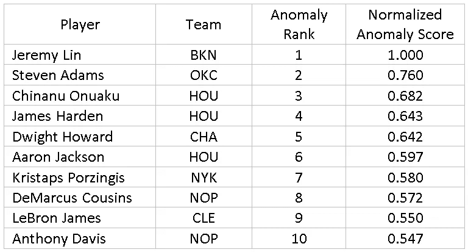
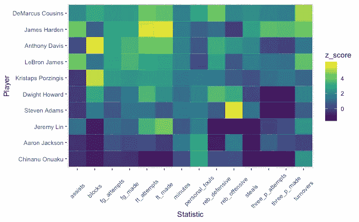

# 在没有已知案例的情况下发现欺诈

> 原文：<https://medium.datadriveninvestor.com/finding-fraud-when-no-cases-are-know-4392d85d02bb?source=collection_archive---------33----------------------->

欺诈检测是关于[在干草堆中寻找针](https://www.elderresearch.com/haystacks-needles-anomaly-detection)并且需要可靠地标记欺诈(针)和非欺诈(草)行为的实例。可以使用这些标签来训练预测模型，以学习输入变量中的潜在模式，该模式最好地将欺诈与非欺诈案件分开，从而估计任何未来案件的欺诈相似性。通常，有趣的案例非常少，在这种情况下，我们可能必须仔细地对稀有类进行上采样和/或对丰富类进行下采样，以帮助模型对稀有类给予足够的关注，使其变得有用。但是，当标签不仅罕见，而且完全不存在时，我们该怎么办呢？

有理由假设[欺诈](https://www.elderresearch.com/analytics-solutions/fraud-and-risk-analytics)案件在某种程度上将是异常的，或者不符合预期的情况。异常与大部分案例的差异足以引起怀疑，即它们可能是由完全不同的过程产生的(例如，欺诈、数据错误)。一个实例与其对等实例相比有多“不同”,可以通过多种方式来衡量。例如，简单的统计方法认为显著偏离平均值是异常的，而基于密度的方法假设正常实例倾向于聚集在一起，从而将边缘实例标记为异常。

但是请注意，并不是所有的异常都是一样的！一个人可能表现出与另一个人截然不同的特征，甚至弄清楚是什么使他们异常也不总是很清楚。它们让我一位同事想起托尔斯泰著名的开场白；“所有幸福的家庭都是相似的；每个不幸的家庭都有自己的不幸。”(《安娜·卡列尼娜》，1878 年)。

# 通过示例进行比较

考虑一个场景:你对识别 NBA 超级巨星感兴趣。监管的方法将涉及创建一个新的标签，超级巨星，以标志表现最佳的球员。使用关于球员表现的属性，你可以建立一个模型来预测球员成为超级巨星的可能性。(这可能很容易；当然，超级明星有很好的统计数据，但这个标签指导我们的模型定义超级明星和(仅仅)伟大的职业球员之间的界限。

或者，可以使用无监督的方法来发现数据中的异常情况。这里的假设是，至少有一种类型的异常会与超级巨星很好地匹配。Mahalanobis 距离方法假设数据是高斯分布的，并测量每个案例到数据云平均值的 sigma 调整距离。在 2017-2018 常规赛的所有 NBA 球员身上使用它，会产生以下 10 大异常:

*Table 1\. Top 10 Anomalous NBA Players (2017–2018 Regular Season)*

NBA 巨星勒布朗·詹姆斯和 Chinanu Onauaku 有什么共同点？勒布朗在第一轮早些时候被选中(这是一个运动员超级巨星潜力的良好指标)，他的职业生涯可谓传奇，在职业生涯的 15 个赛季中获得了多个 MVP 奖项，并赢得了三个联盟冠军。他可以说是他那一代人中最好的球员，这是一个非常积极的异常现象。另一方面，奇纳努·奥纳乌库(Chinanu Onauaku)刚刚结束了他的第二个赛季，并在四天后被交易到达拉斯小牛队(Dallas Mavericks)。这两个运动员非常相似。然而，我们的算法将勒布朗和奇纳努都标记为异常。图 1 显示了每个入选“异常前 10 名”的玩家的资格热图。

*Figure 1\. A heatmap of top 10 anomalies. Players are compared to all their peers in the NBA for each statistic evaluated; a z-score of zero is roughly average, while a z-score greater than zero means higher than average.*

# 我们能从异常检测算法中学到什么？

对于我们使用异常作为代理来识别超级明星球员的目标，我们的结果是随意的。这份名单中的几名球员都有着非凡的赛季:勒布朗·詹姆斯场均 27 分和 9 次助攻，詹姆斯·哈登场均 30 分和大约 10 次罚球(因为他有能力冲向篮筐并获得犯规)。其他球员——齐纳努·欧努阿库、亚伦、杰克森、林书豪——完全因为其他原因而被认为是不正常的。最值得注意的是，这三个人上赛季只打了一场常规赛，而在林的比赛中，他每次罚球都进了！

我们必须记住，异常检测的目标——特别是通过 Mahalanobis 距离——是识别数据世界边缘的参与者。在这里，它确定了球员与伟大的赛季(更多的助攻，盖帽，投篮得分等)。比平均水平)以及那些在光谱另一端的人(或者那些在上场时间上表现突出的人，比如说，不管他们做得好不好。)图 2 显示了数据的可视化描述，通过主成分将维度缩减到一个平面。

Figure 2\. Anomalies are not all equal: A plot of the first two principal components of the analysis variables (player stats), colored by Mahalanobis distance anomaly score. Numbers on the higher end of the scale represent more anomalous players. The first two components explain 78% of the variability in player’s stats.

使用异常检测会产生一组有趣且多样的结果。然而，一个关键是，它可能不会准确地揭示你在寻找什么(超级明星)，这一点有时会被遗忘。

# 你应该使用哪种方法？

如果你有很多你正在寻找的标记实例，监督建模是最有效的方法。如果没有，您必须尝试异常检测。如果您只有几个带标签的案例，请尝试这两种技术。如果一组奇怪的点靠近您标记的欺诈案例，您可能会发现更多遵循相同方案的欺诈案例。如果一个集群在别的地方，你可能已经发现了一个新的方案！这一极有价值的成果绝不是仅靠监督学习就能轻易实现的。一定要对你发现的不同类型的异常进行头脑风暴，找出不同的解释。过去曾经发生过这样的事情，通过仔细研究那些被揭露的“不幸的家庭”,我们在老年研究中发现了比我们最初寻找的更有价值的东西。

**要了解有关欺诈检测分析的更多信息，请观看我们的点播网络研讨会** [构建全面的欺诈分析平台](https://www.elderresearch.com/company/resource-center/webinars/building-holistic-fraud-analytics-platforms)。

# 有关系的

下载白皮书[**粮草异常检测**](https://www.elderresearch.com/haystacks-needles-anomaly-detection)

观看网络研讨会[部署欺诈分析解决方案的最佳实践](https://www.elderresearch.com/company/resource-center/webinars/best-practices-for-deploying-a-fraud-analytics-solution)

阅读博客[检测欺诈性工人赔偿申请](https://www.elderresearch.com/blog/detecting-fraudulent-workers-compensation-claims)

阅读博客[改善失业保险索赔欺诈检测](https://www.elderresearch.com/blog/improving-unemployment-insurance-claim-fraud-detection)

数据科学家卡洛斯·布兰卡特(Carlos Blancarte)被分析所吸引，因为它具有捕捉复杂关系和影响决策的能力。在 Elder Research 之前，Carlos 是一家营销研究公司的首席统计师，他参与了项目生命周期的每个阶段，从收集、清理和分析数据，到构建和部署模型。Carlos 擅长预测建模(还负责文本挖掘、分段和结构方程建模)，喜欢自动化任务以节省客户的时间。

*原载于 www.elderresearch.com***。**