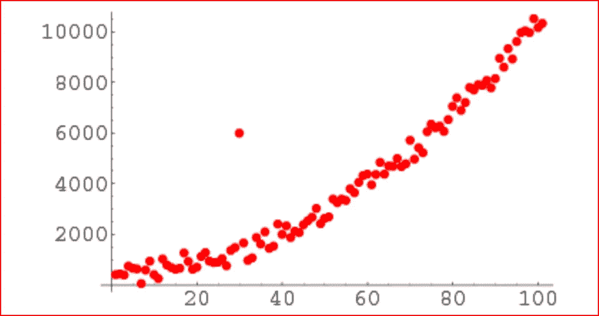

# 使用 python 查找数据集中的异常值

> 原文：<https://medium.datadriveninvestor.com/finding-outliers-in-dataset-using-python-efc3fce6ce32?source=collection_archive---------0----------------------->

*在本文中，我们将使用 python* 使用 z 得分和 IQR 四分位间距来识别任何异常值

*Jupyter 笔记本可在-*[https://github . com/arshren/machine learning/blob/master/Identifying % 20 outliers . ipynb](https://github.com/arshren/MachineLearning/blob/master/Identifying%20outliers.ipynb)获得

***什么是离群值？***

离群值是数据集中远离所有其他观察值的数据点。位于数据集总体分布之外的数据点。

***识别离群值的标准是什么？***

*   数据点落在高于第三个四分位数但低于第一个四分位数的四分位数范围的 1.5 倍之外
*   超出 3 个标准偏差的数据点。我们可以使用 z 值，如果 z 值超出 2 个标准偏差

***数据集中存在离群点的原因是什么？***

由于以下原因，数据集中可能存在异常值

*   数据的可变性
*   实验测量误差

***离群值有什么影响？***

导致统计分析的严重问题

*   扭曲数据，
*   对平均值的显著影响
*   对标准差的显著影响。

如何识别异常值？

*   使用散点图
*   使用 Z 分数
*   使用 IQR 四分位间距

## 使用散点图

我们可以看到散点图，它显示了数据点是否位于数据集的整体分布之外



Scatter plot to identify an outlier

## **使用 Z 分数**

**Z 得分公式=(观察值—平均值)/标准差**

**z = (X — μ) / σ**

我们首先导入库

```
import numpy as np
import pandas as pd
```

这里我们将使用一个列表

```
dataset= [10,12,12,13,12,11,14,13,15,10,10,10,100,12,14,13, 12,10, 10,11,12,15,12,13,12,11,14,13,15,10,15,12,10,14,13,15,10]
```

我们编写一个函数，将数字数据作为输入参数。

我们找到所有数据点的平均值和标准偏差

我们找到数据集中每个数据点的 z 得分，如果 z 得分大于 3，则我们可以将该点归类为异常值。任何超出 3 个标准差的点都是异常值。

```
import numpy as np
import pandas as pd
outliers=[]
def detect_outlier(data_1):

    threshold=3
    mean_1 = np.mean(data_1)
    std_1 =np.std(data_1)

    for y in data_1:
        z_score= (y - mean_1)/std_1 
        if np.abs(z_score) > threshold:
            outliers.append(y)
    return outliers
```

我们现在传递我们之前创建的数据集，并将其作为输入参数传递给 detect_outlier 函数

```
outlier_datapoints = detect_outlier(dataset)
print(outlier_datapoints)
```


output of the outlier_datapoints

## 使用 IQR

IQR 讲述了中间值是如何传播的。它可以用来判断一个值何时离中间值太远。

异常值是位于第三个四分位以上或第一个四分位以下的四分位间距的 1.5 倍以上的点。

我们将使用相同的数据集

第一步:

*   按升序排列数据
*   计算第一个四分位数(q1)和第三个四分位数(q3)
*   查找四分位数范围(q3-q1)
*   求下限 q1*1.5
*   求上限 q3*1.5
*   任何位于下限和上限之外的都是异常值

首先对数据集进行排序

```
sorted(dataset)
```

寻找第一个四分位数和第三个四分位数

```
q1, q3= np.percentile(dataset,[25,75])
```

q1 是 11，q3 是 14

找出第三个四分位数和第一个四分位数之差的 IQR

```
iqr = q3 - q1
```

iqr 是 3

寻找下限和上限

```
lower_bound = q1 -(1.5 * iqr) 
upper_bound = q3 +(1.5 * iqr) 
```

lower_bound 是 6.5，upper bound 是 18.5，因此任何超出 6.5 和 18.5 的都是异常值。