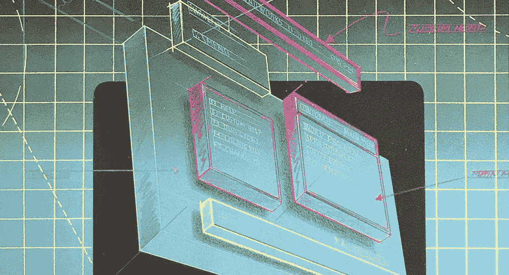
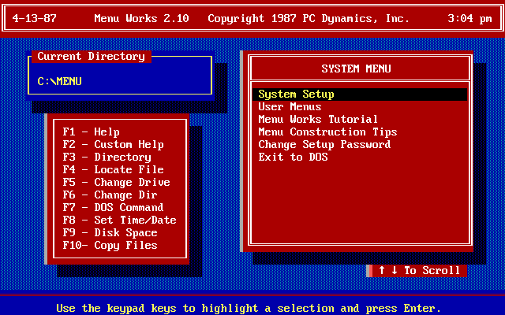
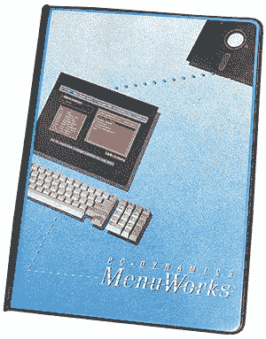
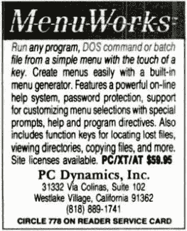
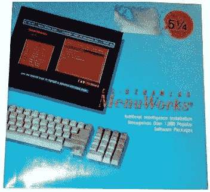

# 午夜后，我们突袭了 Egghead，发现产品市场合适

> 原文：<https://medium.datadriveninvestor.com/finding-product-market-fit-59f8dfb2100f?source=collection_archive---------12----------------------->

## MenuWorks 的故事

那是 1986 年的除夕。我和朋友们在加州大熊市滑雪旅行，突然轮到我宣布新年决心了。由于没有事先考虑，我只是脱口而出想到的第一件事。我打算辞职——明天！

是的，我做到了。我和其他人一样惊讶。我当时 26 岁。

那时我是 Vault 公司的工程副总裁。该公司在我帮助创建的一个独特的[软盘复制保护](http://www.peteravritch.com/portfolio/prolok)解决方案上做得很好，但是销售已经稳定下来，我没有足够的库存来避免引起怀疑。

因此，在没有计划、银行存款只有大约 5000 美元的情况下，我提前两周发出通知，开始自己创业。又来了。你知道，我以前也是创始人。几年前，我创办了 [Genie Computer](http://www.peteravritch.com/portfolio/geniedrives) ，为苹果和 IBM 的个人电脑开发了一系列硬盘，并取得了不错的成绩，直到 IBM 最终推出了自己的产品系列。我需要成为创始人。

我打了几个电话，找到了一些咨询工作来支付账单，但我真正想要的是一个产品；更确切地说，是一种我可以自己编码打包并在电脑商店出售的软件产品。

我把我的公司命名为 PC Dynamics，Inc .，然后开始着手工作。

## MenuWorks

一些事情让我想到了菜单软件。产品选择似乎在我的经济能力范围内，我看到人们在 Vault Corp .使用竞争产品时变得沮丧和困惑。我总是告诉自己，我可以做得更好。

产品的前提很简单。那仍然是一个命令行的世界，人们想要一种简单的方式来运行他们喜欢的程序，而不需要摸索晦涩难懂的语法。Windows 离未来还有几年的时间。

接下来的六个月左右，我白天做合同编程，晚上用微软早期版本的 C++开发 MenuWorks。

就背景而言，彩色显示器还是相当新的，大多数人仍然有传统的绿屏 CRT。WordStar 是当时事实上的文字处理器，而鼠标就在眼前。

MenuWorks 1.0

我最大的竞争对手是一款名为 Direct Access 的产品，售价为 89 美元，所以我将 MenuWorks 的包装定价为 59 美元，如上所示，尽管现在看起来很丑，但在当时非常流行。我的商品成本大约是 8 美元。

MenuWorks 起步较慢。非常慢。尽管人们很喜欢这个产品，但我就是没有足够的钱来推广它。我在 PC 杂志上的小杂志广告不起作用。我不开心。

## 做不可扩展的事情

Y Combinator 的保罗·格拉厄姆教授做不可扩展的事情，这是出了名的。尽你所能培养一小群绝对喜欢你的产品的人，让他们成为大使来建立广泛的吸引力。要是 1986 年保罗在身边给我提建议就好了。

下定决心要做好这件事，我雇了一个名叫吉姆的外向推销员，挨家挨户拜访南加州的夫妻店。吉姆是一个天生的推销员，我毫不怀疑他会带领我们走上正轨。我自己做不到，因为我还在做合同工来支付所有的费用。此外，吉姆是靠佣金工作的，所以除非东西开始销售，否则这个计划真的不会花我那么多钱。

他们的策略是在商店的机器上安装 MenuWorks，这样顾客在看电脑的时候就可以和它互动，并有希望为自己买一份。这似乎是个好主意。

## 时间到了，走开

反馈很快。吉姆告诉我店主会给他五分钟的时间，然后让他打包走人。这根本没有足够的时间来安装产品进行演示。然而，等待演示的少数人真的很喜欢这个产品。

吉姆很沮丧。他告诉我，除非我把安装时间缩短到一两分钟，包括建立所有菜单来启动商店机器上已经安装的应用程序，否则他永远无法在被扫地出门前完成演示。

说真的，吉姆——学习如何打字更快。

但是，我们知道我们有一些东西，因为许多经销商喜欢这个产品，而且我们在当地的旧货交易会上很受欢迎——是的，我们确实有旧货交易会！

伙计，我们差一点就成功了，但是没有生存的动力。

底线是——我们没有适合市场的产品。当然，这个时髦的词语在当时并不存在。我好像记得我们用了一些不太礼貌的词来描述我们的处境。

## 自动菜单构建

我们的经销商实际上是在告诉我们需要改变什么——我们只需要更仔细地倾听这些线索。

他们带领我们走向的“理想”解决方案是重新设计安装程序，以便神奇地找到、识别和分类用户电脑上所有安装的应用程序，并从一开始就将它们配置到 MenuWorks 中。但是怎么做呢？有成千上万个流行的应用程序。

编写这样的代码并不是真正的问题。这个逻辑很容易理解。真正的问题是创造奇迹所需的数据根本不存在。我需要访问一千多个打包产品，这样我就可以记下它们的核心可执行文件的文件名和文件大小，并在安装过程中通过扫描用户的硬盘来识别它们。

为了获得这样的数据，我需要在晚上闯入一家大型计算机商店，撕开他们所有的热缩塑料包装的产品，查看磁盘以获得我需要的数据。

## 午夜恶作剧

为了避免被判重罪，我和一个名叫戴夫的聪明的年轻人制定了一个巧妙的计划；附近 Egghead 软件商店的经理。书呆子什么都有。

我资助了一个计划，让他和几个值得信任的同伙连续很多天在下班后回到商店，打开所有的箱子，把我需要的文件信息从磁盘记录到电子表格中，然后重新收缩包装这些箱子——就像从来没有人在那里一样。太完美了！

我很快就拥有了构建一个杀手级自动菜单生成器所需的一切，它可以识别超过 2，500 个应用程序(包括共享软件/免费软件应用程序)并在不到一分钟的时间内为它们创建分类菜单。

对我来说，找到适合市场的产品就是在安装过程中完成前两分钟的关键工作，并让客户根本不需要看手册，因为他们不需要知道其他任何东西。软件中没有其他需要修改的地方。

## 新包装、新价格和柜台展示

准备重新推出 MenuWorks 给了我们一个机会来回顾另一个困扰的问题——在书架上迷路。

诚然，我们实际上没有卖出足够多的第一个版本来经历这个问题，但它肯定是足够容易想象的，因为我们实际上只是在 Egghead 打开了数百个包来构建我们的自动化安装程序。我们经历了那么多痛苦，肯定不是为了在软件的海洋中隐身。

我们提出的解决方案是将产品包装缩小到厚软盘的大小，并制作小型丙烯酸计数器显示器。更好的是，我们将零售价格改为 24.99 美元，并以 144 美元创建一个标准的批发 SKU，其中包括一个显示器和一打 MenuWorks 副本。

MenuWorks 2.1

诚然，这些天来，由于合作费，在数千家商店放置柜台展示要么是不可能的，要么是极其昂贵的，但在 1987 年，商店较小，柜台清晰可见。令人惊讶的是，我们只需要问一下。我们最终成功地放置了数千台显示器，却从未为放置支付一分钱。

柜台展示还有另一个意想不到的好处——经销商看到它们开始变空，会提前订购补充品，以保持它们看起来满满的。毕竟，谁会想要收银机旁边空空如也的显示器呢——那感觉就是不对的。

## 终于被牵引了

这款改进版的 [MenuWorks](http://www.peteravritch.com/portfolio/menuworks21) 具有更低的价格点和酷炫的柜台展示，绝对符合产品市场需求。此外，包装的变化使商品的成本下降到 1.25 美元左右。

我们的自动化安装程序真的让人们大吃一惊，我们得到了很多媒体的好评；包括有幸成为第一个由沃尔特·莫斯伯格在他的华尔街日报专栏中评论的产品。我可以诚实地说，我们着火了！

最棒的是，我们终于找到了几个主要的分销商，销售部门的 Jim 不再需要在周末亲自去商店或参加交流会。

最终，在接下来的几年里，我们卖出了各种口味的 [MenuWorks](http://www.peteravritch.com/portfolio/menuworksadvanced) 价值近千万美元；从那以后，Windows 开始获得动力，我们将此作为进入不同领域的线索。

也许有一天我会有幸在 YC 见到保罗·格拉厄姆并讲述我的故事。我想他会对我们的坚韧和从零到六十只需要改变这么少而感到好笑。

还有来自 Egghead caper 的 Dave 他非常喜欢这个产品，所以他加入了我们的团队，领导客户支持部门。他太棒了。

一旦你找到了，产品的市场契合度是惊人的。我们玩得很开心。

## 感谢阅读。如果你喜欢这篇文章，请随意点击那个按钮👏帮助其他人找到它。