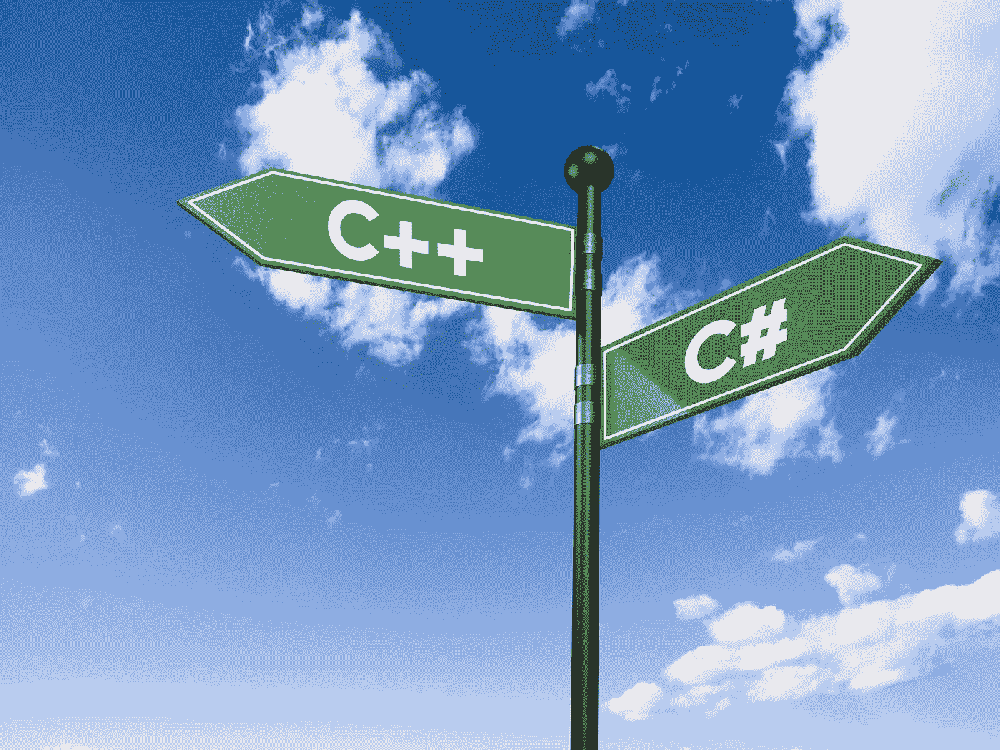
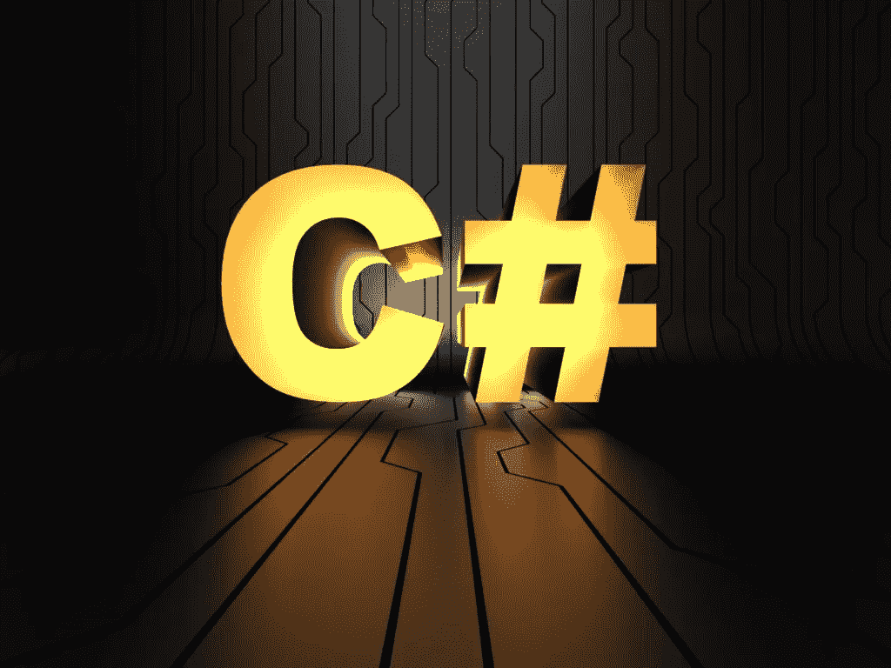

# 找出 C#与 C++和 C 之间的区别

> 原文：<https://medium.datadriveninvestor.com/finding-the-difference-between-c-and-c-and-c-b93369d3834a?source=collection_archive---------4----------------------->

对于未经训练的人来说，C 和 C sharp 或 C++之间似乎没有区别。然而，它们中的每一种都有自己的特点，这将在后面讨论。在本文中，我们将学习 C#和 C++以便你能决定在你的项目中使用哪一个。然而，首先，我们需要看一看 C 语言的同名族。

# 开始这一切的语言

c 语言早在 1972 年就被开发出来，并在 6 年后的 1978 年发布。起初，创建者计划用它来开发 Unix 的新版本。在 20 世纪 70 年代，Unix 仍然运行在汇编语言上，这是一种计算机可以理解的低级编程形式。当 C 第一次被介绍时，它改变了编程的前景。有些人会建议新程序员开始学习 C，因为更多的现代语言与 C 非常相似。

 [## 创建折衷书架的程序员指南|数据驱动的投资者

### 每个开发者都应该有一个书架。他的内阁中可能的文本集合是无数的，但不是每一个集合…

www.datadriveninvestor.com](https://www.datadriveninvestor.com/2019/03/25/a-programmers-guide-to-creating-an-eclectic-bookshelf/) 

然而，由于这种语言已经有 40 多年的历史，很难找到仍然知道如何熟练使用它的人。另一方面，它的年龄可能会使黑客更不希望攻击它，因为他们也可能知道如何使用它。

# 什么是 C 调？

升 c 调是三弦中的高级音。就像音乐符号中的升半音符号增加了给定音符的音高一样，C#提高了第一个 C 语言的水平。微软的一个团队在 17 年前推出了 C#，它的受欢迎程度一直在不断提高。而更高级的[软件开发者](https://skywell.software/)可能会注意到这一点。NET 是这种语言的基础框架，C 仍然是主干。C#编译成字节码而不是机器码，这意味着它可以在虚拟计算机上运行。所有的代码都将被实时翻译成机器代码。C#经常出现在企业应用程序中，当开发。NET 框架。C#是 C 语言家族中技术性最强的，但它仍然可以相对较快地学会，而且更可靠。

# 什么是 C++？

C++是丹麦博士生比雅尼·斯特劳斯特鲁普在 1985 年的发明。基本上，他希望构建一个更好的 C 语言版本。所有这些都必须在保持 C 语言的速度和效率的情况下完成。就难度而言，C 语言被认为是中级的，今天，它与 C 语言一起被广泛用于创建操作系统和 PC 软件。

如果你已经学习了 C 语言，并设法掌握了主要概念，你应该可以毫无困难地过渡到 C++。既然我们已经知道了 C#和 C++的历史和定义，我们现在可以继续讨论它们如何相互比较的问题。

# C#和 C++类似吗？

当我们比较 C#和 C++时，事实上有许多相似之处。它们都是面向对象的，并且都基于原始的 C 语言。话虽如此，还是有一些很大的不同。让我们仔细看看:

*   C++编译成机器码，而 C#编译成 CLR
*   使用 C++，你必须手动处理内存，而 C#运行在一个可以自动管理内存的虚拟机上
*   C#中不使用指针
*   C++可以在任何平台上工作

# 如何确定使用哪一个？

当面临 C Sharp 还是 C++之间的抉择时，很大程度上取决于团队成员当前的技能。如果有人有多年的经验，你可以马上让他们开始使用 C++。如果你的项目涉及。NET 框架和基于 web 的开发，C#是必由之路。你不应该站在好坏的立场上看待这些语言，而应该看哪一种更方便。

另一个要考虑的因素是语言背后的公司。例如，Golang 是由 Google 创建和支持的，这意味着它将吸引大量的追随者和用户社区。它有一个致力于确保其成功的大公司，并将修复任何使其难以使用的缺陷。像 C#这样的语言也是如此。自从微软创建了它，它被广泛使用，并将继续享有很大的受欢迎程度。为你的项目寻找新的候选人也更容易，因为有抱负的程序员会渴望学习像 C#这样受欢迎的语言。

这很大程度上取决于项目的规格和你受雇从事的工作。例如，很多公司喜欢使用 C++进行服务器端开发，使用 C#进行前端开发。然而，要做出正确的决定，你必须了解每种语言的来龙去脉。顺便说一下，学习普通的老 C 不会有什么坏处，因为它是 C#和 C++的前身，可以给你一些有价值的见解。如果您将雇佣第三方承包商来处理您的所有开发需求，请务必向他们询问 C#和 C++最有用的情况，因为他们通常拥有处理大量不同项目的丰富经验，能够做出满足您需求的最佳决策。

*最初发布于*[*https://sky well . software*](https://skywell.software/blog/finding-the-difference-between-c-and-c-and-c/)*。*