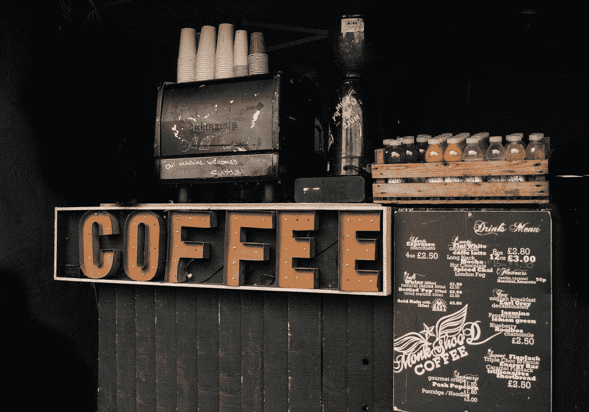
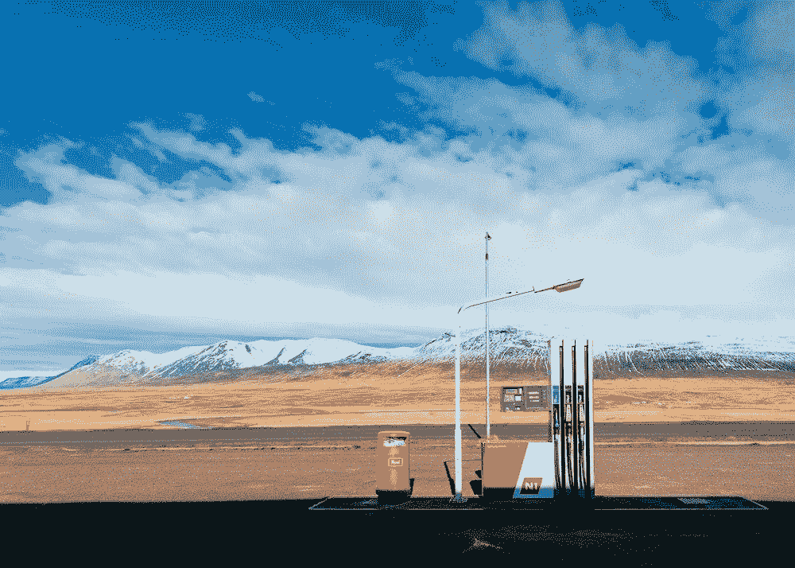

# 找到释放更多重要时刻的燃料。

> 原文：<https://medium.datadriveninvestor.com/finding-your-fuel-to-unleash-more-significant-moments-e2482f035d32?source=collection_archive---------4----------------------->

我们都有某种形式的动力。我们需要燃料来生存。我们最常想到的是汽车里的汽油、我们身体里的食物、商业中的现金和我们头脑中的灵感。

我今天停下来思考最后一个问题。给灵感下定义很难，因为“灵感”显然被过度使用了。在 instagram 上获得灵感，然后滚动到下一张照片，这让你嫉妒你的朋友在度假，而你周四还在工作，这并不能真正激励你。至少，不足以引起行动。

# **你做什么需要燃料？**

每天，我都用一个普通的笔记本来记录我的任务。保持一个记分牌，记录需要完成的事情和清单上已经检查过的事情。未完成的任务会延期到第二天。不是所有我期待的事情。也不是所有的复选框都是平等的，有些具有巨大的价值，而有些则没有什么意义。

每一天，行动和任务都被划分为不需要太多思考的常规任务、需要我们大脑更多参与的思考过程，以及最后那些引发内啡肽的主要认知任务！

这些重要的时刻需要燃料:想象力的火花，创造性地燃烧成可能性的地狱。

发挥创造力。

解决一个问题。

完成一个里程碑。

回首过去的一天、一周甚至一年；那些时刻仍然感觉新鲜。他们还活着。他们值得。

*有没有一种方法可以积极地改变你的一天，创造更多有意义的时刻？*

部分答案是关于效率和容量。更平凡的日常工作通常可以外包。部分参与可以教给其他人，为更重要的时刻释放你的空间。成为一个思考者就是要有一个清醒的头脑。更重要的是清晰，用你的视角，用你现有的能力去开始一些伟大的事情。

# **你找到你的气泵了吗？**

答案的另一部分是关于引发那些火花。为这些时刻腾出空间也需要行动。制造一台发动机却从未启动过，这是一种耻辱。不要做等同的事情，去发现那些让你变得伟大的因素。

有没有一个地方能让你有动力？

你有让你进入状态的配乐吗？

你的理想餐是什么？

跑步或锻炼有帮助吗？

见朋友还是见导师？

每个食谱都不一样。很难复制。你需要花时间来搞清楚你的。触发你的公式也很重要，对我来说，它可能是一首歌的前几秒钟，让我回忆起来。或者我最喜欢的一杯咖啡的味道。

我不是这方面的专家。我鼓励你意识到是什么影响了你的情绪、感受和生产力水平。你能控制的越多，你就能更好地创造更多有意义的时刻。

# 克里斯·米尔顿的燃料。

我有一个奇怪的食谱，一部分是数字游牧者，一部分是在途者，一点点是美食家，偶尔增强信心，加入新的冒险，以及被他人包围和安静孤立的奇怪混合。

让我头脑快速运转的共同点是速度。观察生活节奏，比如繁忙的机场或在有着陆期限的飞机上工作。在曼哈顿这样的地方。与志同道合的人会面。

燃料对我来说有不同的形状和形式，但继续做同样的事情:创造的重要时刻。

这些时刻通常是新的品牌，活动的想法，如何通过不同的视角接近机会，或者可能需要改变什么。

由于创意燃料最近一直在流动，我鼓励你跟随几个项目的启动，将会有更多的分享。我希望在这个过程中增加价值，也许你会学到一个窍门，或者一夜之间成为我的竞争对手。不管怎样，我认为