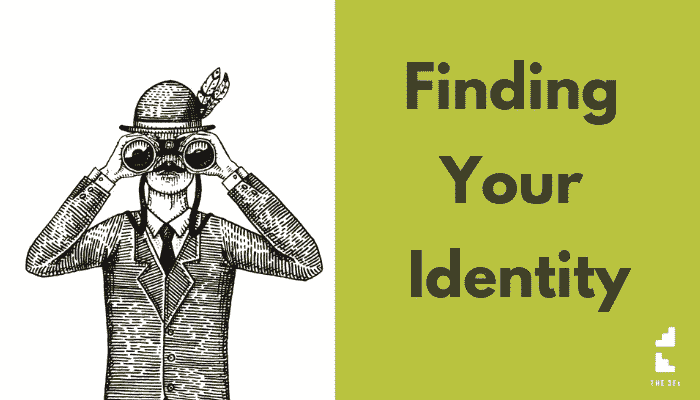

# 寻找你的身份

> 原文：<https://medium.datadriveninvestor.com/finding-your-identity-25af2a498e4c?source=collection_archive---------32----------------------->

“我没有对挣钱有用的技能。”

这是某个自称想成为百万富翁的人在一个 FB 小组中的评论。。。然而我们正经历绝望的深渊。

对他们来说，好消息是他们有妄想症。。。当然，他们有获得收入的技能！

然而，好消息总是被坏消息包裹着。。。在任何事情发生之前，他们必须相信它。

他们的问题是他们的身份。

他们看待自己的方式。

实际上有两个问题。。。他们如何看待“现在”的自己，以及他们如何看待“成功后”的自己。

他们觉得自己想成为百万富翁。。。却不这样看待自己。

他们有一个破碎的身份。

只要它坏了，他们就会被打入冷宫。

重要的是。。。他们如何修复它？

首先。。。忘掉成为百万富翁吧！

不是因为对他们来说不可能。。。不是的！

算了吧，因为他们没有理由成为百万富翁。

他们相信“成为百万富翁”会让他们幸福。

让他们有价值。

让它们变得有意义。

可悲的是，不会。

这和钱没有关系。这完全取决于他们如何看待自己。

到目前为止，我已经帮助了 16 个人成为百万富翁。。。以下是我的经历:

。。。那些对自己有信心的人。。。对自己保持自信；

。。。那些相信钱会改变他们生活的人。。。百万富翁并没有持续很久。

这些钱对他们的自我感觉没有影响。这在短期内感觉不错，但并不能解决他们的根本问题。

他们的认同感。

当我们对自己的身份有清晰强烈的感觉时。。。当我们知道我们的价值观，我们的信仰，我们的立场。。。我们成为一股有冲力的力量。

我们认识到生命是美好而珍贵的。。。现在和将来。

然而当我们没有一个清晰而强烈的身份认同时。。。一切都变得更难，需要更多的努力，更不确定。。。情绪也很低落。

当你怀疑自己的身份时。。。你陷入比较:他比我有钱；她是比我更好的父母。

比较是一场赢不了的游戏。

这是一个只有缺乏安全感的人才玩的游戏。

当你的身份坚如磐石。。。当你知道自己的价值观、信仰和主张时。。。你在玩一场不会输的游戏。

一切都从身份开始。

这是一项深入的工作。

很少做。。。然而生活在改变。

你的价值观。

你的信仰。

你所代表的。

认识他们。。。这对生活的影响是巨大的。

前往[网站](http://www.strategicmentors.co.uk/blog)获取更多关于如何实现你的商业目标的帖子